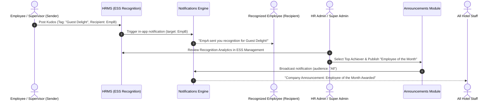

# Social Recognition — Feature Specification & Architecture
### Module: Human Resource Management System (HRMS/HCM) → Performance & Development / ESS
### Sub-Tabs: 
- **Employee Portal:** Employee Self-Service (ESS) → Social Recognition (`/employee/ess?category=Recognition`)
- **Admin & Super Admin Portal:** ESS Management → Recognition & Moderation (`/admin/ess?tab=recognition`, `/superadmin/ess?tab=recognition`)

---

## 1. Executive Summary & Purpose

The **Social Recognition** feature provides Oxford Suites Makati with a centralized, public peer-to-peer appreciation platform. It enables employees, supervisors, and hotel management to openly celebrate colleagues whose day-to-day actions exemplify the hotel’s core service values.

By attaching predefined core value tags to brief kudos, the system transforms informal workplace praise into structured, quantifiable behavioral data. This data serves as qualitative input for performance appraisals, regularizations, and employee engagement metrics without burdening staff with complex evaluation forms.

---

## 2. Architectural Scope & Subsystem Boundaries

### 2.1 Native HRMS vs. HR3 Subsystem
A common point of ambiguity is whether Social Recognition is owned by the external/sister **HR3 subsystem** or maintained within this HRMS application:

* **Native Execution (Within this HRMS):**
  The user interface, social feed, kudos composition, emoji reactions (claps, stars, hearts, fire), social sharing, and notification triggers are **hosted and managed directly inside this HRMS** under the `EmployeeSelfService` module and relational database tables (`social_recognitions`, `recognition_reactions`). It is **not** handled exclusively or hosted remotely by the HR3 subsystem.
* **HR3 Integration & Data Handoff:**
  The **HR3 subsystem** is responsible for formal **Performance & Development**, competency matrices, annual appraisals, and merit/regularization recommendations (`hr3_recommendations`).
  * *Integration Point:* Social recognition data acts as an upstream behavioral data feed for HR3. Aggregated recognition counts and core value distributions per employee are synced with or referenced by HR3 during evaluation cycles to provide holistic evidence of cultural alignment and peer respect.

### 2.2 Announcements vs. Social Recognition
* **Peer-to-Peer Recognition:**
  Can be initiated by any employee, supervisor, or manager. Triggers an in-app notification specifically to the recipient (e.g., *"Kevin Dela Cruz recognized you for 'Guest Delight'!"*).
* **Official Hotel Announcements:**
  Company-wide or department-wide announcements are **exclusively authored and published by Admin and Super Admin** via the Announcements module (`/admin/announcements` and `/superadmin/announcements`). When hotel leadership identifies top-recognized staff or awards "Employee of the Month," the Admin publishes a formal announcement, triggering system-wide notifications for all staff.

---

## 3. Role-Based Access & Portal Integration

The feature is integrated across portals to ensure both grassroots participation and administrative governance:

| Feature / Action | Employee Portal (`/employee`) | HR Admin Portal (`/admin`) | Super Admin Portal (`/superadmin`) |
| :--- | :---: | :---: | :---: |
| **Browse Social Recognition Feed** | ✅ Yes (ESS Tab) | ✅ Yes (ESS Mgmt Tab) | ✅ Yes (ESS Mgmt Tab) |
| **Post Peer Kudos** | ✅ Yes (To any colleague) | ✅ Yes (As Staff / Mgmt) | ✅ Yes (As Staff / Mgmt) |
| **React (Clap, Heart, Star, Fire)** | ✅ Yes | ✅ Yes | ✅ Yes |
| **Share Post (Wall / Feed repost)** | ✅ Yes | ✅ Yes | ✅ Yes |
| **View Personal Recognition Profile Card** | ✅ Yes (ESS Overview) | ✅ Yes (Personal Profile) | ✅ Yes (Personal Profile) |
| **Moderation Queue (Flag / Remove Post)** | ❌ No | ✅ Yes (Admin Tab) | ✅ Yes (Admin Tab) |
| **Recognition Analytics & Department Heatmap** | ❌ No | ✅ Yes (Reports) | ✅ Yes (Reports) |
| **Configure Core Values & Recognition Rules** | ❌ No | ❌ No | ✅ Yes (ESS Administration) |
| **Publish Formal Employee of the Month Announcement** | ❌ No | ✅ Yes (Announcements) | ✅ Yes (Announcements) |

---

## 4. Portal Views & UI Integration

### 4.1 Employee Portal (ESS)
* **Wall of Fame Feed:** Chronological, interactive feed displaying peer recognitions, recipient/sender cards, core value badges, timestamps, reactions, and share counters.
* **Recognition Composer Modal:**
  * Recipient lookup (search by colleague name or department).
  * Core Value selector (dropdown with defined hotel values).
  * Recognition message (enforced 150–200 character count to encourage concise, meaningful praise).
* **ESS Overview Stat Card:**
  Displays a 5th metric card alongside Attendance, Payroll, Performance, and Documents:
  ```
  🏅 RECOGNITION
  3 Received · 1 Given
  This month
  ```

### 4.2 Admin & Super Admin Portal (ESS Management)
A dedicated **"Recognition & Moderation"** tab is provided inside **ESS Management** (`/admin/ess` and `/superadmin/ess`):
* **Moderation Board:** Table of all posted recognitions with filter by department, date, and status (`Active`, `Flagged`, `Archived`), with actions to hide/delete inappropriate content.
* **Engagement Analytics:**
  * Top Recognized Employees of the Month.
  * Core Value Distribution (e.g., 42% Guest Delight, 28% Teamwork, 18% Operational Excellence).
  * Department participation rates.
* **Direct Announcement Action:** A one-click button to *"Convert top recognition into company-wide Announcement"*, prefilling the announcement dialog with the recognized employee's achievements.

---

## 5. Core Fields & Data Structure

### 5.1 Relational Schema Mapping

#### Table: `social_recognitions`
```sql
CREATE TABLE `social_recognitions` (
  `id` bigint(20) UNSIGNED NOT NULL AUTO_INCREMENT,
  `sender_employee_id` bigint(20) UNSIGNED NULL,
  `sender_user_id` bigint(20) UNSIGNED NOT NULL,
  `sender_name` varchar(255) NOT NULL,
  `sender_role` varchar(255) NOT NULL,
  `recipient_employee_id` bigint(20) UNSIGNED NULL,
  `recipient_name` varchar(255) NOT NULL,
  `recipient_role` varchar(255) NOT NULL,
  `core_value` varchar(100) NOT NULL,
  `message` text NOT NULL,
  `shares_count` int(11) NOT NULL DEFAULT 0,
  `status` enum('posted', 'flagged', 'hidden') NOT NULL DEFAULT 'posted',
  `created_at` timestamp NOT NULL DEFAULT current_timestamp(),
  `updated_at` timestamp NOT NULL DEFAULT current_timestamp() ON UPDATE current_timestamp(),
  PRIMARY KEY (`id`)
);
```

#### Table: `recognition_reactions`
```sql
CREATE TABLE `recognition_reactions` (
  `id` bigint(20) UNSIGNED NOT NULL AUTO_INCREMENT,
  `recognition_id` bigint(20) UNSIGNED NOT NULL,
  `employee_id` bigint(20) UNSIGNED NOT NULL,
  `reaction_type` enum('clap', 'heart', 'star', 'fire') NOT NULL,
  `created_at` timestamp NOT NULL DEFAULT current_timestamp(),
  PRIMARY KEY (`id`),
  UNIQUE KEY `unique_user_reaction` (`recognition_id`, `employee_id`, `reaction_type`)
);
```

### 5.2 Oxford Suites Makati Service Values (Tags)
1. **Guest Delight:** Exceptional customer service, positive guest reviews, anticipating guest needs.
2. **Teamwork & Malasakit:** Cross-department support, assisting peers during peak hours, mutual care.
3. **Going the Extra Mile:** Stepping in during emergency shifts, voluntary overtime, exceeding job expectations.
4. **Operational Excellence:** Punctuality, kitchen hygiene compliance, speed of service, adherence to standard operating procedures.
5. **Integrity & Trust:** Honesty in cash/asset handling, transparency, ethical conduct.

---

## 6. Notification & Communication Lifecycle



---

## 7. Strategic Recommendations for Defense & Implementation

1. **Avoid Siloing in ESS:** Keeping the creation of kudos in ESS guarantees broad employee participation, but having an administrative oversight tab in ESS Management is essential to demonstrate governance, compliance, and reporting to auditors and panel evaluators.
2. **Defend the HR3 Boundary:** During defense, emphasize that **HR3 handles formal performance evaluation algorithms and merit recommendations**, while **HRMS ESS handles the real-time social engagement and peer recognition feed**. The two communicate via data points (recognition counts feeding into HR3's evaluation rubric).
3. **Connect to Official Announcements:** The bridge between grassroots praise (Social Recognition) and executive recognition (Announcements) creates a complete, closed-loop recognition culture for Oxford Suites Makati.
