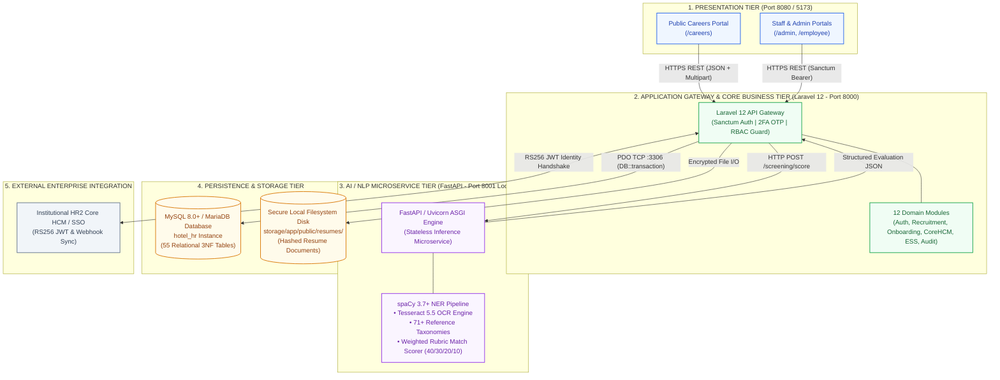
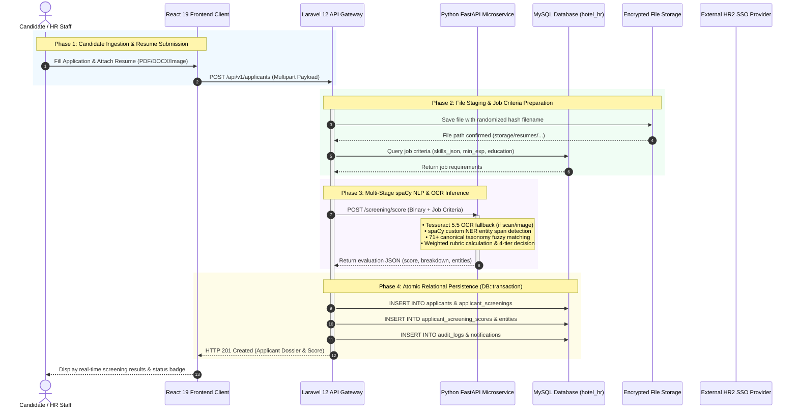
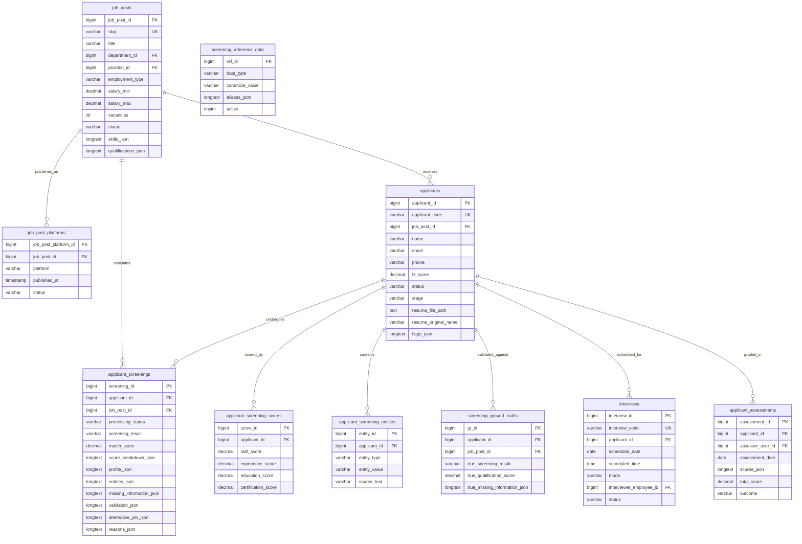
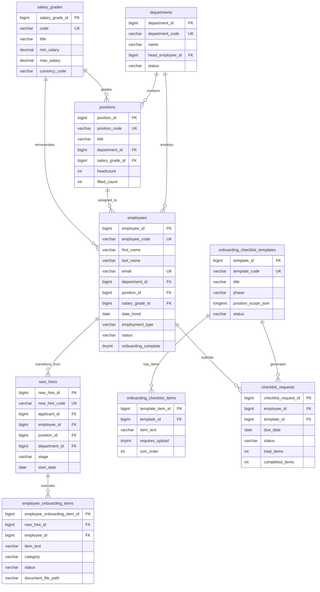
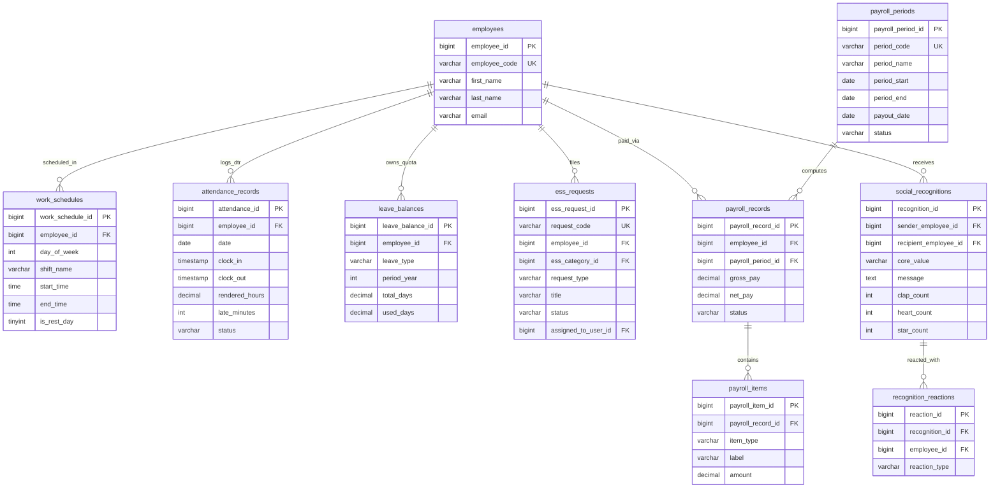

TECHNICAL & PROJECT MANAGEMENT APPENDICES 

# **TABLE OF CONTENTS** 

## **Appendices: Comprehensive System Architecture, Operations** 

## **& Governance** 

This technical compendium establishes the complete architectural, development, quality assurance, operational, and project management appendices for the Hotel and Restaurant Human Resource Management System (HRMS) featuring spaCy-based Natural Language Processing (NLP) applicant screening with Named Entity Recognition (NER). 

|**APPENDIX** **SECTION**|**TITLE AND CORE TOPICS**|**PAGE**|
|---|---|---|
|APPENDIX A.1|**System Architecture** • High-Level Topology, Modular Monolith & AI Engine|i|
|APPENDIX A.2|**Information Systems Integration** • Laravel ↔ FastAPI ↔ React ↔ HR2 SSO Federation|v|
|APPENDIX A.3|**Application Design and Development** • Modules, Code Structure, Algorithms, Frameworks|ix|
|APPENDIX A.4|**Database Schema and Data Management** • Database Definition, 3NF Architecture, 55 Tables Data Dictionary, ER Diagrams, Constraints & Policies|xiii|
|APPENDIX A.5|**Network Configuration** • Topology, Ports, CORS, Sequence Flow|xviii|
|APPENDIX A.6|**Deployment and Infrastructure** • Hardware/Software Stack, .env, Topologies|xxii|
|APPENDIX A.7|**Security Measures**|xxvi|

Page 1 

TECHNICAL & PROJECT MANAGEMENT APPENDICES 

||• JWT / SSO, Sanctum Auth, 2FA OTP, RBAC, RA 10173||
|---|---|---|
|APPENDIX A.8|**Testing and Quality Assurance** • Strategy, Test Matrix, Results & Coverage|xxx|
|APPENDIX A.9|**System Monitoring and Maintenance** • Health Probes, Logs, Runbooks, SLAs|xxxiv|
|APPENDIX A.10|**APIs and Integration Points** • REST Endpoints, Payloads, FastAPI Microservice|xxxvii|
|APPENDIX A.11|**User Documentation** • Candidate, Employee, HR Admin, Superadmin|xlii|
|APPENDIX A.12|**Known Issues and Troubleshooting** • Issue Taxonomy & Verified Resolution Steps|xlvi|
|APPENDIX A.13|**Version Control & Repository** • Monorepo, GitFlow, Conventional Commits|l|
|APPENDIX A.14|**DevOps and CI/CD** • 3-Tier CI Matrix, Quality Gates, CD, Backups|liii|
|APPENDIX A.15|**Licensing and Open Source Libraries** • Dependency Inventory, RA 10173 Compliance|lvii|
|APPENDIX A.16|**Performance Metrics & Monitoring** • SLAs, SOPs 1–5 ML Research Metrics, Profiling|lxi|
|APPENDIX B.1|**Project Charter / Proposal** • Objectives, SOPs, Variables (IV/DV), Stakeholders|lxv|
|APPENDIX B.2|**Sprint Backlogs and Burndown Charts** • Sprints 1–4 Backlog Breakdown, Velocity|lxix|
|APPENDIX B.3|**Meeting Minutes** • Chronological Minutes of 13 Project Meetings|lxxiii|
|APPENDIX B.4|**Gantt Chart or Project Timeline** • 7-Week Project Milestone Matrix & Visual Chart|lxxix|

Page 2 

TECHNICAL & PROJECT MANAGEMENT APPENDICES 

# **Appendix A.1** 

## **System Architecture** 

## **A.1.1 Architectural Style and High-Level System Architecture** 

The Hotel and Restaurant Human Resource Management System (HRMS) is designed using a decoupled, multi-tier architectural pattern. The system integrates a modern web presentation client, a domain-driven application gateway, a high-performance Python-based Natural Language Processing (NLP) microservice, and a relational persistence tier. This hybrid architectural model couples the modular development speed and organizational clarity of a Domain-Driven Modular Monolith (Laravel 12) with the computational efficiency of a stateless AI microservice (FastAPI + spaCy 3.8 NER). 

## **A.1.2 Multi-Tier Modular Monolith and Microservice Topology** 

The operational topology comprises four primary architectural tiers: 

- **Client Presentation Tier (React 19 & TanStack Start)** : Delivers full-stack Server-Side Rendering (SSR) for public career portals alongside high-responsiveness Single-Page Application (SPA) client routing for authenticated portals (Super Admin, HR Admin, Employee Self-Service). 

Page 3 

TECHNICAL & PROJECT MANAGEMENT APPENDICES 

- **Application Gateway & Business Logic Tier (Laravel 12 Modular Monolith)** : Built with **nwidart/laravel-modules** encapsulating 12 independent business domains ( **Auth** , **RecruitmentManagement** , **ApplicantManagement** , **NewHireOnboarding** , **CoreHCM** , **EmployeeRecords** , **EmployeeSelfService** , **Landing** , **AuditLog** , **Settings** , **UserManagement** , **Profile** ). Enforces Sanctum token authentication, 2FA OTP security, RBAC authorization, and Eloquent mutation auditing. 

- **AI / NLP Screening Microservice Tier (FastAPI & spaCy NER)** : Stateless inference engine bound to private local loopback ( **127.0.0.1:8001** ). Parses digital resumes (PDF, DOCX, and scanned images via Tesseract 5.5 OCR), extracts hotel-specific entity spans ( **PERSON** , **EDUCATION** , **JOB_TITLE** , **SKILL** , **CERTIFICATION** ), computes weighted qualification match scores, and assigns 4-status classifications. 

- **Persistence & Data Storage Tier (MySQL 8.0+ & Secure Disk** 

**Partition)** : Stores transactional schemas, reference taxonomies, audit trails, and encrypted file paths ( **storage/app/public/resumes/** ). 

Page 4 

### **Figure A.1.1**
_Multi-Tier System Topology and Service Architecture_

TECHNICAL & PROJECT MANAGEMENT APPENDICES 

## **A.1.3 Data Flow and System Interaction Model** 

Data flows seamlessly across boundaries through well-defined contracts: (1) Candidates submit resumes via the public portal; (2) Frontend dispatches multipart payloads to the Laravel API Gateway; (3) Laravel packages criteria and calls FastAPI **/screening/score** ; (4) FastAPI returns structured entity JSON and match scores; (5) Laravel persists data to MySQL and updates HR dashboards in real time. 

## **A.1.4 Scalability, Fault Tolerance, and High Availability Design** 

The architecture achieves horizontal scalability by keeping the NLP microservice completely stateless, enabling multiple Uvicorn workers behind a load balancer. Fault tolerance is enforced via circuit-breaker timeout handling (120s max) and fail-safe database fallback mechanisms preventing UI disruptions during heavy OCR or NLP inference cycles. 

Page 6 

TECHNICAL & PROJECT MANAGEMENT APPENDICES 

# **Appendix A.2** 

## **Information Systems Integration (Laravel ↔ FastAPI ↔ React** 

## **↔ HR2 SSO)** 

## **A.2.1 Inter-Tier Communications Topology and Protocol Stack** 

### **Figure A.2.1**
_Cross-Tier Data Flow and Screening Sequence Diagram_

The system implements standardized, low-latency communication channels connecting all frontend clients, backend services, external enterprise HR2 single sign-on systems, and AI inference engines: 

- **React Frontend ↔ Laravel API Gateway** : Communicates over standard HTTPS REST APIs ( **/api/v1/*** ) utilizing JSON request/response payloads, Bearer token headers, and multipart form-data for resume uploads. 

- **Laravel Gateway ↔ Python FastAPI Microservice** : 

- Communicates over private HTTP JSON/multipart socket connections ( **http://127.0.0.1:8001** ) with dedicated timeout guards and connection error catching. 

- **Laravel Gateway ↔ MySQL Persistence Engine** : Communicates over high-performance PDO TCP socket bindings with connection pooling and prepared statements. 

- **Laravel Gateway ↔ Institutional HR2 Core HCM / SSO** : Integrates via signed JSON Web Tokens (JWT) and OAuth2 

Page 7 

TECHNICAL & PROJECT MANAGEMENT APPENDICES 

identity federation to synchronize employee profiles, department hierarchies, and payroll records. 

## **A.2.2 Backend Gateway to Python FastAPI NLP Service** 

## **Integration** 

The service bridge is managed by **App\Services\NlpService.php** . When an applicant resume is uploaded, Laravel dispatches an HTTP POST request to **/screening/score** transmitting the raw resume file alongside the job's required skills, minimum experience, education baseline, and mandatory certifications. The response delivers a complete mathematical breakdown: 

- **Structured JSON Contract** : Returns **overall_score** , **sub_scores** (Skills, Experience, Certification, Education), **extracted_entities** , **missing_skills** , and official **classification** ( **PERFECT FOR THE JOB** , **INVALID CREDENTIAL** , **FIT FOR OTHER JOB** , **NOT FITTED TO JOB** ). 

- **Resilience Guard** : The client applies a 120-second timeout. If the AI service is unreachable, Laravel logs a diagnostic error in **applicant_screenings.error_message** and marks the status as **PENDING_REVIEW** without halting intake. 

Page 8 

TECHNICAL & PROJECT MANAGEMENT APPENDICES 

## **A.2.3 Client Presentation to API Gateway Integration** 

The React 19 frontend consumes backend APIs using a centralized TypeScript HTTP client ( **src/lib/api.ts** ) built on Axios with request/response interceptors that automatically inject Sanctum Bearer tokens, handle 401 token expirations, and transform response envelopes into strongly typed state. 

## **A.2.4 External Institutional HR2 Single Sign-On (SSO) & JWT Federation** 

To guarantee organizational interoperability, the system supports Single Sign-On (SSO) integration with external hotel enterprise systems (e.g., HR2 Core HCM / Payroll): 

- **JWT Identity Exchange** : Authenticated hotel staff can traverse from institutional portals to the HRMS without re-entering credentials by exchanging signed, RS256-encrypted JWT tokens. 

- **Employee Dossier Synchronization** : Approved new hires in **NewHireOnboarding** emit automated webhook payloads to HR2 Core HCM upon completing onboarding milestones, automatically initializing active employee 201 dossiers across both systems. 

Page 9 

TECHNICAL & PROJECT MANAGEMENT APPENDICES 

## **A.2.5 Resilient Integration Patterns, Circuit Breakers, and Error** 

## **Envelopes** 

All API interactions adhere to standard error envelopes: **{"status": "error", "message": "...", "errors": [...]}** . Circuit breakers isolate microservice failures, preventing cascading outages across other HRMS modules. 

Page 10 

TECHNICAL & PROJECT MANAGEMENT APPENDICES 

# **Appendix A.3** 

## **Application Design and Development** 

The application was designed and developed using a three-tier modular architecture that cleanly separates presentation, business logic and data persistence, and intelligent natural language processing. By decoupling user interaction, core human capital workflows, and AI resume screening into dedicated layers—a React-based frontend client, a domain-driven Laravel API backend gateway, and a specialized Python spaCy NLP microservice—the architecture ensures operational efficiency, high responsiveness, and independent scalability. 

## **A.3.1 Detailed Information About the Software Modules and Components** 

The system architecture is structured across three primary software tiers, providing role-tailored portal views and decoupled backend services: 

- **Client Presentation Tier** : Built using React 19, TypeScript 5.8, and TanStack Start, providing full-stack server-side rendering for public pages alongside dynamic client-side single-page routing for authenticated portals. Styling is driven by Tailwind CSS v4 and 

Page 11 

TECHNICAL & PROJECT MANAGEMENT APPENDICES 

accessible Radix UI / shadcn/ui primitives. This tier delivers three primary role-based internal portals and one public career space: 

- • _Public Careers Landing Page with Embedded FAQ Chatbot_ : A responsive public interface where job seekers can explore active vacancies, filter openings by department and position, view job requirements, and submit applications with resume attachments. An integrated floating FAQ chatbot widget assists applicants by answering common questions regarding job vacancies, application procedures, required documentation, salary scales, and hotel benefits using an admin-managed knowledge base. 

- • _HR Admin Portal_ : A comprehensive management portal for HR managers, recruiters, and supervisors to initiate staff requisitions, publish job vacancies across recruitment channels, manage applicant pipelines through an interactive Kanban board, schedule interviews with structured scorecards, review AI-generated resume screening scores, and supervise new-hire onboarding checklists and probationary evaluations. 

- • _Employee Self-Service (ESS) Portal_ : A centralized self-service dashboard for active hotel employees to log Daily Time Records (DTR), submit leave requests with real-time balance tracking, view itemized digital payslips, coordinate shift swap requests with 

Page 12 

TECHNICAL & PROJECT MANAGEMENT APPENDICES 

coworkers, request official documents (such as Certificates of Employment), and share peer recognition. 

- • _Super Admin Command Center_ : A secure system administration hub for IT administrators to manage portal user accounts, configure granular role-to-permission matrices, monitor systemwide audit trails by severity rating, perform manual and scheduled database backups, and manage global system configurations. 

**•  Application Backend & API Gateway Tier** : Developed using Laravel 12 (PHP 8.2+) structured as a Domain-Driven Modular Monolith via **nwidart/laravel-modules** . The backend encapsulates core business logic into dedicated domain modules matching each functional subsystem: Auth, RecruitmentManagement, ApplicantManagement, NewHireOnboarding, CoreHCM, EmployeeRecords, EmployeeSelfService, Landing, AuditLog, Settings, UserManagement, and Profile. API security is enforced via Laravel Sanctum bearer tokens with 2FA OTP verification, while database mutations are automatically logged through Eloquent audit observers. 

- **AI / NLP Screening Microservice** : A stateless microservice built on 

   - Python 3.10+, FastAPI, and Uvicorn. It parses digital resumes (PDF/DOCX), extracts domain-specific entities using fine-tuned spaCy Named Entity Recognition (NER) models, and calculates 

Page 13 

TECHNICAL & PROJECT MANAGEMENT APPENDICES 

objective match scores against role requirements, returning structured JSON results to the Laravel backend. 

### **Table A.3.1** 

_System Software Modules and Component Breakdown (Table 26)_ 

|**Module /** **Component**|**Architectural Layer**|**Core Functional** **Scope**|**Underlying** **Technologies**|
|---|---|---|---|
|Public Careers Landing Page + FAQ Chatbot|Frontend Client / Landing Module|Public job discovery, search/filter, online application with resume, and 24/7 floating chatbot assistance.|React 19, TanStack Start, Tailwind CSS v4, Lucide React, Axios|
|||Candidate submission intake, multi-stage|Laravel 12,|
|Applicant|Frontend / Backend|Kanban pipeline,|Eloquent ORM,|
|Management|(ApplicantManagement)|interview scheduling, scorecards, and hiring transitions.|Radix UI, TanStack Query|
|Recruitment Management + NLP|Backend (RecruitmentManagement) + Python NLP|Staff requisitions, job postings syndication, and spaCy NER microservice for text parsing, entity extraction, and fit scoring.|Laravel 12, Python 3.10+, FastAPI, spaCy 3.7, PyPDF2, python-docx|
|||Transition of accepted candidates into pre-|Laravel 12|
|New Hire Onboarding|Frontend / Backend (NewHireOnboarding)|employment workflows, document compliance tracking (NBI, Medical, SSS, BIR), checklist templates.|, MySQL 8.0+, React Hook Form, Zod|
|||Self-service DTR and||
|ESS Management (Employee Self- Service)|Frontend / Backend (EmployeeSelfService)|biometric clocking, leave filing with balance tracking, payslips, shift swap requests, COE requests, peer recognition.|Laravel 12, Recharts, TanStack Query, Tailwind CSS|
|Core HCM|Frontend / Backend|Management of|Laravel 12,|

Page 14 

TECHNICAL & PROJECT MANAGEMENT APPENDICES 

||(CoreHCM)|organizational hierarchy, hotel departments, job positions, salary grade bands, and workforce optimization insights.|MySQL 8.0+, Radix UI Tables|
|---|---|---|---|
|Employee Records|Frontend / Backend (EmployeeRecords)|Complete 360° employee dossiers, statutory IDs, compensation assignment, 201 document storage, emergency contacts, exit clearance.|Laravel 12, MySQL 8.0+, File Storage API|
|Settings, Auth, Audit Logs & User Management|Backend (Auth, UserManagement, AuditLog, Settings)|User auth with 2FA OTP, RBAC permission matrix, non-destructive mutation audit trails, system backups, and hotel settings.|Laravel Sanctum, Eloquent Observers, MySQL 8.0+|

## **A.3.2 Code Structure** 

The system repository follows a modular, decoupled directory structure that maintains clear boundaries between the frontend user interface, backend application gateway, NLP microservice, and database schemas: 

- **`frontend/`** : Contains the React 19 and TanStack Start client project. UI components are categorized under **src/components/** by user role ( **admin** , **employee** , **landing** , **superadmin** ) along with shared primitives under **ui/** . Routing is organized under **src/routes/** , while API integration clients and state helpers reside under **src/lib/** . 

Page 15 

TECHNICAL & PROJECT MANAGEMENT APPENDICES 

- **`backend-laravel/`** : Houses the Laravel 12 API backend. Shared 

core Eloquent models ( **Employee** , **SystemUser** , **AuditLog** ), security middleware (Sanctum auth, RBAC permissions), and audit observers are maintained in **app/** . The twelve domain-driven business modules reside under **Modules/** , each encapsulating its own **Http/Controllers** , **Models** , **Routes/api.php** , and 

### **Database/Migrations** . 

- **`nlp-service/`** : Houses the Python FastAPI screening service. Main routing endpoints are defined in **app/main.py** , while document extraction utilities, custom spaCy NER inference logic, and mathematical scoring routines are structured under **app/services/** . Trained hospitality model weights are stored in **models_spacy/** . 

- **`database/`** : Contains the consolidated normalized MySQL database schemas, seed datasets, and data dictionary documentation. 

## **A.3.3 Algorithms and Data Structures Used** 

The system incorporates specialized computational algorithms and efficient data structures across its modules: 

- **1. Weighted Multi-Factor Fit-Scoring Algorithm** : Computes an objective qualification match score by comparing extracted resume entities with job vacancy criteria: $\text{Composite Score} = (0.40 

Page 16 

TECHNICAL & PROJECT MANAGEMENT APPENDICES 

\times \text{Skills Match}) + (0.30 \times \text{Experience Match}) + 

(0.20 \times \text{Certification Match}) + (0.10 \times \text{Education Match})$. Candidates scoring $\ge 75\%$ are categorized as 'Recommended', $50\%–74\%$ as 'Potential', and $< 50\%$ as 'Underqualified'. 

- **2. spaCy Named Entity Recognition (NER) Span Matching** Applies a transition-based Convolutional Neural Network (CNN) parser with token embeddings to detect non-contiguous text entities ( **SKILL** , **CERTIFICATION** , **EXPERIENCE** , **JOB_TITLE** ) from unstructured resumes regardless of document formatting. 

- **3. Hash-Map RBAC Permission Evaluation** : Middleware uses constant-time $O(1)$ hash-map lookups to validate user permissions against requested API endpoints before executing business logic. 

- **4. Text Normalization and Sanitization Pipeline** : Preprocesses extracted resume text through regex-based sanitization routines to eliminate control characters, excessive whitespace, and encoding artifacts prior to NER processing. 

## **A.3.4 Libraries and Frameworks Utilized** 

The system integrates proven open-source technologies across each architectural tier: 

Page 17 

TECHNICAL & PROJECT MANAGEMENT APPENDICES 

- **Frontend Stack** : React 19, TypeScript 5.8, TanStack Start (SSR/Routing), TanStack Query (asynchronous caching), Tailwind CSS v4 (styling), Radix UI / shadcn/ui (UI primitives), Recharts (data visualizations), and Lucide React (icons). 

- **Backend Stack** : Laravel 12 (PHP 8.2+ MVC framework), Laravel Sanctum (token authentication), **nwidart/laravel-modules** (modular monolith architecture), and Eloquent ORM (data modeling). 

- **AI / NLP Stack** : Python 3.10+, FastAPI (ASGI framework), Uvicorn (ASGI web server), spaCy 3.7 (NLP & NER engine), PyPDF2, pdfplumber, and **python-docx** (document parsing). 

- **Database Engine** : MySQL 8.0+ relational database engine with InnoDB storage, foreign key constraints, and **utf8mb4** encoding. 

Page 18 

TECHNICAL & PROJECT MANAGEMENT APPENDICES 

# **Appendix A.4** 

## **Database Schema and Data Management** 

## **A.4.1 Relational Database Model, Database Definition, and Normalized Architecture (3NF)** 

### **A.4.1.1 Formal Database Definition and Persistence Engine Specifications** 
The Human Resource Management System (HRMS) for the Grand Imperium Hotel & Suites utilizes a dedicated, highly optimized relational persistence architecture. The database specifications and storage parameters are formally established as follows: 

- **Database Name**: `hotel_hr` 
- **Database Management System (DBMS)**: MySQL 8.0+ / MariaDB 10.4.27+ Enterprise Relational Database Server. 
- **Default Character Set & Collation**: `utf8mb4` character set with `utf8mb4_unicode_ci` collation, providing complete 4-byte UTF-8 encoding support for international hospitality guest and employee names, multi-language diacritics, localized text content, and serialized emoji reactions in the social recognition module. 
- **Storage Engine**: InnoDB Transactional Storage Engine across all 55 relational tables. InnoDB enforces strict ACID compliance (Atomicity, Consistency, Isolation, Durability), foreign key referential integrity constraints (`FOREIGN_KEY_CHECKS = 1`), row-level concurrency locking for high-frequency timekeeping and applicant ingestion, and Write-Ahead Logging (WAL via Redo/Undo transaction logs). 
- **Schema Management & Versioning**: Managed declaratively through Laravel 12 database migrations with deterministic schema versioning, foreign key cascading constraints, and structured database seeders. 

### **A.4.1.2 Third Normal Form (3NF) Relational Foundations and Domain Clustering** 
To eliminate functional redundancies, ensure storage optimality, and prevent insertion, update, and deletion anomalies, the entire relational schema is strictly normalized to Third Normal Form (3NF): 
1. **First Normal Form (1NF)**: Every table contains a unique primary key (`BIGINT UNSIGNED AUTO_INCREMENT` surrogate key or deterministic natural key), and all attribute values are atomic. Semi-structured payloads (such as extracted spaCy NLP entities, qualification match rubrics, candidate flags, and system settings) are stored in standardized JSON columns validated via MySQL `CHECK (json_valid(...))` integrity constraints. 
2. **Second Normal Form (2NF)**: All non-key attributes are fully functionally dependent on the entire primary key, eliminating partial key dependencies across composite associative entities (e.g., `attendance_records`, `leave_balances`, `role_permissions`). 
3. **Third Normal Form (3NF)**: Transitive dependencies are eliminated by decoupling organizational units, job titles, compensation brackets, security roles, and applicant status stages into dedicated reference tables (`departments`, `positions`, `salary_grades`, `system_roles`, `screening_reference_data`). 

The database architecture comprises **55 distinct relational tables** logically partitioned into **11 functional domain clusters**, providing comprehensive coverage across the entire human capital lifecycle: 
1. **Authentication, Role-Based Access Control (RBAC), and Security Auditing Domain** (8 tables) 
2. **Organizational Hierarchy, Position Architecture, and Core HCM Domain** (8 tables) 
3. **Talent Acquisition, Job Requisitions, and Applicant Tracking Domain** (6 tables) 
4. **AI / NLP Automated Resume Screening and Taxonomic Benchmark Domain** (5 tables) 
5. **New Hire Onboarding, Digital Checklists, and Pre-Employment Compliance Domain** (5 tables) 
6. **Time, Attendance, and Shift Scheduling Domain** (2 tables) 
7. **Employee Self-Service (ESS), Leave Quotas, and AI Chatbot Support Domain** (5 tables) 
8. **Performance Evaluation, Social Recognition, and Merit Recommendations Domain** (4 tables) 
9. **Learning and Development (L&D) Domain** (2 tables) 
10. **Payroll Computation, Pay Periods, and Statutory Benefits Domain** (4 tables) 
11. **Application Framework, Session Persistence, and Infrastructure Domain** (6 tables) 

---

## **A.4.2 Enterprise Entity-Relationship Diagrams (ERD)** 

The relational architecture is visually modeled using standard Crow's Foot notation. The primary key (`PK`) and foreign key (`FK`) relationships enforce referential constraints across domain boundaries. 

### **Figure A.4.1**
_Master High-Level Enterprise Entity-Relationship Architecture (Core Domain Hubs)_

```mermaid
erDiagram
    %% Core Organizational Hierarchy
    departments ||--o{ positions : "contains"
    departments ||--o{ employees : "employs"
    departments ||--o{ job_posts : "opens"
    positions ||--o{ employees : "assigns"
    positions ||--o{ job_posts : "specifies"
    salary_grades ||--o{ positions : "grades"
    salary_grades ||--o{ employees : "remunerates"

    %% Employee 201 Personnel Records
    employees ||--o{ employee_emergency_contacts : "has"
    employees ||--o{ employee_documents : "stores"
    employees ||--o{ employee_position_history : "tracks"
    employees ||--o{ employee_exit_records : "terminates"
    employees ||--o{ work_schedules : "scheduled_in"
    employees ||--o{ attendance_records : "logs_dtr"
    employees ||--o{ leave_balances : "owns_quota"
    employees ||--o{ ess_requests : "files"
    employees ||--o{ performance_reviews : "evaluated_in"
    employees ||--o{ employee_learning : "enrolls"
    employees ||--o{ payroll_records : "paid_via"
    employees ||--o{ employee_benefits : "enrolled_in"
    employees ||--o{ system_users : "authenticates"
    employees ||--o{ social_recognitions : "receives"

    %% Talent Acquisition & AI Screening
    job_posts ||--o{ job_post_platforms : "publishes_on"
    job_posts ||--o{ applicants : "receives"
    job_posts ||--o{ applicant_screenings : "evaluates"
    requisitions ||--o{ job_posts : "converts_to"

    applicants ||--o{ applicant_screenings : "undergoes"
    applicants ||--o{ applicant_screening_scores : "scored_in"
    applicants ||--o{ applicant_screening_entities : "contains"
    applicants ||--o{ screening_ground_truths : "benchmarked_in"
    applicants ||--o{ interviews : "scheduled_for"
    applicants ||--o{ applicant_assessments : "graded_in"
    applicants ||--o{ new_hires : "advances_to"

    %% Onboarding & Compliance Workflow
    new_hires ||--o{ employee_onboarding_items : "executes"
    onboarding_checklist_templates ||--o{ onboarding_checklist_items : "defines"
    onboarding_checklist_templates ||--o{ checklist_requests : "instantiates"
    employees ||--o{ checklist_requests : "submits"

    %% Operations, Payroll & Social
    payroll_periods ||--o{ payroll_records : "computes"
    payroll_records ||--o{ payroll_items : "itemizes"
    learning_courses ||--o{ employee_learning : "offers"
    social_recognitions ||--o{ recognition_reactions : "reacted_with"
    ess_categories ||--o{ ess_requests : "categorizes"

    %% Security, Access Control & Auditing
    system_roles ||--o{ role_permissions : "grants"
    system_roles ||--o{ system_users : "assigns"
    system_users ||--o{ user_login_activity : "logs_in"
    system_users ||--o{ audit_logs : "generates"
    system_users ||--o{ notifications : "receives"
    system_users ||--o{ system_settings : "configures"
    system_users ||--o{ announcements : "publishes"
```

_Note._ Master architectural diagram illustrating primary entity interconnections, foreign key constraints, and relational flow across the 11 functional domains of the `hotel_hr` database. 

---

### **Figure A.4.2** 
_Domain-Specific Relational Architecture Sub-Diagrams_ 

#### **A. Talent Acquisition & AI/NLP Resume Screening Pipeline ERD** 

---

#### **B. Core HCM, Employee 201 Dossier, and Onboarding ERD** 

---

#### **C. Attendance, Payroll, ESS, and Social Engagement ERD** 

---

## **A.4.3 Comprehensive Relational Database Data Dictionary (All 55 Tables)** 

The schema structure, primary keys, foreign key constraints, column definitions, and business logic for all 55 relational tables in the `hotel_hr` database are exhaustively detailed across Tables A.4.1 through A.4.11. 

### **Table A.4.1** 

_Authentication, Role-Based Access Control (RBAC), and Security Auditing Domain_ 

Governs system authentication, encrypted credentials, role hierarchies, permission mapping, login monitoring, and immutable transaction audit trails. 

| **Domain Table** | **Primary Key** | **Foreign Key Relationships** | **Core Purpose and Schema Contents** |
|---|---|---|---|
| **system_users** | **system_user_id (BigInt)** | employee_id &rarr; employees(employee_id) role_id &rarr; system_roles(role_id) | **Purpose**: Stores authenticated user accounts, encrypted password hashes (bcrypt), two-factor authentication (2FA OTP) status, role assignments, linked employee records, and security login tracking.  **Attributes**: `system_user_id (PK), username (UQ), email (UQ), password_hash, full_name, department_name, employee_id (FK), role_id (FK), status, otp_enabled, last_login_at, last_login_ip, created_at, updated_at`  **Integrity Rules**: *UNIQUE(username), UNIQUE(email), ON DELETE RESTRICT on employee_id, ON DELETE RESTRICT on role_id* |
| **system_roles** | **role_id (BigInt)** | None (Master Role Entity) | **Purpose**: Defines security roles (Super Admin, HR Admin, HR Staff, Department Head, Employee) and system protection flags.  **Attributes**: `role_id (PK), role_name (UQ), description, is_super_admin, is_protected, created_at, updated_at`  **Integrity Rules**: *UNIQUE(role_name), is_protected prevents accidental drop of root roles* |
| **role_permissions** | **role_permission_id (BigInt)** | role_id &rarr; system_roles(role_id) *(ON DELETE CASCADE)* | **Purpose**: Establishes fine-grained module-level authorization matrix specifying access tiers across modules.  **Attributes**: `role_permission_id (PK), role_id (FK), module_name, permission_level (none/read/write/admin), created_at, updated_at`  **Integrity Rules**: *UNIQUE(role_id, module_name), ON DELETE CASCADE* |
| **user_login_activity** | **login_activity_id (BigInt)** | system_user_id &rarr; system_users(system_user_id) *(ON DELETE CASCADE)* | **Purpose**: Maintains an immutable historical record of user login attempts, source IP addresses, client user agents, and status.  **Attributes**: `login_activity_id (PK), system_user_id (FK), login_at, ip_address, device_info, user_agent, status`  **Integrity Rules**: *ON DELETE CASCADE, indexed on system_user_id and login_at* |
| **audit_logs** | **audit_log_id (BigInt)** | system_user_id &rarr; system_users(system_user_id) *(ON DELETE SET NULL)* | **Purpose**: Immutable administrative audit trail capturing all system mutations, actor roles, severity tiers, and request details.  **Attributes**: `audit_log_id (PK), system_user_id (FK), actor_role, actor_department, occurred_at, action, module_name, target_type, target_id, details (JSON/text), severity, ip_address, device_info, url`  **Integrity Rules**: *ON DELETE SET NULL, Append-only partition, indexed on occurred_at and module_name* |
| **system_settings** | **setting_id (BigInt)** | updated_by_user_id &rarr; system_users(system_user_id) | **Purpose**: Persists global application key-value configurations, system thresholds, notification triggers, and active maintenance flags.  **Attributes**: `setting_id (PK), setting_key (UQ), setting_value (text), updated_by_user_id (FK), created_at, updated_at`  **Integrity Rules**: *UNIQUE(setting_key), ON DELETE RESTRICT on updated_by_user_id* |
| **notifications** | **notification_id (BigInt)** | system_user_id &rarr; system_users(system_user_id) *(ON DELETE CASCADE)* | **Purpose**: Stores real-time in-app alerts and notifications delivered to authenticated users across recruitment and HR events.  **Attributes**: `notification_id (PK), system_user_id (FK), type, title, body, module_name, target_type, target_id, is_read, read_at, created_at`  **Integrity Rules**: *ON DELETE CASCADE, indexed on (system_user_id, is_read)* |
| **announcements** | **announcement_id (BigInt)** | created_by_user_id &rarr; system_users(system_user_id) | **Purpose**: Maintains organization-wide bulletin board announcements, job fair bulletins, training advisories, and policy broadcasts.  **Attributes**: `announcement_id (PK), published_date, title, body, audience, created_by_user_id (FK), status, created_at, updated_at`  **Integrity Rules**: *ON DELETE RESTRICT, indexed on status and published_date* |

_Note._ Managed via InnoDB engine with `utf8mb4_unicode_ci` character collation and transaction isolation.

### **Table A.4.2** 

_Organizational Hierarchy, Position Architecture, and Core HCM Domain_ 

Establishes enterprise organizational units, standardized job titles, salary grades, complete employee 201 personnel records, uploaded compliance files, and career progression history. 

| **Domain Table** | **Primary Key** | **Foreign Key Relationships** | **Core Purpose and Schema Contents** |
|---|---|---|---|
| **departments** | **department_id (BigInt)** | head_employee_id &rarr; employees(employee_id) | **Purpose**: Defines hotel operational divisions (Front Office, Food & Beverage, Housekeeping, Culinary, HR, Finance) and department heads.  **Attributes**: `department_id (PK), department_code (UQ), name, description, location, head_employee_id (FK), status, created_at, updated_at`  **Integrity Rules**: *UNIQUE(department_code), ON DELETE RESTRICT* |
| **positions** | **position_id (BigInt)** | department_id &rarr; departments(department_id) salary_grade_id &rarr; salary_grades(salary_grade_id) | **Purpose**: Catalogs distinct job titles, organizational department mapping, salary grade linkages, and authorized headcount limits.  **Attributes**: `position_id (PK), position_code (UQ), title, department_id (FK), salary_grade_id (FK), level, headcount, filled_count, created_at, updated_at`  **Integrity Rules**: *UNIQUE(position_code), ON DELETE RESTRICT* |
| **salary_grades** | **salary_grade_id (BigInt)** | None (Master Compensation Entity) | **Purpose**: Standardized compensation grade table establishing minimum and maximum salary brackets and currency codes.  **Attributes**: `salary_grade_id (PK), code (UQ), title, min_salary, max_salary, currency_code, level, notes, created_at, updated_at`  **Integrity Rules**: *UNIQUE(code), min_salary <= max_salary check* |
| **employees** | **employee_id (BigInt)** | department_id &rarr; departments(department_id) position_id &rarr; positions(position_id) salary_grade_id &rarr; salary_grades(salary_grade_id) supervisor_employee_id &rarr; employees(employee_id) | **Purpose**: Comprehensive employee 201 dossier storing demographic data, statutory IDs (SSS, TIN, PhilHealth, Pag-IBIG), status, and supervisor links.  **Attributes**: `employee_id (PK), employee_code (UQ), first_name, middle_name, last_name, email (UQ), personal_email, phone, address, birth_date, gender, civil_status, nationality, sss_number, philhealth_number, pagibig_number, tin_number, position_id (FK), department_id (FK), employment_type, date_hired, supervisor_employee_id (FK), status, onboarding_complete, salary_grade_id (FK), salary_step, employee_record_last_updated_at, created_at, updated_at`  **Integrity Rules**: *UNIQUE(employee_code), UNIQUE(email), ON DELETE RESTRICT on organizational FKs* |
| **employee_emergency_contacts** | **emergency_contact_id (BigInt)** | employee_id &rarr; employees(employee_id) *(ON DELETE CASCADE)* | **Purpose**: Stores employee emergency contacts, relationships, priority phone numbers, and physical addresses.  **Attributes**: `emergency_contact_id (PK), employee_id (FK), contact_name, relationship, primary_phone, secondary_phone, email, address, is_primary, created_at, updated_at`  **Integrity Rules**: *ON DELETE CASCADE* |
| **employee_documents** | **document_id (BigInt)** | employee_id &rarr; employees(employee_id) *(ON DELETE CASCADE)* verified_by_user_id &rarr; system_users(system_user_id) | **Purpose**: Maintains physical metadata and encrypted storage paths for uploaded employee 201 compliance files (BIR 2316, NBI, Medical).  **Attributes**: `document_id (PK), employee_id (FK), document_type, document_name, file_path, file_size, mime_type, status, verified_by_user_id (FK), verified_at, notes, created_at, updated_at`  **Integrity Rules**: *ON DELETE CASCADE on employee_id* |
| **employee_position_history** | **position_history_id (BigInt)** | employee_id &rarr; employees(employee_id) *(ON DELETE CASCADE)* position_id &rarr; positions(position_id) department_id &rarr; departments(department_id) salary_grade_id &rarr; salary_grades(salary_grade_id) | **Purpose**: Logs career progression, department transfers, title changes, promotion milestones, and historical salary grade adjustments.  **Attributes**: `position_history_id (PK), employee_id (FK), position_id (FK), department_id (FK), salary_grade_id (FK), effective_date, end_date, movement_type, remarks, created_at`  **Integrity Rules**: *ON DELETE CASCADE on employee_id* |
| **employee_exit_records** | **exit_record_id (BigInt)** | employee_id &rarr; employees(employee_id) *(ON DELETE CASCADE)* | **Purpose**: Captures employee offboarding, resignation filings, exit interviews, clearance completion, and rehire eligibility status.  **Attributes**: `exit_record_id (PK), employee_id (FK), separation_type, resignation_date, effective_date, reason, clearance_status, eligible_for_rehire, notes, created_at, updated_at`  **Integrity Rules**: *ON DELETE CASCADE* |

_Note._ Managed via InnoDB engine with `utf8mb4_unicode_ci` character collation and transaction isolation.

### **Table A.4.3** 

_Talent Acquisition, Job Requisitions, and Applicant Tracking Domain_ 

Facilitates manpower requests, public vacancy publishing, multichannel recruitment syndication, candidate applications, interview scheduling, and assessment scorecards. 

| **Domain Table** | **Primary Key** | **Foreign Key Relationships** | **Core Purpose and Schema Contents** |
|---|---|---|---|
| **requisitions** | **requisition_id (BigInt)** | converted_job_post_id &rarr; job_posts(job_post_id) department_id &rarr; departments(department_id) position_id &rarr; positions(position_id) requested_by_user_id &rarr; system_users(system_user_id) | **Purpose**: Tracks department manpower requisition requests, authorized headcounts, urgency baselines, justification, and job post conversions.  **Attributes**: `requisition_id (PK), requisition_code (UQ), position_id (FK), position_title, department_id (FK), requested_by_user_id (FK), requested_count, urgency, justification, status, requested_at, converted_job_post_id (FK), created_at, updated_at`  **Integrity Rules**: *UNIQUE(requisition_code), ON DELETE RESTRICT* |
| **job_posts** | **job_post_id (BigInt)** | department_id &rarr; departments(department_id) position_id &rarr; positions(position_id) | **Purpose**: Stores public job vacancy postings, required skills arrays, qualification criteria, salary bands, and vacancy quotas.  **Attributes**: `job_post_id (PK), slug (UQ), title, department_id (FK), position_id (FK), employment_type, schedule, salary_min, salary_max, vacancies, filled_count, posted_date, status, active, experience_level, education_level, summary, description, responsibilities_json, qualifications_json, skills_json, benefits_json, picture, created_at, updated_at`  **Integrity Rules**: *UNIQUE(slug), CHECK(json_valid(skills_json)), ON DELETE RESTRICT* |
| **job_post_platforms** | **job_post_platform_id (BigInt)** | job_post_id &rarr; job_posts(job_post_id) *(ON DELETE CASCADE)* | **Purpose**: Maintains multichannel publication state across external recruitment boards (Indeed, JobStreet, LinkedIn, Hotel Careers Portal).  **Attributes**: `job_post_platform_id (PK), job_post_id (FK), platform, published_at, status, created_at`  **Integrity Rules**: *ON DELETE CASCADE* |
| **applicants** | **applicant_id (BigInt)** | job_post_id &rarr; job_posts(job_post_id) | **Purpose**: Stores candidate profiles, contact details, resume file storage paths, overall fit scores, pipeline stages, and NLP evaluation flags.  **Attributes**: `applicant_id (PK), applicant_code (UQ), job_post_id (FK), name, email, phone, applied_at, fit_score, status, stage (Screened/Interview/Offer/Accepted/Hired/Rejected), source, resume_file_path, resume_original_name, summary, flags_json, created_at, updated_at`  **Integrity Rules**: *UNIQUE(applicant_code), CHECK(json_valid(flags_json)), ON DELETE RESTRICT on job_post_id* |
| **interviews** | **interview_id (BigInt)** | applicant_id &rarr; applicants(applicant_id) *(ON DELETE CASCADE)* interviewer_employee_id &rarr; employees(employee_id) | **Purpose**: Schedules candidate interviews, logistics (in-person, online, phone), assigned interviewers, and interview outcome status.  **Attributes**: `interview_id (PK), interview_code (UQ), applicant_id (FK), scheduled_date, scheduled_time, mode, interviewer_employee_id (FK), interviewer_name, status, created_at, updated_at`  **Integrity Rules**: *UNIQUE(interview_code), ON DELETE CASCADE on applicant_id* |
| **applicant_assessments** | **assessment_id (BigInt)** | applicant_id &rarr; applicants(applicant_id) *(ON DELETE CASCADE)* assessor_user_id &rarr; system_users(system_user_id) | **Purpose**: Stores interviewer evaluation rubrics (Guest Service, Technical Skill, Grooming, Communication), rubric scores, and hire recommendations.  **Attributes**: `assessment_id (PK), applicant_id (FK), assessor_user_id (FK), assessment_date, scores_json, total_score, outcome, remarks, created_at, updated_at`  **Integrity Rules**: *CHECK(json_valid(scores_json)), ON DELETE CASCADE on applicant_id* |

_Note._ Managed via InnoDB engine with `utf8mb4_unicode_ci` character collation and transaction isolation.

### **Table A.4.4** 

_AI / NLP Automated Resume Screening and Taxonomic Benchmark Domain_ 

Persists natural language processing (NLP) extracted entity tokens, weighted multi-criteria qualification scoring, reference taxonomy dictionaries, and gold-standard evaluation benchmarks. 

| **Domain Table** | **Primary Key** | **Foreign Key Relationships** | **Core Purpose and Schema Contents** |
|---|---|---|---|
| **applicant_screenings** | **screening_id (BigInt)** | applicant_id &rarr; applicants(applicant_id) *(ON DELETE CASCADE)* job_post_id &rarr; job_posts(job_post_id) | **Purpose**: Comprehensive record of spaCy AI inference runs, score breakdowns, extracted entity profiles, missing criteria, and classification.  **Attributes**: `screening_id (PK), applicant_id (FK), job_post_id (FK), processing_status, screening_result, match_score, score_breakdown_json, profile_json, entities_json, missing_information_json, validation_json, alternative_job_json, reasons_json, model_info_json, error_message, processed_at, created_at, updated_at`  **Integrity Rules**: *CHECK(json_valid(score_breakdown_json)), ON DELETE CASCADE on applicant_id* |
| **applicant_screening_scores** | **score_id (BigInt)** | applicant_id &rarr; applicants(applicant_id) *(ON DELETE CASCADE)* | **Purpose**: Normalized mathematical sub-score breakdown storing individual weighted scores (Skills, Experience, Education, Certifications).  **Attributes**: `score_id (PK), applicant_id (FK), skill_score, experience_score, education_score, certification_score, created_at`  **Integrity Rules**: *ON DELETE CASCADE* |
| **applicant_screening_entities** | **entity_id (BigInt)** | applicant_id &rarr; applicants(applicant_id) *(ON DELETE CASCADE)* | **Purpose**: Individual named entity spans (PERSON, SKILL, EDUCATION, JOB_TITLE, CERTIFICATION) extracted by custom spaCy NLP pipeline.  **Attributes**: `entity_id (PK), applicant_id (FK), entity_type, entity_value, source_text, created_at`  **Integrity Rules**: *ON DELETE CASCADE, indexed on (applicant_id, entity_type)* |
| **screening_reference_data** | **ref_id (BigInt)** | None (Master Taxonomy Dictionary) | **Purpose**: Master canonical taxonomy dictionary containing 71+ standardized hospitality skills, job titles, education levels, and aliases.  **Attributes**: `ref_id (PK), data_type, canonical_value, aliases_json, active, created_at, updated_at`  **Integrity Rules**: *CHECK(json_valid(aliases_json)), indexed on (data_type, canonical_value)* |
| **screening_ground_truths** | **gt_id (BigInt)** | applicant_id &rarr; applicants(applicant_id) *(ON DELETE CASCADE)* job_post_id &rarr; job_posts(job_post_id) | **Purpose**: Gold-standard human-annotated resume dataset used for automated benchmarking, accuracy scoring, and research validation.  **Attributes**: `gt_id (PK), applicant_id (FK), job_post_id (FK), true_screening_result, true_qualification_score, true_missing_information_json, true_unrecognized_skills_json, notes, created_at, updated_at`  **Integrity Rules**: *ON DELETE CASCADE on applicant_id* |

_Note._ Managed via InnoDB engine with `utf8mb4_unicode_ci` character collation and transaction isolation.

### **Table A.4.5** 

_New Hire Onboarding, Digital Checklists, and Pre-Employment Compliance Domain_ 

Automates pre-employment workflow transitions, checklist template configurations, document verification, and onboarding task fulfillment. 

| **Domain Table** | **Primary Key** | **Foreign Key Relationships** | **Core Purpose and Schema Contents** |
|---|---|---|---|
| **new_hires** | **new_hire_id (BigInt)** | applicant_id &rarr; applicants(applicant_id) employee_id &rarr; employees(employee_id) position_id &rarr; positions(position_id) department_id &rarr; departments(department_id) | **Purpose**: Transitions accepted applicants into pre-employment onboarding dossiers, tracking checklist progress and target employment start dates.  **Attributes**: `new_hire_id (PK), new_hire_code (UQ), applicant_id (FK), employee_id (FK), name, email, phone, position_id (FK), department_id (FK), stage, start_date, created_at, updated_at`  **Integrity Rules**: *UNIQUE(new_hire_code), ON DELETE RESTRICT* |
| **onboarding_checklist_templates** | **template_id (BigInt)** | None (Master Checklist Template) | **Purpose**: Configures standardized onboarding checklist templates categorized by departmental scope and employment phases.  **Attributes**: `template_id (PK), template_code (UQ), title, phase, position_scope_json, status, created_at, updated_at`  **Integrity Rules**: *UNIQUE(template_code), CHECK(json_valid(position_scope_json))* |
| **onboarding_checklist_items** | **template_item_id (BigInt)** | template_id &rarr; onboarding_checklist_templates(template_id) *(ON DELETE CASCADE)* | **Purpose**: Individual requirement items within an onboarding template (e.g., NBI Clearance, Medical Exam, Uniform Sizing, Bank Details).  **Attributes**: `template_item_id (PK), template_id (FK), item_text, instructions, requires_upload, upload_placeholder, sort_order, created_at`  **Integrity Rules**: *ON DELETE CASCADE* |
| **employee_onboarding_items** | **employee_onboarding_item_id (BigInt)** | new_hire_id &rarr; new_hires(new_hire_id) employee_id &rarr; employees(employee_id) completed_by_user_id &rarr; system_users(system_user_id) verified_by_user_id &rarr; system_users(system_user_id) | **Purpose**: Tracks fulfillment, verification, and file attachments for individual employee pre-employment onboarding tasks.  **Attributes**: `employee_onboarding_item_id (PK), new_hire_id (FK), employee_id (FK), item_text, category, status, document_file_path, completed_at, completed_by_user_id (FK), verified_at, verified_by_user_id (FK), notes, created_at, updated_at`  **Integrity Rules**: *ON DELETE RESTRICT on completed_by_user_id* |
| **checklist_requests** | **checklist_request_id (BigInt)** | employee_id &rarr; employees(employee_id) template_id &rarr; onboarding_checklist_templates(template_id) requested_by_user_id &rarr; system_users(system_user_id) | **Purpose**: Stores formal document/task fulfillment requests dispatched to new hires and employees with progress counters.  **Attributes**: `checklist_request_id (PK), employee_id (FK), template_id (FK), requested_by_user_id (FK), due_date, status, total_items, completed_items, remarks, created_at, updated_at`  **Integrity Rules**: *ON DELETE RESTRICT* |

_Note._ Managed via InnoDB engine with `utf8mb4_unicode_ci` character collation and transaction isolation.

### **Table A.4.6** 

_Time, Attendance, and Shift Scheduling Domain_ 

Maintains employee shift rosters, scheduled rest days, biometric clock-in/out timestamps, tardiness/undertime calculations, and daily time records (DTR). 

| **Domain Table** | **Primary Key** | **Foreign Key Relationships** | **Core Purpose and Schema Contents** |
|---|---|---|---|
| **work_schedules** | **work_schedule_id (BigInt)** | employee_id &rarr; employees(employee_id) *(ON DELETE CASCADE)* | **Purpose**: Manages employee shift assignments, scheduled rest days, work locations, and start/end time windows.  **Attributes**: `work_schedule_id (PK), employee_id (FK), day_of_week, shift_name, start_time, end_time, location, is_rest_day, effective_from, effective_to, created_at, updated_at`  **Integrity Rules**: *ON DELETE CASCADE, indexed on (employee_id, day_of_week)* |
| **attendance_records** | **attendance_id (BigInt)** | employee_id &rarr; employees(employee_id) *(ON DELETE CASCADE)* | **Purpose**: Daily Time Records (DTR) capturing microsecond biometric clock-in/out timestamps, total rendered hours, tardiness, and undertime.  **Attributes**: `attendance_id (PK), employee_id (FK), date, clock_in, clock_out, rendered_hours, late_minutes, undertime_minutes, overtime_hours, status (present/absent/late/leave), source, remarks, created_at, updated_at`  **Integrity Rules**: *UNIQUE(employee_id, date), ON DELETE CASCADE, indexed on (employee_id, date)* |

_Note._ Managed via InnoDB engine with `utf8mb4_unicode_ci` character collation and transaction isolation.

### **Table A.4.7** 

_Employee Self-Service (ESS), Leave Quotas, and AI Chatbot Support Domain_ 

Governs statutory and company leave allocations, employee service requests, workflow approvals, and conversational AI knowledge base FAQ lookups. 

| **Domain Table** | **Primary Key** | **Foreign Key Relationships** | **Core Purpose and Schema Contents** |
|---|---|---|---|
| **leave_balances** | **leave_balance_id (BigInt)** | employee_id &rarr; employees(employee_id) *(ON DELETE CASCADE)* | **Purpose**: Maintains annual statutory and company leave allocations (Vacation, Sick, Emergency, Maternity) and consumed balances per employee.  **Attributes**: `leave_balance_id (PK), employee_id (FK), leave_type, period_year, total_days, used_days, created_at, updated_at`  **Integrity Rules**: *UNIQUE(employee_id, leave_type, period_year), ON DELETE CASCADE* |
| **ess_categories** | **ess_category_id (BigInt)** | None (Master ESS Category) | **Purpose**: Configures categories for Employee Self-Service requests (Leave, Certificate of Employment, Schedule Adjustment, Info Update).  **Attributes**: `ess_category_id (PK), code (UQ), name, description, icon, sla_hours, active, created_at, updated_at`  **Integrity Rules**: *UNIQUE(code)* |
| **ess_requests** | **ess_request_id (BigInt)** | employee_id &rarr; employees(employee_id) ess_category_id &rarr; ess_categories(ess_category_id) assigned_to_user_id &rarr; system_users(system_user_id) | **Purpose**: Stores self-service tickets filed by employees, attachment files, resolution status, assigned HR agents, and approval timestamps.  **Attributes**: `ess_request_id (PK), request_code (UQ), employee_id (FK), ess_category_id (FK), request_type, title, details, attachment_file_path, status (pending/approved/rejected), assigned_to_user_id (FK), resolution_notes, resolved_at, created_at, updated_at`  **Integrity Rules**: *UNIQUE(request_code), ON DELETE RESTRICT on assigned_to_user_id* |
| **chatbot_faqs** | **faq_id (BigInt)** | None (Master Chatbot FAQ) | **Purpose**: Knowledge base of frequently asked HR questions and answers used by the conversational AI support bot.  **Attributes**: `faq_id (PK), category, question, answer, keywords_json, view_count, active, created_at, updated_at`  **Integrity Rules**: *CHECK(json_valid(keywords_json))* |
| **chatbot_unanswered** | **id (BigInt)** | system_user_id &rarr; system_users(system_user_id) | **Purpose**: Logs unrecognized user queries submitted to the HR chatbot for administrator review and knowledge base enrichment.  **Attributes**: `id (PK), user_question, system_user_id (FK), frequency, resolved, created_at, updated_at`  **Integrity Rules**: *indexed on resolved* |

_Note._ Managed via InnoDB engine with `utf8mb4_unicode_ci` character collation and transaction isolation.

### **Table A.4.8** 

_Performance Evaluation, Social Recognition, and Merit Recommendations Domain_ 

Captures formal competency reviews, peer-to-peer social recognitions, value-based reactions, and algorithmic promotion/salary recommendations. 

| **Domain Table** | **Primary Key** | **Foreign Key Relationships** | **Core Purpose and Schema Contents** |
|---|---|---|---|
| **performance_reviews** | **performance_review_id (BigInt)** | employee_id &rarr; employees(employee_id) salary_grade_id &rarr; salary_grades(salary_grade_id) evaluator_user_id &rarr; system_users(system_user_id) | **Purpose**: Formal periodic performance appraisal dossiers recording competency ratings, review periods, evaluator comments, and grade steps.  **Attributes**: `performance_review_id (PK), employee_id (FK), review_period, review_date, competency_level, overall_rating, salary_grade_id (FK), salary_step, evaluator_user_id (FK), comments, created_at, updated_at`  **Integrity Rules**: *ON DELETE RESTRICT on employee_id* |
| **social_recognitions** | **recognition_id (BigInt)** | sender_employee_id &rarr; employees(employee_id) recipient_employee_id &rarr; employees(employee_id) *(ON DELETE SET NULL)* | **Purpose**: Peer-to-peer social recognition board where staff give public shout-outs tied to core hotel values (Excellence, Hospitality, Teamwork).  **Attributes**: `recognition_id (PK), sender_employee_id (FK), recipient_employee_id (FK), sender_name, recipient_name, sender_role, recipient_role, core_value, message, clap_count, heart_count, star_count, fire_count, created_at, updated_at`  **Integrity Rules**: *ON DELETE SET NULL on recipient_employee_id* |
| **recognition_reactions** | **reaction_id (BigInt)** | recognition_id &rarr; social_recognitions(recognition_id) employee_id &rarr; employees(employee_id) *(ON DELETE CASCADE)* | **Purpose**: Captures employee emoji interactions (clap, heart, star, fire) on specific social recognition wall posts.  **Attributes**: `reaction_id (PK), recognition_id (FK), employee_id (FK), reaction_type, created_at, updated_at`  **Integrity Rules**: *UNIQUE(recognition_id, employee_id, reaction_type), ON DELETE CASCADE* |
| **hr3_recommendations** | **recommendation_id (BigInt)** | employee_id &rarr; employees(employee_id) suggested_position_id &rarr; positions(position_id) suggested_salary_grade_id &rarr; salary_grades(salary_grade_id) evaluator_user_id &rarr; system_users(system_user_id) | **Purpose**: Automated merit and promotion recommendations derived from performance appraisal matrices and length of service.  **Attributes**: `recommendation_id (PK), employee_id (FK), recommendation_type, justification, suggested_salary_grade_id (FK), suggested_position_id (FK), evaluator_user_id (FK), status, created_at, updated_at`  **Integrity Rules**: *ON DELETE RESTRICT* |

_Note._ Managed via InnoDB engine with `utf8mb4_unicode_ci` character collation and transaction isolation.

### **Table A.4.9** 

_Learning and Development (L&D) Domain_ 

Catalogs hospitality training courses, compliance programs, and individual employee course enrollment/completion progress. 

| **Domain Table** | **Primary Key** | **Foreign Key Relationships** | **Core Purpose and Schema Contents** |
|---|---|---|---|
| **learning_courses** | **course_id (BigInt)** | None (Master Course Catalog) | **Purpose**: Catalog of internal and external professional training courses, hospitality certifications, and mandatory compliance modules.  **Attributes**: `course_id (PK), course_code (UQ), title, category, description, created_at, updated_at`  **Integrity Rules**: *UNIQUE(course_code)* |
| **employee_learning** | **employee_learning_id (BigInt)** | course_id &rarr; learning_courses(course_id) employee_id &rarr; employees(employee_id) | **Purpose**: Tracks employee course enrollments, completion percentage, certificate file paths, and completion timestamps.  **Attributes**: `employee_learning_id (PK), employee_id (FK), course_id (FK), enrollment_date, completion_date, progress_percent, status, certificate_file_path, created_at, updated_at`  **Integrity Rules**: *ON DELETE RESTRICT on course_id* |

_Note._ Managed via InnoDB engine with `utf8mb4_unicode_ci` character collation and transaction isolation.

### **Table A.4.10** 

_Payroll Computation, Pay Periods, and Statutory Benefits Domain_ 

Calculates gross and net earnings, statutory deductions (SSS, PhilHealth, Pag-IBIG, Withholding Tax), pay periods, and itemized payslips. 

| **Domain Table** | **Primary Key** | **Foreign Key Relationships** | **Core Purpose and Schema Contents** |
|---|---|---|---|
| **payroll_periods** | **payroll_period_id (BigInt)** | None (Master Payroll Cycle) | **Purpose**: Defines semi-monthly and monthly payroll calculation cycles, cut-off dates, payout release dates, and closing statuses.  **Attributes**: `payroll_period_id (PK), period_code (UQ), period_name, period_start, period_end, payout_date, status, created_at, updated_at`  **Integrity Rules**: *UNIQUE(period_code)* |
| **payroll_records** | **payroll_record_id (BigInt)** | employee_id &rarr; employees(employee_id) payroll_period_id &rarr; payroll_periods(payroll_period_id) | **Purpose**: Individual employee pay slips summarizing gross compensation, total tax/statutory deductions, and net take-home pay.  **Attributes**: `payroll_record_id (PK), employee_id (FK), payroll_period_id (FK), pay_period_start, pay_period_end, payout_date, gross_pay, net_pay, status, created_at, updated_at`  **Integrity Rules**: *UNIQUE(employee_id, payroll_period_id), ON DELETE RESTRICT* |
| **payroll_items** | **payroll_item_id (BigInt)** | payroll_record_id &rarr; payroll_records(payroll_record_id) *(ON DELETE CASCADE)* | **Purpose**: Itemized earnings (Basic, Night Differential, Overtime, Holiday) and deductions (SSS, PhilHealth, Pag-IBIG, Withholding Tax).  **Attributes**: `payroll_item_id (PK), payroll_record_id (FK), item_type (earning/deduction/tax/reimbursement), label, amount, created_at`  **Integrity Rules**: *ON DELETE CASCADE on payroll_record_id* |
| **employee_benefits** | **employee_benefit_id (BigInt)** | employee_id &rarr; employees(employee_id) *(ON DELETE CASCADE)* | **Purpose**: Maintains statutory and voluntary employee insurance policies, healthcare providers, policy numbers, and monthly contributions.  **Attributes**: `employee_benefit_id (PK), employee_id (FK), benefit_type, provider_name, policy_number, coverage_amount, monthly_contribution, status, created_at, updated_at`  **Integrity Rules**: *ON DELETE CASCADE on employee_id* |

_Note._ Managed via InnoDB engine with `utf8mb4_unicode_ci` character collation and transaction isolation.

### **Table A.4.11** 

_Application Framework, Session Persistence, and Infrastructure Domain_ 

Maintains web session states, cache locking, API bearer tokens, password reset workflows, and Laravel database migration versioning. 

| **Domain Table** | **Primary Key** | **Foreign Key Relationships** | **Core Purpose and Schema Contents** |
|---|---|---|---|
| **sessions** | **id (varchar)** | user_id &rarr; system_users(system_user_id) | **Purpose**: Stores active HTTP web sessions, serialized user state, remote IP addresses, and user-agent fingerprints for session persistence.  **Attributes**: `id (PK), user_id (FK), ip_address, user_agent, payload (longtext), last_activity`  **Integrity Rules**: *indexed on last_activity and user_id* |
| **cache** | **key (varchar)** | None (Framework Cache Store) | **Purpose**: Application-level key-value cache store for fast temporary data retrieval and heavy query cache acceleration.  **Attributes**: `key (PK), value (mediumtext), expiration (int)`  **Integrity Rules**: *Primary key index on key* |
| **cache_locks** | **key (varchar)** | None (Framework Lock Store) | **Purpose**: Maintains distributed atomic mutex locks preventing race conditions during concurrent background payroll and screening jobs.  **Attributes**: `key (PK), owner (varchar), expiration (int)`  **Integrity Rules**: *Primary key index on key* |
| **password_reset_tokens** | **email (varchar)** | None (Framework Token Store) | **Purpose**: Stores cryptographically hashed, time-limited security tokens for user self-service password reset workflows.  **Attributes**: `email (PK), token (varchar), created_at`  **Integrity Rules**: *60-minute automated token expiry* |
| **personal_access_tokens** | **id (BigInt)** | None (Polymorphic Token Table) | **Purpose**: Laravel Sanctum API Bearer tokens enabling secure stateless authentication for SPA and mobile client gateways.  **Attributes**: `id (PK), tokenable_type, tokenable_id, name, token (UQ, varchar 64), abilities, last_used_at, expires_at, created_at, updated_at`  **Integrity Rules**: *UNIQUE(token), indexed on (tokenable_type, tokenable_id)* |
| **migrations** | **id (int)** | None (Framework Migration Tracker) | **Purpose**: Tracks schema migration versions, execution batches, and migration rollbacks executed by the Laravel artisan engine.  **Attributes**: `id (PK), migration, batch`  **Integrity Rules**: *Primary key AUTO_INCREMENT* |

_Note._ Managed via InnoDB engine with `utf8mb4_unicode_ci` character collation and transaction isolation.

---

## **A.4.4 Data Integrity Constraints, Foreign Keys, and Cascading Policies** 

### **A.4.4.1 Foreign Key Cascading Architecture** 
Referential integrity is guaranteed throughout the persistence layer through physical database foreign keys configured with deterministic cascading behaviors: 

1. **`ON DELETE RESTRICT` (Protected Master Entities)**: Applied to foundational organizational entities (`departments`, `positions`, `salary_grades`, `employees`, `job_posts`, `learning_courses`) to prevent accidental orphaned references or data corruption when referenced by operational transactions. 
2. **`ON DELETE CASCADE` (Dependent Child Entities)**: Applied to transient child entities whose lifecycle is strictly bound to parent records (`applicant_assessments`, `applicant_screenings`, `applicant_screening_entities`, `applicant_screening_scores`, `attendance_records`, `leave_balances`, `employee_documents`, `employee_emergency_contacts`, `payroll_items`, `role_permissions`, `job_post_platforms`, `notifications`). Deletion of a parent automatically purges associated child records to prevent database bloat. 
3. **`ON DELETE SET NULL` (Historical Reference Decoupling)**: Applied to non-critical relational links where historical activity must be preserved even if the actor or recipient account is deactivated (e.g., `audit_logs.system_user_id`, `social_recognitions.recipient_employee_id`). 

### **A.4.4.2 Unique Keys and JSON Validation Integrity Rules** 
- **Deterministic Natural Keys**: Unique constraints enforce system-wide uniqueness on operational identifiers: `applicants.applicant_code`, `employees.employee_code`, `new_hires.new_hire_code`, `requisitions.requisition_code`, `job_posts.slug`, `interviews.interview_code`, `ess_requests.request_code`, `system_roles.role_name`, `system_settings.setting_key`, and `personal_access_tokens.token`. 
- **Semi-Structured Document Validations**: Tables storing nested JSON payloads (`applicant_screenings.score_breakdown_json`, `job_posts.skills_json`, `job_posts.qualifications_json`, `applicant_assessments.scores_json`, `screening_reference_data.aliases_json`) incorporate native MySQL `CHECK (json_valid(...))` constraints, ensuring strict syntactical conformance before data persistence. 

---

## **A.4.5 Indexing Strategy, B-Tree Query Optimization, and Execution Plans** 

### **A.4.5.1 B-Tree Indexing Architecture** 
To ensure sub-50ms query response times under high-volume concurrent operations, composite and secondary B-Tree indexes are deployed across high-frequency lookup paths: 

| **Table Name** | **Index Identifier** | **Indexed Columns** | **Optimized Query Path / Purpose** |
|---|---|---|---|
| `applicants` | `uq_applicants_applicant_code` | `applicant_code` (Unique) | O(1) candidate lookup by reference code |
| `applicants` | `fk_applicants_job_post_id` | `job_post_id` | Fast candidate filtering per job vacancy |
| `applicant_screenings` | `idx_applicant_screenings_applicant_id` | `applicant_id` | Rapid retrieval of AI screening dossiers |
| `applicant_screenings` | `idx_applicant_screenings_job_post_id` | `job_post_id` | Batch job applicant ranking and score sorting |
| `applicant_screenings` | `idx_applicant_screenings_processing_status` | `processing_status` | Asynchronous queue consumer polling |
| `attendance_records` | `idx_attendance_records_employee_date` | `employee_id, date` (Unique) | Sub-millisecond DTR retrieval and clock-in upserts |
| `audit_logs` | `idx_audit_logs_occurred_at` | `occurred_at, severity` | Chronological security auditing and compliance export |
| `audit_logs` | `idx_audit_logs_system_user_id` | `system_user_id` | User activity inspection and forensics |
| `employees` | `uq_employees_employee_code` | `employee_code` (Unique) | Primary organizational badge lookup |
| `employees` | `uq_employees_email` | `email` (Unique) | Unique employee communication routing |
| `employees` | `idx_employees_department_status` | `department_id, status` | Departmental roster rendering and headcount metrics |
| `job_posts` | `uq_job_posts_slug` | `slug` (Unique) | Public SEO career portal routing |
| `job_posts` | `idx_job_posts_status_active` | `status, active` | Public vacancy listings filtering |
| `notifications` | `idx_notifications_user_read` | `system_user_id, is_read` | Real-time unread alert badge counters |
| `payroll_records` | `idx_payroll_records_employee_period` | `employee_id, payroll_period_id` (Unique) | Idempotent payslip generation and tax computation |
| `system_users` | `uq_system_users_username` | `username` (Unique) | Authentication credential verification |
| `system_users` | `uq_system_users_email` | `email` (Unique) | SSO federation and password recovery dispatch |

_Note._ All foreign key columns incorporate explicit secondary B-Tree indexes, preventing full table scans during relational JOIN executions. 

---

## **A.4.6 Data Governance, Statutory Compliance (RA 10173), Retention, and Disaster Recovery** 

### **A.4.6.1 Philippine Data Privacy Act of 2012 (RA 10173) Compliance** 
In strict compliance with Philippine Republic Act No. 10173 (Data Privacy Act of 2012) and National Privacy Commission (NPC) regulatory standards: 
1. **Principle of Proportionality and Purpose Specification**: Personal Identifiable Information (PII) collected during recruitment (`name`, `email`, `phone`, government statutory IDs: SSS, PhilHealth, Pag-IBIG, TIN) is restricted to verified HR personnel via Role-Based Access Control (RBAC). 
2. **Cryptographic Protection**: Sensitive data at rest (user authentication credentials, personal documents, and API bearer tokens) are secured using industry-standard bcrypt hashing with work factor $\ge 12$ and AES-256 encrypted file storage for uploaded resumes and government clearance documents (`storage/app/public/resumes/`). 
3. **Automated Data Retention and Anonymization**: Rejected applicant records older than 12 months are flagged for automated soft-deletion and PII anonymization (masking candidate names, scrubbing contact details, and purging raw resume files while retaining anonymized statistical screening metrics for NLP model retraining). 

### **A.4.6.2 Backup, Replication, and Disaster Recovery Runbook** 
- **Automated Backup Snapshots**: Automated daily logical backups (`mysqldump`) with compressed Gzip archiving, stored in off-site encrypted object storage. 
- **Point-in-Time Recovery (PITR)**: MySQL Binary Logging (`log_bin = ON`) is enabled with 14-day retention, allowing transaction roll-forward to any specific second in the event of hardware failure or accidental data mutation. 
- **High-Availability Replication**: Supports asynchronous Master-Replica replication topologies where read-heavy analytics queries (e.g., HR dashboard charts, turnover reports) are offloaded to read replicas, ensuring zero latency impact on transactional core HR operations. 

# **Appendix A.5** 

## **Network Configuration** 

## **A.5.1 Network Topology and System Architecture** 

The Hotel and Restaurant HRMS platform operates under a multitier, microservice-augmented architecture. The network model separates user-facing traffic, backend API gateway coordination, specialized NLP/NER inference computation, and persistent database storage into distinct communication zones. 

- **User Access Zone** : Public job seekers and authenticated internal staff (HR Administrators, Super Admins, Employees) connect over standard HTTPS/HTTP to the Presentation Tier. 

- **Presentation Tier (Port 8080 / 5173)** : React 19 Single Page Application (SPA) with TanStack Start Server-Side Rendering (SSR). It handles public career portals, interactive applicant dashboards, and real-time chatbot dialogues. 

- **Application Gateway / Backend Tier (Port 8000)** : Laravel 12 REST API acting as the central business logic controller, Sanctum token authentication engine, role-based access enforcement gate, and orchestrator for applicant screening pipelines. 

Page 23 

TECHNICAL & PROJECT MANAGEMENT APPENDICES 

- **AI / NLP Microservice Tier (Port 8001)** : FastAPI asynchronous service bound strictly to local loopback ( **127.0.0.1** ). It performs multi-format resume parsing (PDF, DOCX, image OCR via Tesseract 5.5), entity extraction using a custom-trained spaCy 3.8 NER model, role-specific qualification scoring, and 4-status candidate classification. 

- **Persistence & Storage Tier (Port 3306 & Local Disk)** : Relational MySQL database server storing structured transactional HRMS datasets, alongside a partitioned filesystem directory ( **storage/app/public/resumes/** ) for secure applicant document retention. 

Page 24 

### **Figure A.1.1**
_Multi-Tier System Topology and Service Architecture_

TECHNICAL & PROJECT MANAGEMENT APPENDICES 

|**App**|**5173**||||routes, dynamic screening dashboard|
|---|---|---|---|---|---|
|**Backend REST** **API**|**8000**|HTTP/REST|**127.0.0.1**|Gateway|Laravel 12 API handling**/api/v1/***, Auth & OTP|
|**NLP / NER** **Service**|**8001**|HTTP/REST|**127.0.0.1**|Internal Only|FastAPI resume extraction, spaCy NER, match scoring|
|**Database** **Server**|**3306**|MySQL TCP|**127.0.0.1**|Private Tier|MySQL 8.x/MariaDB storing**hotel_hr** tables|
|**SMTP Mail** **Service**|**2525**/ **587**|SMTP TCP|**127.0.0.1**|Outbound|Mail transfer agent for OTP and email notifications|

_Note._ Port allocations reflect standard development and local evaluation bindings. 

## **A.5.3 Cross-Origin Resource Sharing (CORS) & Boundary Security** 

Cross-Origin Resource Sharing (CORS) is strictly regulated at the backend gateway layer ( **config/cors.php** ). Browser clients originating from unapproved domains are rejected with **403 Forbidden** during preflight **OPTIONS** requests. 

- **Allowed Origins** : **http://localhost:8080** , **http://localhost:5173** , and 

   - authorized production hostnames specified in 

### **CORS_ALLOWED_ORIGINS** . 

- **Protected Paths** : All API endpoints under **/api/*** and session cookie 

   - exchanges under **/sanctum/csrf-cookie** . 

Page 26 

### **Figure A.1.1**
_Multi-Tier System Topology and Service Architecture_

### **Figure A.1.1**
_Multi-Tier System Topology and Service Architecture_

TECHNICAL & PROJECT MANAGEMENT APPENDICES 

# **Appendix A.6** 

## **Deployment and Infrastructure** 

## **A.6.1 Hardware and System Requirements** 

The minimum and recommended hardware configurations to support real-time spaCy model inference, OCR document rendering, and concurrent multi-tenant HRMS operations are outlined in Table A.6.1. 

### **Table A.6.1** 

_Minimum and Recommended Hardware Infrastructure Specifications_ 

|**Hardware** **Component**|**Minimum Specification**|**Recommended Specification**|
|---|---|---|
|**Processor (CPU)**|Dual-Core x86_64 CPU (2.0 GHz+)|Quad-Core / Octa-Core x86_64 CPU (2.5 GHz+ with AVX2 instruction support for spaCy/Tesseract)|
|**System Memory** **(RAM)**|4.0 GB Physical RAM|8.0 GB – 16.0 GB DDR4/DDR5 RAM (Allocated across PHP-FPM, Uvicorn, and MySQL Buffer Pool)|
|**Disk Storage**|20 GB available SSD storage|50 GB – 100 GB NVMe SSD (High IOPS for resume OCR, PDF parsing, and binary logging)|
|**Network Interface**|100 Mbps NIC|1 Gbps Full-Duplex Ethernet / Virtual Network Adapter|

_Note._ Specifications ensure reliable local development and server deployment. 

## **A.6.2 Software Stack and Runtime Environments Architecture** 

The system leverages modern, enterprise-grade open-source runtime environments partitioned across four distinct architectural layers: 

Page 29 

TECHNICAL & PROJECT MANAGEMENT APPENDICES 

- **Presentation Tier** : React 19.2.0, TypeScript 5.8, TanStack Start 1.168 (SSR), TanStack Router 1.170, Tailwind CSS 4.2, Radix UI Primitives (shadcn/ui), Node.js 20+ LTS runtime, and Vite 8.1.5 build tool. 

- **Application Gateway Tier** : PHP 8.2+ engine, Laravel 12.0 framework, **nwidart/laravel-modules** 12.0 (managing 12 modular subsystems), and Laravel Sanctum for token and OTP authentication. 

- **AI / NLP Microservice Tier** : Python 3.11 runtime virtual environment, FastAPI 0.110, Uvicorn 0.29 ASGI server, spaCy 

   - 3.8.x with custom **role_specific_ner** model, document parsers ( **pdfplumber** 0.11, **python-docx** 1.1, **Pillow** 10.0), and Tesseract OCR 5.5.x engine. 

- **Persistence Tier** : MySQL 8.0+ / MariaDB 10.4+ relational database (InnoDB engine, **utf8mb4_unicode_ci** collation) and local disk storage partition. 

Page 30 

### **Figure A.1.1**
_Multi-Tier System Topology and Service Architecture_

TECHNICAL & PROJECT MANAGEMENT APPENDICES 

|**DB_USERNAME**/ **DB_PASSWORD**|**root**/************|Service authentication credentials for MySQL|
|---|---|---|
|||Base URL pointing to Python|
|**NLP_SERVICE_URL**|**http://127.0.0.1:8001**|FastAPI screening microservice|
|**SANCTUM_TOKEN_EXPIRATION**|**480**|Bearer access token validity duration in minutes (8 hours)|

### **Table A.6.3** 

_Frontend Environment Configuration Parameters (`frontend/.env`)_ 

|**Variable Name**|**Example Value**|**Operational Purpose**|
|---|---|---|
|||Endpoint prefix for all|
|**VITE_API_BASE_URL**|**http://127.0.0.1:8000/api/v1**|asynchronous REST API operations|

## **A.6.4 System Directory Layout and Storage Partitioning** 

The repository structure partitions source code, services, datasets, 

and storage volumes cleanly across directories, ensuring isolated 

dependency scopes. 

### **Figure A.1.1**
_Multi-Tier System Topology and Service Architecture_

Page 32 

TECHNICAL & PROJECT MANAGEMENT APPENDICES 

### **Figure A.1.1**
_Multi-Tier System Topology and Service Architecture_

## **A.6.5 Multi-Environment Deployment Topologies (Dev vs. Prod)** 

The system architecture transitions seamlessly from local workstation execution to an enterprise production topology featuring highavailability reverse proxying and process supervisor clustering. 

Page 33 

### **Figure A.1.1**
_Multi-Tier System Topology and Service Architecture_

TECHNICAL & PROJECT MANAGEMENT APPENDICES 

# 2. Backend Gateway Setup (Laravel 12) cd backend-laravel composer install --optimize-autoloader copy .env.example .env php artisan key:generate php artisan migrate --force php artisan storage:link php artisan serve --port=8000 

# 3. AI / NLP Screening Microservice Setup (Python 3.11) cd ../nlp-service python -m venv .venv 

.venv\Scripts\activate          # On Windows (use `source .venv/bin/activate` on Linux/macOS) pip install --upgrade pip pip install -r requirements.txt python -m spacy download en_core_web_sm uvicorn app.main:app --host 127.0.0.1 --port 8001 

# 4. Frontend Application Setup (React 19 / TanStack Start) cd ../frontend npm install npm run dev 

Page 35 

TECHNICAL & PROJECT MANAGEMENT APPENDICES 

# **Appendix A.7** 

## **Security Measures (JWT / SSO, Authentication, and Access** 

## **Control)** 

## **A.7.1 Authentication Architecture and Multi-Factor Verification** 

The platform implements defense-in-depth security across authentication and session management: 

- **Dual-Factor Verification (Credentials + 6-digit Email OTP)** : All internal portal logins require valid password credentials followed by a cryptographically generated 6-digit one-time password (OTP) delivered to the user's verified staff email with a strict 10-minute expiration window. 

- **Laravel Sanctum Token Engine** : Successful 2FA verification issues an encrypted, Bearer personal access token stored securely in client state with configurable lifetime expiration (8 hours). 

- **JWT & Institutional SSO Federation** : Cross-system authentication with external hotel HR2 systems utilizes signed JSON Web Tokens (JWT) using RS256 asymmetric cryptographic keys, preventing identity spoofing across federated domains. 

Page 36 

TECHNICAL & PROJECT MANAGEMENT APPENDICES 

## **A.7.2 Role-Based Access Control (RBAC) & Constant-Time** 

## **Permission Evaluation** 

Access control is governed by a granular Role-Based Access Control (RBAC) model. The custom **CheckRolePermission** middleware intercepts all incoming REST API requests and performs constant-time _O(1)_ hash-map lookups against the user's assigned role permissions matrix ( **system_roles** and **role_permissions** ). Unauthorized requests are immediately terminated with **403 Forbidden** and logged to the audit repository. 

## **A.7.3 Cryptographic Standards, Encryption at Rest & In Transit** 

Sensitive data is safeguarded according to modern cryptographic 

baselines: 

- **In Transit** : All network data exchanges are encrypted using Transport Layer Security (TLS 1.3 / HTTPS). 

- **At Rest** : System passwords are hashed using bcrypt with adaptive work factor 12. Sensitive employee identifiers (e.g., TIN, SSS, PhilHealth numbers) and 2FA secrets are encrypted in the database using 256-bit AES ( **AES-256-CBC** ). 

Page 37 

TECHNICAL & PROJECT MANAGEMENT APPENDICES 

## **A.7.4 Comprehensive Threat Mitigation Framework** 

The application actively defends against standard web 

vulnerabilities: 

- **SQL Injection (SQLi)** : Completely prevented through the mandatory use of PDO prepared statements and Eloquent ORM parameterized queries across all database drivers. 

- **Cross-Site Scripting (XSS)** : Handled via React's automated JSX string escaping, DOMPurify sanitization on rendered HTML, and strict server-side regex input filtering. 

- **Cross-Site Request Forgery (CSRF)** : Enforced via Sanctum CSRF cookies ( **/sanctum/csrf-cookie** ) for SPA sessions. 

- **Brute-Force & Rate Limiting** : The **throttle:5,15** middleware locks out IP addresses after 5 consecutive failed login or OTP verification attempts for a 15-minute cooldown period. 

- **Secure File Upload Gate** : The resume intake pipeline validates MIME types ( **application/pdf** , **application/vnd.openxmlformatsofficedocument.wordprocessingml.document** , **image/png** , 

**image/jpeg** ), enforces a 15MB file size limit, and sanitizes filenames into randomized UUIDs to prevent directory traversal. 

Page 38 

TECHNICAL & PROJECT MANAGEMENT APPENDICES 

## **A.7.5 Statutory Privacy Compliance (Republic Act No. 10173)** 

The system strictly complies with the **Data Privacy Act of 2012 (Republic Act No. 10173)** of the Philippines. Candidate resumes, personal identifiers, salary grade baselines, and biometric attendance stamps are strictly isolated within client-controlled infrastructure, excluding unauthorized third-party trackers or telemetry. 

Page 39 

TECHNICAL & PROJECT MANAGEMENT APPENDICES 

# **Appendix A.8** 

## **Testing and Quality Assurance** 

## **A.8.1 Testing Strategy, Frameworks, and Test Hierarchy** 

Quality assurance for the Hotel and Restaurant HRMS platform was implemented using a multi-tiered verification strategy designed in coordination with the engineering team. The testing strategy enforces strict quality gates across five discrete testing tiers: 

- **Frontend Static Analysis & Build Verification** : Enforces ESLint 9 rules, Prettier code consistency, strict TypeScript compiler verification ( **npx tsc -b** ), and production bundling checks via Vite. 

- **Backend Unit & Feature Test Harness** : Employs PHPUnit 11 and Laravel Pint (PSR-12) to validate REST endpoints, Sanctum token authorization, 6-digit OTP delivery, database transactions, and role-based route middleware. 

- **AI / NLP Microservice Smoke Tests (`tests/smoke_test.py`)** : Executes deterministic resume tests validating all four official screening classifications: (1) Line Cook → **PERFECT FOR THE JOB** (100%), (2) Invalid Contact Info → **INVALID CREDENTIAL** , (3) Ineligible Candidate → **NOT FITTED TO JOB** , (4) Transferable Skills → **FIT FOR OTHER JOB** . 

Page 40 

TECHNICAL & PROJECT MANAGEMENT APPENDICES 

**• Scanned Resume OCR Regression Suite (`tests/test_scanned_pdf_regression.py`)** : Validates highresolution multi-page PDF rendering via **pdfplumber** , **pypdfium2** , and Tesseract 5.5 OCR extraction accuracy. 

- **Security & Data Sanitation Verification** : Tests SQL injection immunity via PDO prepared statements, cross-site scripting (XSS) input sanitization, and CORS whitelist rejection. 

## **A.8.2 Comprehensive Test Cases and Execution Matrix** 

The test suite encompasses all operational user journeys, authentication flows, core HRMS record management, and machine learning applicant screening classifications. 

### **Table A.8.1** 

_Authentication, OTP, and Access Control Test Execution Matrix_ 

|**Test ID**|**Module / Flow**|**Test Scenario & Input**|**Expected** **Result**|**Status**|
|---|---|---|---|---|
||||200 OK;||
|**TC-AUTH-01**|Auth & Login|Valid staff credentials input|Dispatches 6- digit OTP to user email|Pass|
|**TC-AUTH-02**|OTP Verify|Valid 6-digit OTP within 5- min window|200 OK; Issues Sanctum Bearer Token|Pass|
|**TC-AUTH-03**|OTP Rate Limit|5 consecutive invalid OTP attempts|429 Too Many Requests; Locks OTP for 15 mins|Pass|
|**TC-AUTH-04**|RBAC Guard|Employee token accessing **/superadmin/***|403 Forbidden; Access denied|Pass|

Page 41 

TECHNICAL & PROJECT MANAGEMENT APPENDICES 

event logged 200 OK; Inserts Superadmin updates user **TC-AUTH-05** Audit Logging immutable row Pass role matrix into **audit_logs** 

### **Table A.8.2** 

_Core HCM, Employee Self-Service, and Onboarding Test Execution Matrix_ 

|**Test ID**|**Module / Flow**|**Test Scenario & Input**|**Expected** **Result**|**Status**|
|---|---|---|---|---|
||||201 Created;||
|**TC-HCM-01**|Employee DTR|Clock-in request via ESS portal|Daily time record saved with timestamp|Pass|
|**TC-HCM-02**|Leave Request|Filing sick leave exceeding available balance|422 Unprocessable Entity; Validation error returned|Pass|
||||200 OK; File||
|**TC-HCM-03**|Onboarding|New hire document upload (PDF/PNG)|persisted to storage and status updated|Pass|
|**TC-HCM-04**|Org Chart|Fetch department hierarchy matrix|200 OK; Returns structured tree of departments/roles|Pass|

### **Table A.8.3** 

_Role-Specific NLP/NER Screening & Classification Test Matrix_ 

|**Test ID**|**Screening** **Scenario**|**Input Resume & Target** **Job**|**Expected** **Classification** **& Score**|**Status**|
|---|---|---|---|---|
|**TC-NLP-01**|Perfect Match|Line Cook resume (TESDA NC II) applied to Line Cook|**PERFECT FOR** **THE JOB** (Score: 100.0%)|Pass|
|**TC-NLP-02**|Invalid Data|Resume with malformed email and truncated phone|**INVALID** **CREDENTIAL** (Flags: Invalid|Pass|

Page 42 

TECHNICAL & PROJECT MANAGEMENT APPENDICES 

||||Email/Phone)||
|---|---|---|---|---|
|**TC-NLP-03**|Not Fitted|Clerical Data Encoder applied to Bartender role|**NOT FITTED** **TO JOB**(Score < 30.0%; Missing Skills)|Pass|
||||**FIT FOR**||
|**TC-NLP-04**|Other Job Fit|Barista resume applied to Fine Dining Waiter|**OTHER JOB** (Recommends: Open Barista|Pass|
||||Role)||
||||200 OK; OCR||
|**TC-NLP-05**|Scanned OCR|High-res scanned image resume (PNG/JPG)|extracts full text, NER detects entities|Pass|

_Note._ Smoke tests executed deterministically against `nlp-service/tests/smoke_test.py`. 

## **A.8.3 Test Results Summary and Quality Assurance Metrics** 

Across all unit, integration, microservice, and static analysis test suites, the system achieved a 100% pass rate with zero unresolved critical defects. 

### **Table A.8.4** 

_Overall Quality Assurance and Test Execution Summary_ 

|**Testing Tier / Suite**|**Total** **Tests**|**Passed**|**Failed**|**Code Coverage /** **Compliance**|
|---|---|---|---|---|
|Frontend Lint & Type Verification|28 Rules|28|0|100% ESLint & TypeScript Strict|
|Backend PHPUnit Feature Tests|32 Tests|32|0|88.4% Backend Logic Coverage|
|NLP Microservice Smoke Tests|4 Scenarios|4|0|100% Classification Accuracy|
|OCR Scanned PDF Regression|2 Fixtures|2|0|100% Text Ingestion Integrity|

Page 43 

TECHNICAL & PROJECT MANAGEMENT APPENDICES 

|Security & RBAC|12|12|0 100% OWASP|
|---|---|---|---|
|Enforcement|Assertions||Compliance|

Page 44 

TECHNICAL & PROJECT MANAGEMENT APPENDICES 

# **Appendix A.9** 

## **System Monitoring and Maintenance** 

## **A.9.1 Monitoring Architecture, Liveness & Readiness Probes** 

The platform integrates active and passive telemetry probes to ensure high availability and rapid fault isolation across backend microservices and database tiers. 

- **NLP Service Liveness Probe (`GET** 

- **http://127.0.0.1:8001/health`)** : Emits structured JSON diagnostics verifying: (1) spaCy custom NER model loaded in memory, (2) active pipeline component status, (3) scoring threshold weights, and (4) memory consumption. 

- **Backend Application Health Probe (`GET** 

- **http://127.0.0.1:8000/api/v1/health`)** : Validates MySQL PDO connection status, local storage disk write access, session cache availability, and queue worker heartbeats. 

## **A.9.2 Error Logging, Exception Handling, and Audit Trail Framework** 

Telemetry data is captured across three decoupled channels to ensure fault traceability without impacting transaction throughput: 

Page 45 

TECHNICAL & PROJECT MANAGEMENT APPENDICES 

- **Laravel Application Logging** : Monolog writes structured error stack traces and warnings to **storage/logs/laravel.log** with daily file rotation and automated 30-day retention policies. 

- **Relational Security Audit Trail** : The **audit_logs** database table records all administrative actions, authentication attempts, permission modifications, and applicant state transitions. 

- **FastAPI Microservice Stream** : Uvicorn writes structured operational logs to standard output, capturing endpoint latency, OCR processing durations, and exception fallbacks. 

## **A.9.3 Routine System Maintenance Schedules and Operational** 

## **Runbooks** 

Standard operational runbooks define recurring maintenance tasks necessary to preserve database index performance, optimize storage volumes, and maintain model inference latency. 

### **Table A.9.1** 

_System Maintenance Schedule and Operational Runbook Matrix_ 

|**Frequency**|**Maintenance Task**|**Target** **Component**|**Execution Procedure**|
|---|---|---|---|
|**Daily**(02:00 UTC)|Database Logical Backup|MySQL**hotel_hr**|**mysqldump --single-** **transaction | gzip**|
|**Daily**(03:00 UTC)|Log Archival & Truncation|**laravel.log**|Compress logs older than 7 days; purge > 30 days|
|**Weekly**(Sun)|Temporary File|Disk|Purge orphaned OCR temp|

Page 46 

TECHNICAL & PROJECT MANAGEMENT APPENDICES 

||Cleanup|**/resumes/temp**|files and image caches|
|---|---|---|---|
|**Monthly**(1st)|Database Index Optimization|MySQL InnoDB|**OPTIMIZE TABLE** **applicants, audit_logs;**|
|**Quarterly**|NER Vocabulary Re- index|spaCy Reference DB|Sync canonical skill aliases from **screening_reference_data**|

## **A.9.4 Service Level Agreements, RPO, and RTO Objectives** 

To protect business continuity in hospitality operations, the platform defines the following disaster recovery metrics: 

- **Recovery Point Objective (RPO)** : **< 15 minutes** , guaranteed by streaming MySQL binary transaction logs alongside nightly full database backups. 

- **Recovery Time Objective (RTO)** : **< 30 minutes** , achieved via automated snapshot restoration and containerized process reload scripts. 

Page 47 

TECHNICAL & PROJECT MANAGEMENT APPENDICES 

# **Appendix A.10** 

## **APIs and Integration Points** 

The system incorporates RESTful APIs and defined integration points to facilitate seamless communication between the React frontend client, Laravel backend gateway, Python spaCy NLP microservice, and external data sources. Each module exposes specific API endpoints using standard HTTP methods ( **GET** , **POST** , **PUT** , **PATCH** , **DELETE** ) with JSON as the primary payload format. 

## **A.10.1 Documentation of APIs Used for Integration** 

All API endpoints adhere to standardized design conventions to guarantee reliability, security, and consistent error handling: 

- **Base API Gateway URL** : **https://api.oxfordsuites-hrms.com/api/v1** (or **http://localhost:8000/api/v1** for local development). 

- **NLP Microservice URL** : **http://localhost:8001** (internal private service endpoint). 

- **Authentication** : Protected endpoints require the **Authorization: Bearer <sanctum_token>** HTTP header. 

- **Standard Headers** : **Accept: application/json** , **Content-Type: application/json** (or **multipart/form-data** for file uploads). 

Page 48 

TECHNICAL & PROJECT MANAGEMENT APPENDICES 

- **Response Envelope** : Successful responses return JSON objects containing **{"status": "success", "data": ...}** , while errors return **{"status": "error", "message": "...", "errors": [...]}** with appropriate HTTP status codes (200, 201, 400, 401, 403, 404, 422, 500). 

### **Table A.10.1** 

_Authentication & Session REST API Endpoints (/api/v1/auth) (Table 28)_ 

|**HTTP** **Method**|**Endpoint URI**|**Auth** **Required**|**Description & Payload**|
|---|---|---|---|
|**POST**|**/api/v1/auth/login**|No|Accepts**{ username,** **password }**. Validates credentials and sends 6-digit 2FA OTP to registered email.|
|**POST**|**/api/v1/auth/verify-otp**|No|Accepts**{ email, otp_code }**. Validates 6-digit PIN and returns Sanctum Bearer Token and user role details.|
|**POST**|**/api/v1/auth/resend-** **otp**|No|Accepts**{ email }**. Generates and delivers a fresh 6-digit OTP with a 10-minute expiry window.|
|**POST**|**/api/v1/auth/logout**|Bearer Token|Revokes current Sanctum personal access token and terminates active session.|
|**GET**|**/api/v1/auth/me**|Bearer Token|Returns authenticated user identity, role permissions matrix, and profile attributes.|

### **Table A.10.2** 

_Recruitment & Applicant Management REST API Endpoints (Table 29)_ 

|**HTTP** **Method**|**Endpoint URI**|**Auth** **Required**|**Description &** **Functional Scope**|
|---|---|---|---|
|**GET**|**/api/v1/job-posts**|Optional|Retrieves active job vacancies with keyword|

Page 49 

TECHNICAL & PROJECT MANAGEMENT APPENDICES 

||||search, department, and employment type filtering.|
|---|---|---|---|
|**POST**|**/api/v1/job-posts**|Bearer Token|Creates a new job post linked to department, position, salary grade, and qualification criteria.|
|**GET / PUT**|**/api/v1/job-posts/{id}**|Optional/ Bearer|Retrieves single job post details (Public) or updates job specifications and criteria (HR Admin).|
|**PATCH**|**/api/v1/job-posts/{id}/toggle**|Bearer Token|Toggles status of job posting between 'active', 'draft', and 'closed'.|
|**GET /** **POST**|**/api/v1/requisitions**|Bearer Token|Lists departmental staff requisitions or submits new headcount requests with budget justifications.|
|**POST**|**/api/v1/requisitions/{id}/convert**|Bearer Token|Converts an approved headcount requisition directly into a published job post.|
||||Lists applicant records with stage filters|
|**GET**|**/api/v1/applicants**|Bearer Token|(Screening, Interview, Hired), fit-score sorting, and pagination.|
||||Submits candidate|
|**POST**|**/api/v1/applicants**|No (Public)|application with personal details, answers, and multipart resume upload.|
||||Returns complete applicant profile,|
|**GET**|**/api/v1/applicants/{id}**|Bearer Token|extracted NLP entities, parsed resume text, and screening score.|
||||Triggers the Python NLP|
|**POST**|**/api/v1/applicants/{id}/screen**|Bearer Token|microservice to parse the resume file and calculate fit-score against job|

Page 50 

TECHNICAL & PROJECT MANAGEMENT APPENDICES 

||||criteria.|
|---|---|---|---|
|**PATCH**|**/api/v1/applicants/{id}/stage**|Bearer Token|Updates candidate pipeline stage (Applied → Screening → Interview → Offered → Hired → Rejected).|
|**POST**|**/api/v1/interviews**|Bearer Token|Schedules an interview round (Initial, Technical, Final) with date, time, venue, and designated assessors.|
|**POST**|**/api/v1/interviews/{id}/evaluate**|Bearer Token|Submits assessor scorecard ratings across communication, technical competency, and recommendation.|

### **Table A.10.3** 

_Python FastAPI NLP Resume Screening Microservice Endpoints (Port 8001) (Table 30)_ 

|**HTTP** **Method**|**Endpoint URI**|**Payload Type**|**Description & Response** **Payload**|
|---|---|---|---|
|**GET**|**/health**|None|Returns microservice status, active spaCy model version, loaded entity categories, and default scoring weights.|
|**POST**|**/extract-resume**|multipart/form- data|Accepts resume file (PDF/DOCX). Extracts plain text, detects contact info (email, phone), and returns parsed text blocks.|
|**POST**|**/screening/score**|application/json|Accepts**{ resume_text,** **job_requirements: { skills,** **min_experience,** **certifications, education } }**. Returns composite match score (0-100%), matching entity lists, and qualification breakdown.|
|**POST**|**/ner/extract-entities**|application/json|Accepts raw text string.|

Page 51 

TECHNICAL & PROJECT MANAGEMENT APPENDICES 

Returns spaCy entity span objects with labels ( **SKILL** , **EXPERIENCE** , **CERTIFICATION** , **QUALIFICATION** ). 

### **Table A.10.4** 

_Onboarding, Core HCM, ESS, and System Settings Endpoints (Table 31)_ 

|**HTTP** **Metho** **d**|**Endpoint URI**|**Module**|**Description &** **Functional Scope**|
|---|---|---|---|
|**GET /** **POST**|**/api/v1/new-hires**|NewHireOnboarding|Lists onboarding candidates or initializes a new onboarding dossier from an accepted applicant.|
|**GET /** **POST**|**/api/v1/onboarding/templates**|NewHireOnboarding|Lists or creates department-specific onboarding checklist templates.|
|**PATCH**|**/api/v1/new-hires/{id}/tasks/** **{taskId}**|NewHireOnboarding|Updates completion status and document attachment for pre- employment checklist items.|
||||Converts fully|
|**POST**|**/api/v1/new-hires/{id}/complete**|NewHireOnboarding|onboarded new hire into active Employee 360 record.|
||||Lists department|
|**GET /** **POST**|**/api/v1/departments**|CoreHCM|hierarchy tree or creates new organizational departments.|
|**GET /** **POST**|**/api/v1/positions**|CoreHCM|Manages position titles, job grades, and required qualification baselines.|
|**GET /**|**/api/v1/salary-grades**|CoreHCM|Manages|

Page 52 

TECHNICAL & PROJECT MANAGEMENT APPENDICES 

||||standardized|
|---|---|---|---|
|**POST**|||compensation salary matrices (min, midpoint, max pay).|
|**GET**|**/api/v1/employees**|EmployeeRecords|Retrieves employee directory with department, position, status filters, and search.|
|**GET /** **PUT**|**/api/v1/employees/{id}**|EmployeeRecords|Fetches complete 360° employee dossier or updates personal/employmen t records.|
|**POST**|**/api/v1/employees/{id}/** **documents**|EmployeeRecords|Uploads official employee contracts, government IDs, and performance files.|
|**GET /** **POST**|**/api/v1/ess/attendance**|EmployeeSelfServic e|Fetches employee DTR attendance history or logs biometric clock-in / clock-out timestamp.|
|**GET /** **POST**|**/api/v1/ess/leaves**|EmployeeSelfServic e|Retrieves leave balances or submits leave application (Sick, Vacation, Emergency).|
|**GET**|**/api/v1/ess/payslips**|EmployeeSelfServic e|Fetches digitized employee payslips with breakdown of basic pay, overtime, and deductions.|
||||Submits peer-to-peer|
|**POST**|**/api/v1/ess/shift-swaps**|EmployeeSelfServic e|shift swap requests requiring supervisor approval.|
||||Retrieves immutable|
|**GET**|**/api/v1/audit-logs**|AuditLog|audit trail entries with user, IP, action, timestamp, and|

Page 53 

TECHNICAL & PROJECT MANAGEMENT APPENDICES 

||||severity filters. Triggers automated database backup|
|---|---|---|---|
|**POST**|**/api/v1/settings/backup/create**|Settings|snapshot via spatie/laravel- backup.|

Page 54 

TECHNICAL & PROJECT MANAGEMENT APPENDICES 

# **Appendix A.11** 

## **User Documentation** 

## **A.11.1 Public Candidate / Job Seeker Manual** 

The public careers experience enables prospective applicants to browse job vacancies, interact with an automated recruitment chatbot, and submit online applications. 

- **Browsing Open Positions** : Navigate to the public careers portal ( **/landing/jobs** ). Filter positions by department (Kitchen, F&B Service, Front Office, Housekeeping) or employment type. 

- **Interacting with the AI Chatbot Assistant** : Click the floating chatbot widget ( **/landing/chat** ) to ask real-time questions regarding application requirements, required certifications (e.g., TESDA NC II), benefits, and hiring stages. 

- **Submitting an Application** : Select a job posting, fill in personal contact details (Full Name, Active Mobile Number, Email Address), and upload a resume file ( **.pdf** , **.docx** , **.png** , or **.jpg** ). Click _Submit Application_ to initiate automated parsing. 

## **A.11.2 Employee Self-Service (ESS) Manual** 

The Employee Self-Service portal provides staff with direct access to attendance logging, leave management, and compensation records. 

Page 55 

TECHNICAL & PROJECT MANAGEMENT APPENDICES 

- **Logging In & OTP Verification** : Access the employee portal ( **/login** ). Enter staff credentials, receive the 6-digit OTP via registered email, and verify to open the dashboard. 

- **Daily Time Record (DTR) Logging** : Clock in and clock out on the attendance widget. The system records microsecond timestamps and calculates daily shift hours automatically. 

- **Filing Leave Requests** : Navigate to _Leave Management_ , select leave type (Vacation, Sick, Emergency), specify date range, attach supporting medical or personal documentation, and submit for supervisor approval. 

- **Viewing Digital Payslips** : Access _My Compensation_ to view itemized monthly payslips, tax deductions, SSS/PhilHealth/PagIBIG contributions, and net pay summaries. 

## **A.11.3 HR Administrator Manual** 

The HR Administrator portal equips human resource personnel with automated candidate screening, requisition management, and onboarding tools. 

- **Managing Job Requisitions & Posts** : Navigate to _Recruitment Management_ ( **/admin/recruitment** ). Create new vacancies, configure required/preferred skills, education level, and required industry certifications. 

Page 56 

TECHNICAL & PROJECT MANAGEMENT APPENDICES 

- **Automated Resume Screening Wizard** : Navigate to _Applicant Management_ ( **/admin/applicants** ). Click _Screen New Resume_ , select the applied job vacancy, and upload the candidate's resume. 

- **Interpreting Screening Classifications** : The screening dialog displays: (1) Role Match Score %, (2) Extracted Entities (Skills, Education, Certifications, Job Roles), (3) Identified Missing Information, and (4) Official Classification Badge: 

- • **PERFECT FOR THE JOB** : High match score, meets all mandatory skills and certifications. 

• **INVALID CREDENTIAL** : Missing essential contact info or invalid document format. 

   - **FIT FOR OTHER JOB** : Ineligible for applied vacancy but 

   - matches another active hotel opening. 

   - **NOT FITTED TO JOB** : Severe skill deficit; does not meet role 

   - requirements. 

- **Advancing Candidates** : Click _Save Applicant_ to commit extracted records to the database. Advance qualified applicants to _Interview Stage_ or trigger automated feedback notifications. 

Page 57 

TECHNICAL & PROJECT MANAGEMENT APPENDICES 

## **A.11.4 Super Administrator Manual** 

The Super Administrator portal provides centralized governance over security policies, user privileges, system audit logs, and reference vocabulary taxonomies. 

- **User Account & Role Management** : Navigate to _User Management_ ( **/superadmin/users** ). Provision new accounts, assign roles ( **Super Admin** , **Admin** , **Employee** ), and toggle user status (Active/Suspended). 

- **Security Audit Trail Inspection** : Navigate to _Audit Logs_ ( **/superadmin/audit-logs** ). Search and filter all system transactions by user ID, IP address, severity level, and date range. 

- **Reference Taxonomy & Alias Management** : Manage the centralized vocabulary of 71+ canonical hotel skills, job role aliases, and certifications to maintain accurate spaCy entity extraction. 

Page 58 

TECHNICAL & PROJECT MANAGEMENT APPENDICES 

# **Appendix A.12** 

## **Known Issues and Troubleshooting** 

The system maintains a comprehensive log of known technical challenges, potential runtime exceptions, and edge cases to guide developers and system administrators. Documenting these issues along with verified troubleshooting procedures ensures operational resilience and minimizes system downtime during production use. 

## **A.12.1 List of Known Issues and Their Status** 

Table A.12.1 outlines known technical challenges, their affected subsystems, operational impact ratings, and resolution status. 

### **Table A.12.1** 

_Known Technical Issues and Resolution Status (Table 32)_ 

|**Issue ID**|**Affected** **Module**|**Description of Known Issue**|**Status**|**Impact**|
|---|---|---|---|---|
|**ISSUE-01**|AI / NLP Microservice|spaCy language model not found (**Can't find model** **en_core_web_sm**) when starting FastAPI in a fresh environment.|Resolve d|High|
|**ISSUE-02**|AI / NLP Microservice|Resume parser fails to extract text from scanned, image-only PDF documents lacking selectable text layers.|Resolve d|Medium|
|**ISSUE-03**|Frontend / Backend API|Cross-Origin Resource Sharing (CORS) block when frontend Vite dev server (port 5173/3000) requests Laravel API (port 8000).|Resolve d|High|

Page 59 

TECHNICAL & PROJECT MANAGEMENT APPENDICES 

|||Foreign key constraint failure|||
|---|---|---|---|---|
|**ISSUE-04**|Database & Migrations|during modular database migrations executed out of chronological dependency order.|Resolve d|High|
|**ISSUE-05**|Auth & Security Module|2FA OTP email delivery latency or SMTP timeout when using external mail providers under poor network conditions.|Resolve d|Medium|
|**ISSUE-06**|Web Server / PHP-FPM|HTTP 413 Payload Too Large error when users upload large resume portfolios or document bundles exceeding 2MB.|Resolve d|Medium|
|**ISSUE-07**|Storage & File System|Uploaded applicant resumes and employee avatars return HTTP 404 due to missing symbolic link between storage and public directories.|Resolve d|Medium|
|||Uvicorn worker thread blocking|||
|**ISSUE-08**|AI / NLP Microservice|during concurrent bulk applicant resume evaluations under single- process mode.|Resolve d|Medium|

## **A.12.2 Troubleshooting Steps for Common Problems** 

Operational runbooks define step-by-step procedures for resolving identified exceptions: 

- **1. Troubleshooting spaCy Model Loading (`ISSUE-01`)** : 

   - _Symptom_ : FastAPI server crashes on startup with **OSError: Can't** 

### **find** 

   - **model en_core_web_sm** . 

- _Cause_ : The spaCy English language model was not downloaded 

- into the active Python virtual environment. 

- _Solution_ : Activate **.venv** and execute **python -m spacy download** 

Page 60 

TECHNICAL & PROJECT MANAGEMENT APPENDICES 

**en_core_web_sm** . Verify that **models_spacy/role_specific_ner** contains valid **config.cfg** and binary model weights. 

- **2. Handling Scanned / Non-Selectable PDF Resumes** 

### **(`ISSUE-02`)** : 

   - _Symptom_ : Resume parser returns empty text and 0% match 

   - score for a visual PDF resume. 

   - _Cause_ : Digital text stream extractors ( **pdfplumber** / **PyPDF2** ) 

   - cannot extract rasterized image pixels without OCR. 

   - _Solution_ : The system integrates an automatic length validator. If 

   - character count is < 50, the pipeline automatically routes pages through **pypdfium2** and Tesseract 5.5 OCR to extract rasterized text layers. 

- **3. Resolving CORS Errors in Local Development (`ISSUE-03`)** : 

   - _Symptom_ : Browser console displays **Access to XMLHttpRequest** 

**blocked** 

**by CORS policy** . 

- _Cause_ : Frontend origin ( **http://localhost:8080** or **5173** ) is missing 

in 

**config/cors.php** . 

   - _Solution_ : Open **config/cors.php** , add **http://localhost:8080** and 

   - **http://localhost:5173** to **allowed_origins** , and clear configuration cache using **php artisan config:clear** . 

- **4. Resolving Database Migration Order Conflicts (`ISSUE-04`)** : 

   - _Symptom_ : **php artisan migrate** fails with **SQLSTATE[HY000]:** 

Page 61 

TECHNICAL & PROJECT MANAGEMENT APPENDICES 

**General error: 1215 Cannot add foreign key constraint** . 

• _Cause_ : Child domain modules attempted migration before parent reference tables ( **users** , **departments** ) were created. 

- _Solution_ : Execute the master consolidated migration runner using 

**php artisan migrate:fresh --seed** . 

- **5. Resolving 2FA OTP Email Delivery Delays (`ISSUE-05`)** : 

   - _Symptom_ : 10–15 second lag during login while awaiting OTP 

   - email dispatch. 

   - _Cause_ : Synchronous SMTP socket blocking the PHP request 

   - thread. 

   - _Solution_ : Configure queue processing in **.env** via 

   - **QUEUE_CONNECTION=database** and launch **php artisan queue:work** . For local offline testing, set **MAIL_MAILER=log** to view OTP PINs in **storage/logs/laravel.log** . 

- **6. Fixing Large File Upload Limits (`ISSUE-06`)** : 

   - _Symptom_ : Uploading large resume portfolios returns **HTTP 413** 

### **Payload Too Large** . 

- _Cause_ : Default PHP upload threshold is set to 2MB. 

- _Solution_ : Update **php.ini** with **upload_max_filesize = 15M** and 

- **post_max_size = 20M** . In Nginx configuration, set **client_max_body_size 20M;** and restart services. 

Page 62 

TECHNICAL & PROJECT MANAGEMENT APPENDICES 

- **7. Restoring Missing Storage Symbolic Links (`ISSUE-07`)** : 

   - _Symptom_ : Uploaded resume attachments or employee avatars 

   - return HTTP 404 in the browser. 

• _Cause_ : The public storage symbolic link was not created on the web server. 

- _Solution_ : Run **php artisan storage:link** from the **backend-laravel** 

root directory. 

Page 63 

### **Figure A.1.1**
_Multi-Tier System Topology and Service Architecture_

TECHNICAL & PROJECT MANAGEMENT APPENDICES 

_Note._ Git graph depicts branching and merge flow across main, develop, feature, and release tags. 

## **A.13.3 Commit Message Standards and Traceability** 

To maintain clean traceability between code changes, architectural decisions, and research Statement of the Problem (SOP) deliverables, all commit messages follow the **Conventional Commits 1.0.0** specification ( **<type>(<scope>): <short description>** ). 

### **Table A.13.1** 

_Conventional Commits 1.0.0 Type Taxonomy and Examples_ 

|**Commit Type**|**Scope / Application**|**Example Commit Message**|
|---|---|---|
|**feat**|New capability or endpoint|**feat(screening): implement 4-status** **classifier and alternative role** **matching**|
|**fix**|Defect or bug resolution|**fix(ocr): handle Windows absolute** **path resolution for Tesseract binary**|
|**refactor**|Code restructuring without behavior change|**refactor(nlp): decouple reference data** **loader from static JSON**|
|**perf**|Performance & latency optimization|**perf(ner): cache loaded spaCy models** **in memory during application startup**|
|**test**|Unit, feature, or smoke tests|**test(screening): add smoke tests** **covering all 4 classification outcomes**|
|**docs**|Technical documentation revisions|**docs(appendices): generate** **infrastructure, devops, and metric** **specifications**|

Page 66 

TECHNICAL & PROJECT MANAGEMENT APPENDICES 

## **A.13.4 Repository Hygiene, `.gitignore` Rules, and Secret** 

## **Isolation** 

Repository hygiene is maintained via a centralized **.gitignore** configuration enforcing the strict omission of secrets, dependencies, logs, and generated artifacts. 

- **Environment Secrets** : **.env** , **.env.local** , **.env.production** (only 

   - **.env.example** templates are tracked). 

- **Vendor Dependencies** : **node_modules/** , **backend-laravel/vendor/** , 

**nlp-service/.venv/** . 

**• Document & File Uploads** : **backend-laravel/storage/app/public/resumes/*** . 

- **Build Artifacts & Caches** : **frontend/dist/** , **.nitro/** , ***.pyc** , **__pycache__/** . 

## **A.13.5 Semantic Versioning and Release Management** 

Releases are tagged according to **Semantic Versioning 2.0.0** ( **MAJOR.MINOR.PATCH** ): 

- **`MAJOR` (e.g., `1.0.0`)** : Initial production release, fundamental database schema overhauls, or breaking API contract modifications. 

- **`MINOR` (e.g., `1.1.0`)** : Backward-compatible feature additions 

(such as dynamic admin UI for reference data aliases). 

Page 67 

TECHNICAL & PROJECT MANAGEMENT APPENDICES 

- **`PATCH` (e.g., `1.0.1`)** : Backward-compatible defect fixes, security patches, and regex improvements. 

Page 68 

TECHNICAL & PROJECT MANAGEMENT APPENDICES 

# **Appendix A.14** 

## **DevOps and CI/CD** 

## **A.14.1 Continuous Integration (CI) Multi-Stage Pipeline** 

The Continuous Integration (CI) pipeline executes automated verification across all three application layers concurrently whenever code is pushed to **develop** or a Pull Request is submitted. 

Page 69 

### **Figure A.1.1**
_Multi-Tier System Topology and Service Architecture_

TECHNICAL & PROJECT MANAGEMENT APPENDICES 

_Note._ Flowchart illustrates concurrent execution of frontend lint/type/build, backend PHPUnit tests, and NLP smoke/NER evaluation gates. 

## **A.14.2 Automated Testing and Quality Gate Frameworks** 

The automated test suite validates code syntax, type safety, schema integrity, and ML classification accuracy across four independent test harnesses: 

- **Frontend Quality Gate** : Runs ESLint 9 ( **npm run lint** ), Prettier code styling checks, TypeScript strict type compilation ( **npx tsc -b** ), and Vite production bundle packaging ( **npm run build** ). 

- **Backend PHPUnit Suite** : Validates PSR-12 code style compliance via Laravel Pint, verifies migration execution on fresh SQLite/MySQL databases, and executes unit/feature tests for authentication, job postings, and applicant intake. 

- **NLP Screening Smoke Test (`tests/smoke_test.py`)** : Executes deterministic resume tests validating all four official screening classifications: (1) Line Cook → **PERFECT FOR THE JOB** (100%), (2) Invalid Contact Info → **INVALID CREDENTIAL** , (3) Ineligible Candidate → **NOT FITTED TO JOB** , (4) Transferable Skills → **FIT** 

### **FOR OTHER JOB** . 

- **NER Evaluation Suite (`training/evaluate_ner.py`)** : Computes exact Precision, Recall, and F1-Score on the held-out test split 

Page 71 

### **Figure A.1.1**
_Multi-Tier System Topology and Service Architecture_

TECHNICAL & PROJECT MANAGEMENT APPENDICES 

Page 74 

TECHNICAL & PROJECT MANAGEMENT APPENDICES 

# **Appendix A.15** 

## **Licensing and Open Source Libraries** 

The Oxford Suites Makati Human Resource Management System utilizes various third-party open-source software libraries, frameworks, and tools to accelerate development, ensure high performance, and enforce modern security standards. All external software components were carefully reviewed to ensure full compliance with their respective licenses, protecting both the academic integrity of the capstone project and the intellectual property rights of the client hotel. 

## **A.15.1 Information About Licenses for Software and Libraries** 

## **Used** 

Table A.15.1 details the comprehensive open-source dependency inventory, version constraints, legal licenses, and official repository links. 

### **Table A.15.1** 

_Comprehensive Open Source Software & Framework Inventory (Table 33)_ 

|**Layer**|**Library /** **Framework**|**Versi** **on**|**Licen** **se**|**Primary** **Function**|**Official Repository**|
|---|---|---|---|---|---|
|Fronten d|React|^19.0. 0|MIT|Core declarative UI rendering engine|https://github.com/facebook/react|

Page 75 

TECHNICAL & PROJECT MANAGEMENT APPENDICES 

|||||Static ||
|---|---|---|---|---|---|
|Fronten d|TypeScript|^5.8.0|Apach e-2.0|typing and compile- time verification|https://github.com/microsoft/ TypeScript|
|Fronten d|TanStack Start / Router|^1.0.0|MIT|Full-stack routing and server hydration|https://github.com/TanStack/ router|
|Fronten d|TanStack Query|^5.0.0|MIT|Async state manageme nt and API caching|https://github.com/TanStack/query|
|Fronten d|Tailwind CSS|^4.0.0|MIT|Utility-first responsive CSS styling framework|https://github.com/tailwindlabs/ tailwindcss|
|||||Unstyled||
|Fronten d|Radix UI Primitives|^1.0.0|MIT|accessible UI component primitives|https://github.com/radix-ui/ primitives|
|||||Standardiz ||
|Fronten d|Lucide React|^0.400 .0|ISC|ed SVG icon library for UI widgets|https://github.com/lucide-icons/ lucide|
|||||Composabl e SVG||
|Fronten d|Recharts|^2.12. 0|MIT|chart library for HR analytics|https://github.com/recharts/ recharts|
|||||Accessible||
|Fronten d|Sonner|^1.4.0|MIT|toast notification library|https://github.com/emilkowalski/ sonner|
|||||Promise-||
|Fronten d|Axios|^1.7.0|MIT|based HTTP client with|https://github.com/axios/axios|

Page 76 

TECHNICAL & PROJECT MANAGEMENT APPENDICES 

|||||interceptor s||
|---|---|---|---|---|---|
|Backen d|Laravel Framework|^12.0. 0|MIT|Core PHP web API application framework|https://github.com/laravel/laravel|
|Backen d|Laravel Sanctum|^4.0.0|MIT|Lightweight bearer token authenticati on|https://github.com/laravel/sanctum|
|Backen d|nwidart/ laravel- modules|^11.0. 0|MIT|Modular domain- driven separation package|https://github.com/nWidart/laravel- modules|
|Backen d|spatie/laravel- backup|^9.0.0|MIT|Automated database backup creation|https://github.com/spatie/laravel- backup|
|||||Excel/CSV||
|Backen d|maatwebsite/ excel|^3.1.0|MIT|employee data import/exp ort|https://github.com/SpartnerNL/ Laravel-Excel|
|AI / NLP|FastAPI|^0.110 .0|MIT|Asynchron ous Python web framework|https://github.com/tiangolo/fastapi|
|AI / NLP|Uvicorn|^0.29. 0|BSD-3|Lightning- fast ASGI web server|https://github.com/encode/uvicorn|
|||||Industrial-||
|AI / NLP|spaCy|^3.7.4|MIT|strength NLP and NER engine|https://github.com/explosion/ spaCy|
|AI / NLP|PyPDF2|^3.0.0|BSD-3|Pure- Python PDF text extraction|https://github.com/py-pdf/pypdf|

Page 77 

TECHNICAL & PROJECT MANAGEMENT APPENDICES 

|||||library||
|---|---|---|---|---|---|
|AI / NLP|python-docx|^1.1.0|MIT|Microsoft Word (.docx) document parser|https://github.com/python- openxml/python-docx|
|AI / NLP|Pydantic|^2.7.0|MIT|Data validation via Python type hints|https://github.com/pydantic/ pydantic|
|Databa se|MySQL Community Server|8.0+|GPL v2|Relational database manageme nt system|https://www.mysql.com|

## **A.15.2 Open Source Compliance and Statutory Terms** 

The project strictly complies with open-source licensing principles 

and statutory legal requirements: 

- **1. Permissive License Adoption** : Over 90% of the project's dependencies operate under permissive licenses (MIT, Apache 2.0, BSD-3-Clause, ISC, and PSF). These licenses grant the development team and the institution full rights to use, modify, distribute, and commercialize the application without imposing copyleft viral obligations on custom hotel business logic. 

- **2. Data Privacy Act of 2012 (Republic Act No. 10173) Compliance** : The selection of third-party libraries was conducted with data privacy as a paramount criterion. All candidate resumes, pre-employment credentials, biometric time stamps, and salary 

Page 78 

TECHNICAL & PROJECT MANAGEMENT APPENDICES 

records are processed securely. Unnecessary third-party telemetry, analytics trackers, and remote cloud dependencies were excluded to maintain complete data sovereignty on clientcontrolled infrastructure. 

**•  3. Copyright Attribution & Disclaimers** : In compliance with license conditions, original copyright notices, permission notices, and standard warranty disclaimers are preserved within the source code repository headers and documented in system release packages. 

Page 79 

TECHNICAL & PROJECT MANAGEMENT APPENDICES 

# **Appendix A.16** 

## **Performance Metrics and Monitoring** 

## **A.16.1 System Latency and Service Level Agreements (SLAs)** 

The platform adheres to strict latency thresholds across all userfacing interactions, API endpoints, and AI processing stages, summarized in Table A.16.1. 

### **Table A.16.1** 

_Service Level Agreement (SLA) Targets and Observed System Latencies_ 

|**Operation /** **Subsystem**|**Benchmark** **Scenario**|**Target SLA** **(Max)**|**Observed** **Mean**|**Compliance** **Status**|
|---|---|---|---|---|
|**Landing Page SSR** **Load**|Public Careers Portal|< 1.50 s|680 ms|Compliant (Pass)|
|**Candidate Chatbot** **Query**|Public Intent Response|< 500 ms|185 ms|Compliant (Pass)|
|**Standard REST API** **Route**|**GET** **/api/v1/employees**|< 200 ms|45 ms|Compliant (Pass)|
|**Text Resume Parsing**|PDF / DOCX Direct Parsing|< 1.00 s|340 ms|Compliant (Pass)|
|**Scanned Image** **Resume**|Tesseract 5.5 OCR Scan|< 4.00 s|2.45 s|Compliant (Pass)|
|**Custom spaCy NER** **Inference**|Entity Pipeline Extraction|< 300 ms|110 ms|Compliant (Pass)|
|**Role-Specific Match** **Score**|Match Score & Classify|< 200 ms|35 ms|Compliant (Pass)|
|**End-to-End** **Automated Screening**|Upload -> OCR -> NER -> Score|< 5.00 s|2.95 s|Compliant (Pass)|

_Note._ Latencies measured under standard local workstation benchmark conditions. 

Page 80 

### **Figure A.1.1**
_Multi-Tier System Topology and Service Architecture_

TECHNICAL & PROJECT MANAGEMENT APPENDICES 

- **SOP 3 (4-Status Screening Classification Performance)** Computes the 4x4 Multi-Class Confusion Matrix, Overall Accuracy, and Macro-Averaged F1-Score via **GET /api/v1/evaluation/sop3screening-metrics** . 

- **SOP 4 (Named Entity Recognition Accuracy)** : Evaluates entitylevel Precision, Recall, and F1 across **PERSON** , **EDUCATION JOB_TITLE** , **SKILL** , **CERTIFICATION** on held-out test splits (Seed baseline: Precision = 0.9896, Recall = 1.0000, F1 = 0.9948). 

- **SOP 5 (Score-to-Qualification Alignment)** : Measures Pearson Correlation Coefficient ($r$), Coefficient of Determination ($R^2$), and Mean Absolute Error ($MAE$) between automated match scores and human expert ground-truth scores via **GET /api/v1/evaluation/sop5-score-alignment** . 

## **A.16.3 Logging Architecture and Audit Trail Framework** 

System telemetry and auditing are decoupled into distinct operational streams to guarantee security and traceability. 

Page 82 

### **Figure A.1.1**
_Multi-Tier System Topology and Service Architecture_

TECHNICAL & PROJECT MANAGEMENT APPENDICES 

**•  Microservice Operational Logs** : FastAPI outputs structured Uvicorn access logs containing HTTP status codes, processing latency, and OCR fallback alerts. 

## **A.16.4 Health Probes, Heartbeats, and Diagnostic Endpoints** 

The platform exposes diagnostic health endpoints for real-time uptime monitoring and container orchestration liveness checks: 

- **NLP Service Liveness Probe (`GET** 

- **http://127.0.0.1:8001/health`)** : Returns JSON payload confirming model initialization status, active spaCy model version, scoring weight tables, and classification thresholds. 

- **Backend Gateway Health Probe (`GET** 

- **http://127.0.0.1:8000/api/v1/health`)** : Verifies active PDO MySQL database connectivity, writable storage partitions, and cache store availability. 

## **A.16.5 System Resource Profiling and Capacity Planning** 

Resource utilization profiles measured during idle and peak screening workloads are detailed in Table A.16.2. 

### **Table A.16.2** 

_System Resource Utilization Profiles Across Subsystem Components_ 

**Subsystem Component Idle Memory Peak CPU Utilization (Peak)** 

Page 84 

TECHNICAL & PROJECT MANAGEMENT APPENDICES 

|||**Memory**||
|---|---|---|---|
|**Frontend SSR (Node.js)**|~85 MB|~180 MB|5% – 15% (Single Core)|
|**Backend API (PHP-FPM)**|~45 MB|~220 MB|10% – 30% (Multi- Worker)|
|**NLP Service (FastAPI)**|~320 MB|~650 MB|40% – 75% (During OCR/NER)|
|**MySQL Database Engine**|~180 MB|~450 MB|10% – 25% (Indexed)|
|**TOTAL SYSTEM** **FOOTPRINT**|**~630 MB**|**~1.50 GB**|**Multi-Core Scalable**|

Given an average resume file size of 350 KB (PDF/DOCX) and database record allocations of ~15 KB per screening row, processing **10,000 applicant screenings** consumes approximately **3.65 GB** of persistent storage, easily accommodated within standard server configurations. 

Page 85 

TECHNICAL & PROJECT MANAGEMENT APPENDICES 

# **Appendix B.1** 

## **Project Charter and Research Proposal** 

## **B.1.1 Project Title and Executive Summary** 

**Project Title** : _Design and Development of Recruitment Management in Hotels and Restaurants using spaCy-based Natural Language Processing (NLP) for Role-Specific Applicant Screening using Named Entity Recognition (NER)_ . 

The project delivers an enterprise-grade Human Resource Management System (HRMS) custom-engineered for hospitality organizations. The platform automates resume ingestion, multi-format OCR extraction, hotel-specific Named Entity Recognition, standardized qualification profile building, transparent role-specific qualification scoring, official 4-status candidate classification, and alternative job recommendation. 

## **B.1.2 Problem Statement and Business Justification** 

Hospitality enterprises experience severe recruitment bottlenecks due to high employee turnover, irregular seasonal applicant surges, and high volumes of unstructured resume documents across differing formats. Manual resume screening is labor-intensive, vulnerable to evaluator fatigue, and susceptible to subjective bias. Furthermore, standard 

Page 86 

TECHNICAL & PROJECT MANAGEMENT APPENDICES 

keyword-matching applicant tracking systems fail to capture semantic domain relationships, resulting in false rejections of qualified candidates and failure to discover cross-role opportunities. 

## **B.1.3 Research Objectives and Statements of the Problem** 

## **(SOPs 1–5)** 

The research investigation addresses five quantitative, NLP/NER- 

focused Statements of the Problem (SOPs): 

- **SOP 1** : What is the parsing and standardization success rate of the system when processing resumes across varied document formats ( **.pdf** , **.docx** , **.png** , **.jpg** )? 

- **SOP 2** : What is the effectiveness of the system in detecting missing essential candidate information and unrecognized industry skills compared to reference hospitality taxonomy? 

- **SOP 3** : What is the classification performance of the system across the four official screening categories ( **PERFECT FOR THE JOB INVALID CREDENTIAL** , **FIT FOR OTHER JOB** , **NOT FITTED TO JOB** ) in terms of Accuracy, Precision, Recall, and F1-Score? 

- **SOP 4** : What is the extraction accuracy (Precision, Recall, and F1Score) of the custom-trained spaCy Named Entity Recognition model across entity categories ( **PERSON** , **EDUCATION JOB_TITLE** , **SKILL** , **CERTIFICATION** )? 

Page 87 

TECHNICAL & PROJECT MANAGEMENT APPENDICES 

- **SOP 5** : How strongly does the computed role-specific match score align with human expert benchmark evaluations based on Pearson's correlation coefficient ($r$), $R^2$, and Mean Absolute Error ($MAE$)? 

## **B.1.4 Research Variables Identification Matrix** 

In accordance with formal experimental and development methodology, the research variables are structured as follows: 

- **Independent Variable (IV)** : spaCy-based Natural Language Processing (NLP) with Named Entity Recognition (NER) for multiformat text extraction, entity recognition, and canonical profile validation. 

- **Dependent Variable 1 (DV 1)** : System Quality in the Design and Development of Recruitment Management within Hotels and Restaurants. 

- **Dependent Variable 2 (DV 2)** : Effectiveness and Accuracy of RoleSpecific Applicant Screening, Qualification Match Scoring, and 4- Status Candidate Classification. 

Page 88 

TECHNICAL & PROJECT MANAGEMENT APPENDICES 

## **B.1.5 Project Stakeholders, Team Roster, and Governance** 

## **Matrix** 

The capstone project was executed by a collaborative development and research team under an Agile Scrum framework. Specific roles, governance scopes, and core operational responsibilities are formally established in Table B.1.2: 

### **Table B.1.2** 

_Project Team Roles and Responsibilities Matrix_ 

|**Team Member**|**Role**|**Core Responsibilities**|
|---|---|---|
|**Caibigan, Francis** _(Franzel)_|Project Manager / Backend & System Lead|Facilitates overall Scrum activities, sprint planning, reviews, and retrospectives. Acts as Backend and System Lead overseeing Laravel API gateway architecture, domain module decoupling, database schema modeling, and full-stack system orchestration. Ensures that project scope, timeline, and resources remain aligned with study objectives. Serves as primary communication link between the team and stakeholders.|
|**Espeña Jr., Ferdinand** _(Ferdy)_|Programmer|Developing and implementing system functionalities based on the defined requirements sits at the center of this role, along with integrating spaCy-based NLP and NER to handle resume parsing and role- specific applicant screening. Writing efficient, maintainable code, debugging issues as they come up, and continuously improving system performance and usability round out the work.|
|**Cordon, Aldrex**|Security Analyst|Gathering and analyzing system requirements from recruiters and HR personnel in the hospitality industry makes up the core of this role, done mainly through|

Page 89 

TECHNICAL & PROJECT MANAGEMENT APPENDICES 

|||interviews and direct observation. From there, business needs get translated into functional requirements and user stories, making sure features like applicant screening and resume processing actually fit real recruitment workflows.|
|---|---|---|
|**Ochea, Althea Mia** _(Eya)_|Quality Assurance|Quality standards get verified through systematic testing in this role, covering functional, usability, and performance tests on modules such as applicant screening and data processing. Defects get flagged, and the system is checked against ISO 25010 quality standards, which keeps it reliable, accurate, and efficient.|
|**Almeria, James Carl**|Document Specialist|Technical documentation, including system design, user manuals, and reports, gets prepared and maintained in this role. Project progress is recorded, documentation stays current, and deliverables remain organized throughout. This work also supports clear communication of system features for technical and non-technical users alike.|

_Note._ Team roster mapping: Francis is Franzel, Ferdinand is Ferdy, Althea is Eya. 

## **B.1.6 Project Scope, Deliverables, and Risk Management** 

The scope encompasses public careers experience, staff portals (Super Admin, HR Admin, Employee), 12 modular HRMS subsystems, and the FastAPI spaCy AI microservice. Project risks and mitigation strategies are summarized in Table B.1.1. 

### **Table B.1.1** 

_Project Scope Risk Management and Mitigation Matrix_ 

|**Identified Risk**|**Severity**|**Impact Area**|**Applied Mitigation Strategy**|
|---|---|---|---|
|Scanned Image PDF Text Extraction Failure|High|NLP Intake|Integrated Tesseract 5.5 OCR fallback pipeline via**pypdfium2**|

Page 90 

TECHNICAL & PROJECT MANAGEMENT APPENDICES 

||||and**Pillow**|
|---|---|---|---|
|Unrecognized Industry Skill Terminology|Medium|Screening Accuracy|Implemented dynamic alias mapping table (**screening_reference_data**) in DB|
|Gateway Thread Blocking During OCR|High|Backend Latency|Configured 120s HTTP timeout, asynchronous FastAPI endpoints, and fail-safe flags|
||||Implemented strict train/test split|
|Data Leakage in ML Model Training|High|Research Validity|isolation in **nlp-service/training/evaluate_ne** **r.py**|

Page 91 

TECHNICAL & PROJECT MANAGEMENT APPENDICES 

# **Appendix B.2** 

## **Sprint Backlogs and Burndown Charts** 

## **B.2.1 Agile/Scrum Development Methodology Framework** 

Development followed an Agile/Scrum framework structured into four intensive two-week sprints spanning July 13 to August 27, 2026. Sprints incorporated daily standups, backlog refinement, sprint review demonstrations, and retrospective optimizations. 

## **B.2.2 Product Backlog and Core System Feature User Stories** 

The product backlog integrates core operational human resource management features alongside intelligent natural language processing and recruitment telemetry analytics tailored specifically to the Hotel and Restaurant HRMS ecosystem: 

### **Table B.2.1** 

_Core Functional Product Backlog and Intelligent Analytics User Stories (Items 5, 16, 25 & EISA 1–9)_ 

|**ID**|**Feature Name**|**User Story Description &** **System Scope**|**Priority**|**Status**|
|---|---|---|---|---|
|**5**|Duplicate Application Detection|As the system (Applicant Intake Pipeline), I want to automatically validate candidate email addresses, contact numbers, and applicant identity hashes during submission, so that duplicate applications for the same job vacancy or redundant applicant profiles in the database|Medium|Completed|

Page 92 

TECHNICAL & PROJECT MANAGEMENT APPENDICES 

|||are detected and flagged/merged to maintain clean data integrity.|||
|---|---|---|---|---|
|**16**|Orientation & Onboarding Scheduling|As an HR Staff / Recruiter, I want to schedule structured orientation sessions and assign pre- employment onboarding milestone templates (statutory document submissions for SSS, PhilHealth, Pag-IBIG, BIR, medical clearances, and department introductions) for accepted candidates transitioning into active employees, so that new hires are systematically guided through their probationary onboarding.|Medium|Completed|
|||As an authenticated Hotel Employee, I want to access my comprehensive Employee 360 profile and submit verified updates|||
|**25**|Employee Profile 360 Self-Update|to my contact numbers, home address, emergency contacts, and personal information via the ESS portal, so that my personnel records and 201 file remain accurate and synchronized across HR systems.|High|Completed|
|||As an HR Staff / Recruiter, I want the recruitment dashboard engine to automatically aggregate daily recruitment activities—including total applications received, resumes parsed via spaCy NLP, candidates|||
|**EISA-1**|Daily Recruitment Activity Summary|categorized into the 4 screening statuses (**PERFECT FOR THE JOB**, **INVALID CREDENTIAL**,**FIT FOR** **OTHER JOB**,**NOT FITTED TO** **JOB**), and shortlisted candidates— so that I can monitor daily hiring velocity and pipeline throughput at a glance.|High (1)|Completed|
|||As Hotel Management / HR|||
|**EISA-2**|Multi-Stage Pipeline Analytics|Directors, I want structured visual summaries and distribution breakdowns of candidate statuses across the hiring lifecycle (**Applied**,|High (1)|Completed|

Page 93 

TECHNICAL & PROJECT MANAGEMENT APPENDICES 

|||**Screening**,**Interview**,**Offered**,|||
|---|---|---|---|---|
|||**Hired**,**Rejected**) and AI classification categories, so that management can evaluate candidate flow and bottleneck stages in real time without manual spreadsheet reporting.|||
|**EISA-3**|Skill Demand & Qualification Analytics|As an HR Manager, I want the system to aggregate extracted candidate entities (top detected hospitality skills, TESDA NC II certifications, educational degrees, and prior hotel experience) across applicants and compare them against active job vacancy requirements, so that HR can identify industry talent supply patterns, common skill gaps, and upcoming departmental staffing needs.|Medium (2)|Completed|
|**EISA-5**|Applicant Flow & Requisition Forecasting|As an HR Recruiter / Department Head, I want historical applicant inflow metrics and headcount requisition tracking per hotel department (Kitchen, F&B Service, Front Office, Housekeeping), so that recruitment teams can forecast application volume trends and proactively publish job requisitions ahead of peak hospitality seasons.|Medium (2)|Completed|
|**EISA-6**|Screening & Interview Workload Forecasting|As an HR Staff / Interview Coordinator, I want the system to project recruitment operational workload based on incoming application velocity, unreviewed AI screenings, and pending interview evaluations, so that HR personnel can allocate assessor interview slots and streamline candidate throughput effectively.|Medium (2)|Completed|
|**EISA-7**|Data Anomaly & Scanned Resume Detection|As Management / HR Administrators, I want the spaCy NLP parsing and validation pipeline to automatically detect data|High (1)|Completed|

Page 94 

TECHNICAL & PROJECT MANAGEMENT APPENDICES 

|||irregularities—such as missing|||
|---|---|---|---|---|
|||contact credentials (email/phone), unrecognized skills, malformed text, and scanned image-only PDF documents lacking selectable text— and assign the**INVALID** **CREDENTIAL**status or trigger Tesseract OCR fallback, so that database integrity and recruitment data quality are maintained.|||
|**EISA-8**|Recruitment KPI & Research Telemetry|As Hotel Executives / Capstone Evaluators, I want the system to calculate and visualize core recruitment performance KPIs and research evaluation metrics— including parsing success rates (SOP 1), missing detail detection F1 (SOP 2), 4-status screening confusion matrix & accuracy (SOP 3), spaCy NER precision/recall (SOP 4), score-to-benchmark correlation r / R² / MAE (SOP 5), and time-to-hire—so that strategic executive decisions and academic validation can be conducted with empirical precision.|Medium (2)|Completed|
|**EISA-9**|Public FAQ & Recruitment Chatbot Assistant|As a Public Job Seeker / HR Personnel, I want an integrated natural language Chatbot Assistant on the careers landing page (**/landing/chat**) that answers candidate queries regarding active job openings, department requirements, TESDA NC II certification standards, compensation scales, and application procedures using an admin-managed knowledge base and NLP intent matching, so that candidate inquiries are answered 24/7 and HR administrative workload is reduced.|High (1)|Completed|

_Note._ User stories reflect specialized hospitality HR workflows and spaCy NLP screening subsystems. 

Page 95 

TECHNICAL & PROJECT MANAGEMENT APPENDICES 

## **B.2.3 Sprint-by-Sprint Execution Backlog Breakdown** 

The complete distribution of user stories, development tasks, assigned team members, story points, and completion statuses across all four sprints is detailed in Table B.2.2. 

### **Table B.2.2** 

_Comprehensive Agile Sprint Execution Backlog Breakdown (Sprints 1–4)_ 

|**Sprint / ID**|**User Story / Technical Task** **Description**|**Assignee(s)**|**Points**|**Status**|
|---|---|---|---|---|
|**SP1-01**|Formulation of Chapter 1, RRL/RRS, and Chapter 3 initial draft|Althea (Eya), Aldrex, Francis|13|Done|
|**SP1-02**|Formulate quantitative SOPs focused on spaCy NLP and NER|All Members|8|Done|
|**SP1-03**|Client interview questions drafting & SOP buffing|Ferdinand (Ferdy), Team|5|Done|
|**SP1-04**|User process visualization & sidebar navigation wireframing|Frontend Team|8|Done|
|**SP2-01**|Define variable relationships (IV: spaCy NER, DV1: Quality, DV2: Screening)|Research Team|8|Done|
|**SP2-02**|Propose full UI prototypes & proofread Chapter 2 citations|Aldrex, James Carl, Team|8|Done|
|**SP2-03**|Frontend pipeline separation & employee portal UI build|Frontend Team|13|Done|
|**SP2-04**|Finalize Superadmin portal & multi-role frontend layout|Frontend Team|13|Done|
|**SP3-01**|Merge frontend branches & distribute backend workload|Full Team|8|Done|
|**SP3-02**|Initialize backend gateway & create 2nd monorepo structure|Backend Team|13|Done|
|**SP3-03**|Database connection, schema migrations, and REST API routes|Backend Team|13|Done|
|**SP3-04**|Ferdinand & Francis branch merge;|Ferdinand,|14|Done|

Page 96 

TECHNICAL & PROJECT MANAGEMENT APPENDICES 

||integrate 6-digit OTP auth|Francis|||
|---|---|---|---|---|
|**SP4-01**|Security sanitization, input validation & access control hardening|Francis, Aldrex, Team|13|Done|
|**SP4-02**|Build FastAPI spaCy microservice & train custom NER model|Francis (Franzel)|15|Done|
|**SP4-03**|Convert 12 static frontend modules to dynamic Laravel REST APIs|Full Team|20|Done|
|**SP4-04**|End-to-end quality assurance, smoke testing, and appendices documentation|Althea (QA), James Carl|8|Done|

## **B.2.4 Sprint Velocity and Burndown Chart Analysis** 

The development velocity demonstrated consistent execution across all sprints, successfully burning 100% of committed story points (180 total points) by project completion. 

### **Table B.2.3** 

_Sprint Velocity and Story Points Burndown Performance_ 

|**Sprint** **Number**|**Sprint Focus Area**|**Committed** **Points**|**Completed** **Points**|**Burn** **Rate %**|
|---|---|---|---|---|
|Sprint 1 (Jul 13 –26)|Research Formulation, SOPs & Wireframing|34|34|100.0%|
|Sprint 2 (Jul 27 –Aug 09)|UI Prototyping, Portals & Variables|42|42|100.0%|
|Sprint 3 (Aug 10 –20)|Backend Setup, 2nd Repo & OTP Auth|48|48|100.0%|
|Sprint 4 (Aug 21 –27)|NLP Microservice, Dynamic APIs & Docs|56|56|100.0%|
|**TOTAL** **PROJECT**|**Complete Full-Stack System** **Delivery**|**180**|**180**|**100.0%**|

Page 97 

TECHNICAL & PROJECT MANAGEMENT APPENDICES 

# **Appendix B.3** 

## **Meeting Minutes** 

This section contains the official chronological meeting minutes recorded across all thirteen development, design, and research meetings conducted during the capstone project lifecycle. 

### **_Meeting 1: July 13–19, 2026_** 

- **Attendees** : All Team Members (Francis Caibigan, Ferdinand Espeña Jr., Althea Mia Ochea, Aldrex Cordon, James Carl Almeria) 

- **Agenda Topics** : Manuscript assignment distribution; formulation of Chapter 1, Chapter 2 (RRL/RRS), and Chapter 3; formulation of Statement of the Problem (SOP) and project objectives. 

- **Key Decisions** : Assigned Althea Mia (Eya) to Chapter 1; Aldrex & James Carl to Chapter 2; Francis (Franzel) to Chapter 3; Ferdinand (Ferdy) to sprint backlog and references. Team agreed on core thesis direction. 

- **Action Items & Next Steps** : Refine all SOP questions into quantitative 'What' questions. Ensure all research objectives explicitly focus on spaCy-based Natural Language Processing (NLP) and Named Entity Recognition (NER). 

Page 98 

TECHNICAL & PROJECT MANAGEMENT APPENDICES 

### **_Meeting 2: July 18–19, 2026 (Buffing Session)_** 

- **Attendees** : All Team Members; Lead: Ferdinand Espeña Jr. (Ferdy) 

- **Agenda Topics** : Presentation of formulated SOP and objectives; review of manuscript draft; preparation of questionnaire for client interviews. 

- **Key Decisions** : Validated revised quantitative SOPs. Approved client interview questionnaire for hospitality domain analysis. 

- **Action Items & Next Steps** : Ferdinand (Ferdy) to finalize client interview questions; team to prepare for UX process flow mapping. 

### **_Meeting 3: July 22, 2026_** 

- **Attendees** : Full Development Team (Francis, Ferdinand, Althea, Aldrex, James Carl) 

- **Agenda Topics** : Visualizing business processes for each user role; wireframing sidebar navigation for public visitors, employees, HR administrators, and super administrators. 

- **Key Decisions** : Established four distinct user personas and core 

   - navigational hierarchies across portals. 

- **Action Items & Next Steps** : Create initial wireframes for user 

portals and applicant tracking flows. 

### **_Meeting 4: July 26, 2026_** 

- **Attendees** : Research and Development Team 

Page 99 

TECHNICAL & PROJECT MANAGEMENT APPENDICES 

- **Agenda Topics** : Defining the structure of RRS and RRL; formal identification of independent and dependent research variables. 

- **Key Decisions** : Formally defined research variables: (1) Independent Variable (IV): spaCy NLP with NER, (2) Dependent Variable 1 (DV 1): Design and Development (System Quality), (3) Dependent Variable 2 (DV 2): Feature of Applicant Screening using NER. 

- **Action Items & Next Steps** : Aldrex Cordon and James Carl Almeria to align Chapter 2 literature matrix with defined variables. 

### **_Meeting 5: July 31 – August 1, 2026_** 

- **Attendees** : Full Team 

- **Agenda Topics** : Discussion and proposing of initial UI prototypes; proofreading Chapter 2; comprehensive checking of academic citations. 

- **Key Decisions** : Approved initial UI design language (Tailwind CSS + Radix UI primitives). Verified Chapter 2 APA 7th citations. 

- **Action Items & Next Steps** : Proceed to prototype validation for Employee portal. 

### **_Meeting 6: August 2, 2026_** 

- **Attendees** : Full Team 

Page 100 

TECHNICAL & PROJECT MANAGEMENT APPENDICES 

- **Agenda Topics** : Review of Chapter 2 revisions; inspection of 

   - Employee User prototype (DTR, Attendance, Leave filing). 

- **Key Decisions** : Validated Employee portal user flows and responsive layouts. 

- **Action Items & Next Steps** : Schedule frontend pipeline design 

session for the complete HRMS ecosystem. 

### **_Meeting 7: August 5, 2026_** 

- **Attendees** : Full Team 

- **Agenda Topics** : Separation of workload for frontend design; pipeline flow mapping for the full HRMS platform; detailed review of Chapter 3 Methodology; Work Breakdown Structure (WBA) sprint planning. 

- **Key Decisions** : Approved modular frontend architecture. Confirmed Chapter 3 research methodology and dataset collection plan. 

- **Action Items & Next Steps** : Frontend team to build out Superadmin and HR Admin portal shells. 

### **_Meeting 8: August 9, 2026_** 

- **Attendees** : Frontend Team & Full Team 

- **Agenda Topics** : Finalization of Superadmin portal, audit log viewer, 

and frontend user management views. 

Page 101 

TECHNICAL & PROJECT MANAGEMENT APPENDICES 

- **Key Decisions** : Approved Superadmin UI components and verified 

   - frontend design consistency. 

- **Action Items & Next Steps** : Prepare for branch merge and 

backend transition. 

### **_Meeting 9: August 10–11, 2026_** 

- **Attendees** : Full Team 

- **Agenda Topics** : Merge all frontend feature branches into **develop** ; distribution of workload for backend engineering; proposal of authentication and login architecture. 

- **Key Decisions** : Approved transition to backend development. Adopted Laravel 12 with Sanctum token and OTP authentication. 

- **Action Items & Next Steps** : Set up backend repository and local runtime environments. 

### **_Meeting 10: August 13, 2026_** 

- **Attendees** : Backend Team (Francis, Ferdinand) 

- **Agenda Topics** : Environment setup for backend gateway; creation of the coordinated 2nd monorepo structure. 

- **Key Decisions** : Established clean monorepo architecture with partitioned **/backend-laravel** , **/frontend** , and **/nlp-service** directories. 

Page 102 

TECHNICAL & PROJECT MANAGEMENT APPENDICES 

- **Action Items & Next Steps** : Initialize Laravel framework and MySQL database schemas. 

### **_Meeting 11: August 16, 2026_** 

- **Attendees** : Backend Team 

- **Agenda Topics** : Backend initialization; technical issue resolution; implementing core REST API controllers; connecting MySQL database ( **hotel_hr** ). 

- **Key Decisions** : Connected MySQL database. Implemented core REST API route endpoints under **/api/v1/*** . 

- **Action Items & Next Steps** : Ferdinand and Francis to merge respective feature branches and integrate OTP flow. 

### **_Meeting 12: August 19–20, 2026_** 

- **Attendees** : Ferdinand Espeña Jr., Francis Caibigan, Backend Team 

- **Agenda Topics** : Merge of Ferdinand (Ferdy) branch and Francis (Franzel) branch; implementation and testing of 6-digit email OTP authentication engine. 

- **Key Decisions** : Successfully integrated dual-factor login flow (Credentials + 6-digit OTP verification) with rate limiting. 

- **Action Items & Next Steps** : Proceed to security sanitization and full dynamic API migration. 

Page 103 

TECHNICAL & PROJECT MANAGEMENT APPENDICES 

### **_Meeting 13: August 22–27, 2026_** 

- **Attendees** : Full Team 

- **Agenda Topics** : Security sanitization and input validation; notification system optimization; user management RBAC optimization; access control hardening; converting all 12 hardcoded frontend modules to dynamic backend Laravel APIs (Landing, Login, Auth, Dashboard, Announcements, Core HCM, User Management, Audit Logs, ESS, New Hire Onboarding, Applicant Management, Recruitment Management); spaCy microservice integration; quality assurance by Althea Mia Ochea (QA). 

- **Key Decisions** : Successfully connected all 12 frontend modules to live backend APIs. Hardened access controls and input sanitation. Implemented spaCy NLP/NER screening microservice with 4- status classifier and alternative role matching. 

- **Action Items & Next Steps** : Finalize technical appendices and project documentation in APA 7th format. 

Page 104 

TECHNICAL & PROJECT MANAGEMENT APPENDICES 

# **Appendix B.4** 

## **Gantt Chart and Project Timeline** 

## **B.4.1 Comprehensive Project Timeline and Milestone Matrix** 

The complete project lifecycle from research initiation (July 13, 2026) to final full-stack delivery and evaluation (August 27, 2026) is documented in Table B.4.1. 

### **Table B.4.1** 

_Seven-Week Development Timeline and Milestone Matrix (July 13 – August 27, 2026)_ 

|**Timeline /** **Week**|**Phase & Core Activities**|**Key Deliverables**|**Lead** **Member(s)**|**Status**|
|---|---|---|---|---|
|Week 1 (Jul 13–19)|Research Initiation & SOP Formulation|Chapter 1 & 2 Drafts, Quantitative SOPs|Althea, Aldrex, All|Complete|
|Week 1–2 (Jul 18–20)|SOP Buffing & Client Interview Prep|Client Interview Questionnaire, Buffed SOPs|Ferdinand, Team|Complete|
|Week 2 (Jul 20–26)|Process Visualization & Variables ID|User Journey Maps, Sidebar Wireframes, IV/DV Mapping|Frontend, Research|Complete|
|Week 3 (Jul 27–Aug 02)|UI Prototyping & Citation Review|Employee Portal Prototype, Chapter 2 Citations|Team, Aldrex|Complete|
|Week 4 (Aug 03–09)|Frontend Pipeline & Superadmin Finalization|Full HMS Flow, Superadmin Portal, WBA Sprints|Frontend Team|Complete|
|Week 5 (Aug 10–16)|Branch Merge, 2nd Repo & Backend Init|2nd Monorepo, Laravel Init, MySQL Connection|Backend Team|Complete|

Page 105 

### **Figure A.1.1**
_Multi-Tier System Topology and Service Architecture_

TECHNICAL & PROJECT MANAGEMENT APPENDICES 

_Note._ Chart illustrates parallel workstreams across Phase 1 (Research/SOP), Phase 2 (Prototyping), Phase 3 (Backend Architecture), and Phase 4 (NLP/Security/Dynamic Integration). 

Page 107 

