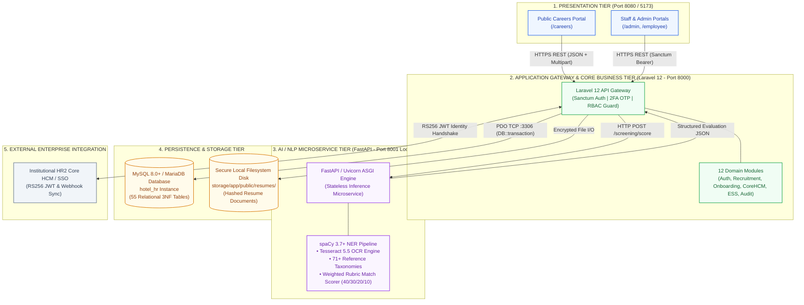
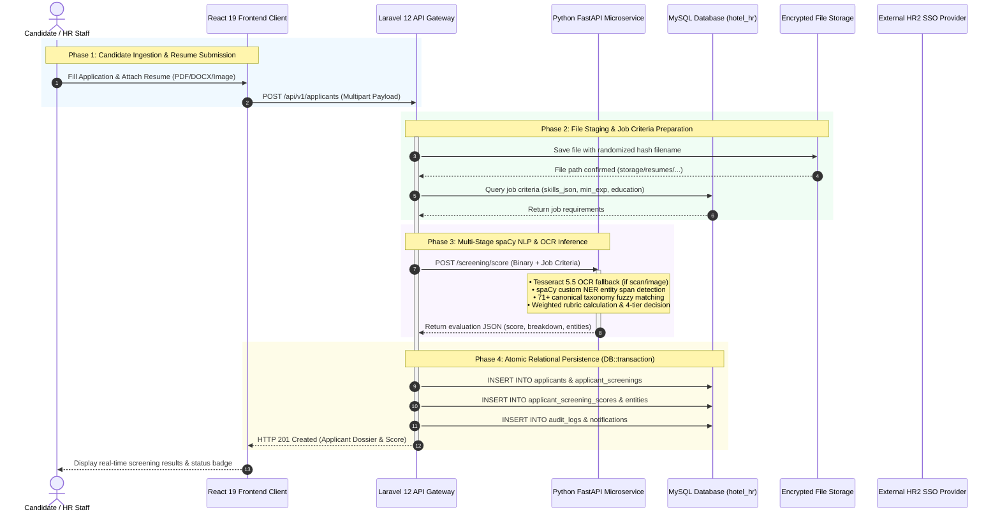

# APPENDICES A & B: TECHNICAL MANUSCRIPT & DEFENSE DOCUMENTATION

**Capstone Title:**  
*Design and Development of Recruitment Management in Hotels and Restaurants using spaCy-based Natural Language Processing (NLP) for Role-Specific Applicant Screening using Named Entity Recognition (NER)*

**Database Instance:** `hotel_hr` (MySQL 8.0+ / MariaDB 10.4.27+ InnoDB, `utf8mb4_unicode_ci`, 55 Relational Tables)  
**Backend Framework:** Laravel 12 Modular Monolith (`nwidart/laravel-modules` across 12 Domain Modules)  
**AI / NLP Microservice:** Python 3.10+ / FastAPI / Uvicorn / spaCy 3.7+ (`en_core_web_sm` + Custom Hospitality NER)  
**Presentation Client:** React 19 / TypeScript 5.8 / TanStack Start & Router / Tailwind CSS v4  

---

## TABLE OF CONTENTS
- [APPENDIX A.1: System Architecture](#appendix-a1-system-architecture)
  - [1. Architectural Model & Paradigm](#1-architectural-model--paradigm)
  - [2. Tier Breakdown & Technology Stack](#2-tier-breakdown--technology-stack)
  - [3. Modular Domain Architecture (Laravel 12)](#3-modular-domain-architecture-laravel-12)
- [APPENDIX A.2: Information Systems Integration](#appendix-a2-information-systems-integration)
  - [1. Integration Interaction & Data Flow Diagram](#1-integration-interaction--data-flow-diagram)
  - [2. Subsystem Interface Protocols & Contracts](#2-subsystem-interface-protocols--contracts)
  - [3. Enterprise HR2 Single Sign-On (SSO) & JWT Federation](#3-enterprise-hr2-single-sign-on-sso--jwt-federation)
- [APPENDIX A.4: Database Schema and Data Management](#appendix-a4-database-schema-and-data-management)
  - [1. Database Definition & 3NF Normalization Principles](#1-database-definition--3nf-normalization-principles)
  - [2. Enterprise Entity-Relationship Diagrams (ERD)](#2-enterprise-entity-relationship-diagrams-erd)
  - [3. Core Domain Data Dictionaries (Key System Entities)](#3-core-domain-data-dictionaries-key-system-entities)
  - [4. Data Integrity, Foreign Key Cascading & Indexing Strategies](#4-data-integrity-foreign-key-cascading--indexing-strategies)
- [APPENDIX A.7: Security Measures](#appendix-a7-security-measures)
  - [1. Authentication, Session & Two-Factor OTP Security](#1-authentication-session--two-factor-otp-security)
  - [2. Role-Based Access Control (RBAC) & Authorization Matrix](#2-role-based-access-control-rbac--authorization-matrix)
  - [3. Threat Mitigation, Cryptographic Safeguards & RA 10173 Compliance](#3-threat-mitigation-cryptographic-safeguards--ra-10173-compliance)
  - [4. Universal Observability & Immutable Audit Logging](#4-universal-observability--immutable-audit-logging)
- [APPENDIX B: Oral Defense Q&A Preparation & Panel Guidelines](#appendix-b-oral-defense-qa-preparation--panel-guidelines)
  - [Core Defense Questions & Exemplary Responses (Q1 - Q8)](#core-defense-questions--exemplary-responses)

---

# APPENDIX A.1: System Architecture

### 1. Architectural Model & Paradigm
The system is constructed based on a **Decoupled Multi-Tier Service-Oriented Architecture (SOA)** with modular monolith characteristics on the core backend and a dedicated microservice for compute-intensive natural language processing.



### 2. Tier Breakdown & Technology Stack

| Layer / Architectural Tier | Technology & Runtime | System Port / Protocol | Primary Responsibilities & Operations |
| :--- | :--- | :--- | :--- |
| **Presentation Tier** | React 19, TypeScript 5.8, TanStack Start/Router, TanStack Query, Tailwind CSS v4, Lucide React, Axios | TCP 8080 / 5173<br>(HTTPS / REST) | Client interface rendering, dynamic applicant review pipelines, score breakdown visualizations, multi-format resume viewing, and interactive chatbot interface. |
| **Application Gateway & Business Logic Tier** | PHP 8.2+, Laravel 12, `nwidart/laravel-modules`, Eloquent ORM, Sanctum | TCP 8000<br>(HTTP/REST) | API gateway routing, Sanctum token authentication, 2FA OTP verification, RBAC authorization, business workflow execution, file management, and audit logging. |
| **AI & NLP Microservice Tier** | Python 3.10+, FastAPI, Uvicorn ASGI, spaCy 3.7+, Tesseract 5.5 OCR, pdfplumber, python-docx | TCP 8001<br>(Internal HTTP Loopback) | Multi-format document text extraction, OCR image processing, spaCy named entity recognition (NER), qualification matching against job baselines, and 4-tier status scoring. |
| **Persistence & Relational Data Tier** | MySQL 8.0+ / MariaDB 10.4.27+, InnoDB Storage Engine | TCP 3306<br>(MySQL Native Socket) | ACID transactional persistence, 55 relational tables in 3NF, foreign key integrity constraints, composite B-Tree query indexing, and JSON document validation. |
| **Encrypted Storage Tier** | Linux / Windows Local Filesystem Storage (`storage/app/public/resumes/`) | File I/O Stream<br>(Local OS Disk) | Secure storage of uploaded candidate resumes and employee 201 compliance documents using randomized unique SHA/UUID file naming. |

### 3. Modular Domain Architecture (Laravel 12)
The backend encapsulates 12 isolated business domains managed under `Modules/`:
1. **`Auth`**: Sanctum token issuance, credential verification, 2FA email OTP generation/validation, password resets, and HR2 SSO handshake.
2. **`UserManagement`**: Administrator accounts, role assignments (`system_roles`), and user access control.
3. **`RecruitmentManagement`**: Manpower requisitions (`requisitions`), job postings (`job_posts`), and multi-platform publishing (`job_post_platforms`).
4. **`ApplicantManagement`**: Candidate applications (`applicants`), interview scheduling (`interviews`), interview rubrics (`applicant_assessments`), and resume screening coordination.
5. **`NewHireOnboarding`**: Pre-employment transitions (`new_hires`), onboarding checklist templates (`onboarding_checklist_templates`), and task verification (`employee_onboarding_items`).
6. **`CoreHCM`**: Department hierarchy (`departments`), position catalog (`positions`), and compensation salary grades (`salary_grades`).
7. **`EmployeeRecords`**: Complete 201 dossiers (`employees`), emergency contacts, uploaded credentials (`employee_documents`), career history, and exit records.
8. **`EmployeeSelfService`**: Employee service requests (`ess_requests`), category routing (`ess_categories`), leave balances (`leave_balances`), and FAQ knowledge base (`chatbot_faqs`).
9. **`AuditLog`**: Centralized event observer capturing user mutations, forensic telemetry, and login activity.
10. **`Settings`**: System key-value configurations, email SMTP triggers, and threshold controls (`system_settings`).
11. **`Landing`**: Public hotel career portal APIs, job listings, and applicant self-service intake.
12. **`Profile`**: Staff profile management and avatar/password updates.

---

# APPENDIX A.2: Information Systems Integration

### 1. Integration Interaction & Data Flow Diagram
The system implements a synchronized, secure inter-tier data pipeline bridging user actions on the frontend, business validation in Laravel, machine learning inference in FastAPI, and ACID transactional persistence in MySQL.



### 2. Subsystem Interface Protocols & Contracts

#### A. Frontend (React) ↔ Gateway (Laravel)
- **Protocol**: HTTPS REST API (`/api/v1/*`).
- **Authorization**: `Authorization: Bearer <Sanctum_Token>` attached automatically via Axios interceptors.
- **Envelope Standard**: Standardized JSON envelopes:
  ```json
  {
    "success": true,
    "message": "Applicant screened and registered successfully.",
    "data": {
      "applicant_id": 48,
      "applicant_code": "APL-01070",
      "fit_score": 92.50,
      "status": "fit",
      "stage": "Screened"
    }
  }
  ```

#### B. Gateway (Laravel) ↔ AI Inference Microservice (FastAPI)
- **Protocol**: Internal loopback HTTP socket (`http://127.0.0.1:8001`).
- **Resilience & Timeout Guard**: 120-second timeout guard (`Http::timeout(120)->attach(...)`). If the AI microservice is temporarily offline, the gateway catches the connection exception, logs a warning in `applicant_screenings.error_message`, and marks `processing_status = 'PENDING'` without interrupting applicant submission.
- **Primary Endpoints**:
  - `GET /health`: Microservice liveness and spaCy model status probe.
  - `POST /extract-resume`: Fast pre-parsing for form autofill during candidate registration.
  - `POST /screening/score`: Full multi-criteria weighted scoring and 4-tier classification.

### 3. Enterprise HR2 Single Sign-On (SSO) & JWT Federation
- **Federated Authentication Flow**:
  1. Internal hotel staff authenticate at the institutional HR2 Core HCM Single Sign-On portal.
  2. The HR2 Identity Provider issues an RS256-signed JSON Web Token (JWT) containing employee claims (`employee_code`, `email`, `department`, `role`).
  3. The React client transmits the token to Laravel Gateway at `POST /api/v1/auth/sso-login`.
  4. Laravel validates the RS256 signature using the HR2 public key, reconciles the user in `system_users`, updates department/role permissions, and issues a native Laravel Sanctum token for session continuity.
  5. When an applicant transitions to `Hired` in `NewHireOnboarding`, an automated outbound webhook synchronizes the completed employee dossier with the institutional HR2 database.

---

# APPENDIX A.4: Database Schema and Data Management

### 1. Database Definition & 3NF Normalization Principles
- **Database Identifier**: `hotel_hr`
- **Engine**: InnoDB Transactional Storage Engine with full ACID support and foreign key constraints.
- **Character Collation**: `utf8mb4_unicode_ci` (supporting multilingual text, diacritics, and 4-byte UTF-8 emoji reactions).
- **Normalization Standards (3NF)**:
  - **1NF**: All table columns contain atomic scalar values. Complex structures (skills arrays, rubric score vectors, validation flags) are stored in standardized JSON columns validated by MySQL `CHECK (json_valid(...))` constraints.
  - **2NF**: No non-key attribute is dependent on a subset of a composite primary key.
  - **3NF**: All non-key fields are strictly dependent on the primary key alone. Lookup entities (`departments`, `positions`, `salary_grades`, `system_roles`, `screening_reference_data`) are fully decoupled into normalized tables.

### 2. Enterprise Entity-Relationship Diagrams (ERD)

```mermaid
erDiagram
    %% Core Organizational Hierarchy
    departments ||--o{ positions : "contains"
    departments ||--o{ employees : "employs"
    departments ||--o{ job_posts : "opens"
    positions ||--o{ employees : "assigns"
    positions ||--o{ job_posts : "specifies"
    salary_grades ||--o{ positions : "grades"
    salary_grades ||--o{ employees : "remunerates"

    %% Employee 201 Personnel Records
    employees ||--o{ employee_emergency_contacts : "has"
    employees ||--o{ employee_documents : "stores"
    employees ||--o{ employee_position_history : "tracks"
    employees ||--o{ employee_exit_records : "terminates"
    employees ||--o{ work_schedules : "scheduled_in"
    employees ||--o{ attendance_records : "logs_dtr"
    employees ||--o{ leave_balances : "owns_quota"
    employees ||--o{ ess_requests : "files"
    employees ||--o{ performance_reviews : "evaluated_in"
    employees ||--o{ employee_learning : "enrolls"
    employees ||--o{ payroll_records : "paid_via"
    employees ||--o{ employee_benefits : "enrolled_in"
    employees ||--o{ system_users : "authenticates"
    employees ||--o{ social_recognitions : "receives"

    %% Talent Acquisition & AI Screening
    job_posts ||--o{ job_post_platforms : "publishes_on"
    job_posts ||--o{ applicants : "receives"
    job_posts ||--o{ applicant_screenings : "evaluates"
    requisitions ||--o{ job_posts : "converts_to"

    applicants ||--o{ applicant_screenings : "undergoes"
    applicants ||--o{ applicant_screening_scores : "scored_in"
    applicants ||--o{ applicant_screening_entities : "contains"
    applicants ||--o{ screening_ground_truths : "benchmarked_in"
    applicants ||--o{ interviews : "scheduled_for"
    applicants ||--o{ applicant_assessments : "graded_in"
    applicants ||--o{ new_hires : "advances_to"

    %% Onboarding & Compliance Workflow
    new_hires ||--o{ employee_onboarding_items : "executes"
    onboarding_checklist_templates ||--o{ onboarding_checklist_items : "defines"
    onboarding_checklist_templates ||--o{ checklist_requests : "instantiates"
    employees ||--o{ checklist_requests : "submits"

    %% Operations, Payroll & Social
    payroll_periods ||--o{ payroll_records : "computes"
    payroll_records ||--o{ payroll_items : "itemizes"
    learning_courses ||--o{ employee_learning : "offers"
    social_recognitions ||--o{ recognition_reactions : "reacted_with"
    ess_categories ||--o{ ess_requests : "categorizes"

    %% Security, Access Control & Auditing
    system_roles ||--o{ role_permissions : "grants"
    system_roles ||--o{ system_users : "assigns"
    system_users ||--o{ user_login_activity : "logs_in"
    system_users ||--o{ audit_logs : "generates"
    system_users ||--o{ notifications : "receives"
    system_users ||--o{ system_settings : "configures"
    system_users ||--o{ announcements : "publishes"
```



### 3. Core Domain Data Dictionaries (Key System Entities)

#### Table: `applicants`
Central candidate registry capturing demographic information, application channel, resume storage paths, and current pipeline stages.
| Column | Data Type | Modifiers / Constraints | Description & Business Purpose |
| :--- | :--- | :--- | :--- |
| `applicant_id` | BIGINT(20) UNSIGNED | PRIMARY KEY, AUTO_INCREMENT | Unique surrogate identifier for candidate record. |
| `applicant_code` | VARCHAR(40) | UNIQUE, NOT NULL | Human-readable tracking code (e.g., `APP-1032`, `APL-01055`). |
| `job_post_id` | BIGINT(20) UNSIGNED | FOREIGN KEY &rarr; `job_posts.job_post_id` | Target vacancy identifier (`ON DELETE RESTRICT`). |
| `name` | VARCHAR(160) | NOT NULL | Candidate full name extracted or submitted. |
| `email` | VARCHAR(190) | NOT NULL | Primary contact email address. |
| `phone` | VARCHAR(40) | NULLABLE | Contact telephone / mobile number. |
| `applied_at` | TIMESTAMP | DEFAULT CURRENT_TIMESTAMP | Application submission timestamp. |
| `fit_score` | DECIMAL(5,2) | NULLABLE | Composite qualification score (0.00% to 100.00%). |
| `status` | VARCHAR(30) | NOT NULL | Screening outcome: `fit`, `credential`, `other-role`, `not-fit`. |
| `stage` | VARCHAR(40) | NOT NULL | Pipeline stage: `Screened`, `Interview Scheduled`, `Offer`, `Accepted`, `Hired`, `Rejected`. |
| `source` | VARCHAR(60) | NULLABLE | Ingestion channel: `Online Portal`, `Walk-in`, `Indeed`, `Referral`. |
| `resume_file_path` | TEXT | NULLABLE | Relative disk path to stored resume file. |
| `resume_original_name`| VARCHAR(255) | NULLABLE | Original client filename prior to hashing. |
| `summary` | TEXT | NULLABLE | High-level candidate qualification overview. |
| `flags_json` | LONGTEXT | `CHECK (json_valid(flags_json))` | Extracted warnings (e.g., missing credentials, alternative role hints). |

#### Table: `applicant_screenings`
Maintains full forensic logs of spaCy NLP parsing executions, entity breakdowns, and classification reasoning.
| Column | Data Type | Modifiers / Constraints | Description & Business Purpose |
| :--- | :--- | :--- | :--- |
| `screening_id` | BIGINT(20) UNSIGNED | PRIMARY KEY, AUTO_INCREMENT | Unique screening execution identifier. |
| `applicant_id` | BIGINT(20) UNSIGNED | FOREIGN KEY &rarr; `applicants.applicant_id` | Associated candidate record (`ON DELETE CASCADE`). |
| `job_post_id` | BIGINT(20) UNSIGNED | FOREIGN KEY &rarr; `job_posts.job_post_id` | Target job baseline criteria used for evaluation. |
| `processing_status`| VARCHAR(30) | DEFAULT 'PENDING' | Execution state: `PENDING`, `PROCESSED`, `PARTIALLY_PROCESSED`, `FAILED`. |
| `screening_result` | VARCHAR(30) | NULLABLE | 4-tier decision: `fit`, `credential`, `other-role`, `not-fit`. |
| `match_score` | DECIMAL(5,2) | NULLABLE | Total weighted qualification score percentage. |
| `score_breakdown_json` | LONGTEXT | `CHECK (json_valid(...))` | Component breakdown (skills, experience, education, certifications). |
| `profile_json` | LONGTEXT | NULLABLE | Candidate parsed profile structure. |
| `entities_json` | LONGTEXT | NULLABLE | Array of all named entity spans detected by spaCy. |
| `missing_information_json` | LONGTEXT | NULLABLE | Missing essential contact or credential fields. |
| `validation_json` | LONGTEXT | NULLABLE | Rule-based verification notes and credential audits. |
| `alternative_job_json` | LONGTEXT | NULLABLE | Candidate scores evaluated across other open vacancies. |
| `reasons_json` | LONGTEXT | NULLABLE | Natural language explanations justifying the score. |
| `model_info_json` | LONGTEXT | NULLABLE | Model version (`en_core_web_sm` + custom NER model path). |
| `error_message` | TEXT | NULLABLE | Diagnostic exception message if inference failed. |
| `processed_at` | TIMESTAMP | NULLABLE | Timestamp of completed NLP inference run. |

#### Table: `job_posts`
Published job vacancies containing criteria vectors for NLP qualification matching.
| Column | Data Type | Modifiers / Constraints | Description & Business Purpose |
| :--- | :--- | :--- | :--- |
| `job_post_id` | BIGINT(20) UNSIGNED | PRIMARY KEY, AUTO_INCREMENT | Unique job posting identifier. |
| `slug` | VARCHAR(120) | UNIQUE, NOT NULL | SEO-friendly URL slug for public careers portal. |
| `title` | VARCHAR(150) | NOT NULL | Job vacancy title (e.g., *Front Desk Receptionist*, *Bartender*). |
| `department_id` | BIGINT(20) UNSIGNED | FOREIGN KEY &rarr; `departments` | Associated hotel operational department. |
| `position_id` | BIGINT(20) UNSIGNED | FOREIGN KEY &rarr; `positions` | Associated organizational job position. |
| `employment_type`| VARCHAR(30) | NOT NULL | Employment tenure: `Full-time`, `Part-time`, `Contractual`. |
| `salary_min` / `salary_max` | DECIMAL(12,2) | NULLABLE | Target compensation range for the vacancy. |
| `vacancies` | INT(11) | DEFAULT 1 | Authorized open headcounts. |
| `filled_count` | INT(11) | DEFAULT 0 | Count of candidates advanced to `Hired`. |
| `skills_json` | LONGTEXT | `CHECK (json_valid(...))` | Array of required and preferred technical hospitality skills. |
| `qualifications_json`| LONGTEXT | `CHECK (json_valid(...))` | Structured minimum requirements (experience years, education). |
| `status` | VARCHAR(20) | NOT NULL | Vacancy lifecycle state: `published`, `draft`, `closed`. |
| `active` | TINYINT(1) | DEFAULT 1 | Active listing flag for career portal visibility. |

#### Table: `employees`
Central employee 201 dossier storing demographic data, statutory IDs, and organization placement.
| Column | Data Type | Modifiers / Constraints | Description & Business Purpose |
| :--- | :--- | :--- | :--- |
| `employee_id` | BIGINT(20) UNSIGNED | PRIMARY KEY, AUTO_INCREMENT | Unique surrogate identifier for employee 201 record. |
| `employee_code` | VARCHAR(40) | UNIQUE, NOT NULL | Standardized company badge number (e.g., `EMP-00104`). |
| `first_name` / `last_name` | VARCHAR(80) | NOT NULL | Employee official legal name. |
| `email` | VARCHAR(190) | UNIQUE, NOT NULL | Official corporate email address. |
| `sss_number` / `tin_number` | VARCHAR(30) | NULLABLE | Statutory government IDs (SSS, TIN, PhilHealth, Pag-IBIG). |
| `position_id` | BIGINT(20) UNSIGNED | FOREIGN KEY &rarr; `positions` | Current job position assignment (`ON DELETE RESTRICT`). |
| `department_id` | BIGINT(20) UNSIGNED | FOREIGN KEY &rarr; `departments` | Current operational department assignment. |
| `salary_grade_id`| BIGINT(20) UNSIGNED | FOREIGN KEY &rarr; `salary_grades` | Compensation grade band assignment. |
| `date_hired` | DATE | NOT NULL | Official date of employment commencement. |
| `status` | VARCHAR(30) | NOT NULL | Employment status: `Regular`, `Probationary`, `Contractual`. |
| `onboarding_complete` | TINYINT(1) | DEFAULT 0 | Pre-employment compliance checklist completion flag. |

#### Table: `system_users` & `system_roles`
Governs administrative accounts, encrypted credentials, 2FA states, and RBAC role assignments.
| Column | Data Type | Modifiers / Constraints | Description & Business Purpose |
| :--- | :--- | :--- | :--- |
| `system_user_id`| BIGINT(20) UNSIGNED | PRIMARY KEY, AUTO_INCREMENT | Unique user account identifier. |
| `username` | VARCHAR(100) | UNIQUE, NOT NULL | Account login username. |
| `email` | VARCHAR(190) | UNIQUE, NOT NULL | User email address for notifications and 2FA OTPs. |
| `password_hash` | VARCHAR(255) | NOT NULL | Bcrypt-hashed password ($	ext{cost factor} \ge 12$). |
| `employee_id` | BIGINT(20) UNSIGNED | FOREIGN KEY &rarr; `employees` | Link to internal employee 201 dossier (`ON DELETE RESTRICT`). |
| `role_id` | BIGINT(20) UNSIGNED | FOREIGN KEY &rarr; `system_roles` | Security role assignment (`ON DELETE RESTRICT`). |
| `otp_enabled` | TINYINT(1) | DEFAULT 1 | Enforces mandatory 6-digit email OTP verification. |
| `status` | VARCHAR(20) | NOT NULL | Account status: `active`, `inactive`, `suspended`. |
| `last_login_at` | TIMESTAMP | NULLABLE | Timestamp of most recent successful authentication. |
| `last_login_ip` | VARCHAR(45) | NULLABLE | IPv4/IPv6 address of last login event. |

### 4. Data Integrity, Foreign Key Cascading & Indexing Strategies
- **Cascading Policies**:
  - `ON DELETE RESTRICT`: Protects foundational entities (`departments`, `positions`, `salary_grades`, `employees`, `job_posts`) from accidental deletion when operational transactions reference them.
  - `ON DELETE CASCADE`: Automatically cleans child records (`applicant_screenings`, `applicant_screening_entities`, `attendance_records`, `leave_balances`, `payroll_items`, `role_permissions`) when parent entities are removed.
  - `ON DELETE SET NULL`: Applied to non-critical user references (`audit_logs.system_user_id`, `social_recognitions.recipient_employee_id`) to preserve audit history even if accounts are purged.
- **Indexing Architecture**: Composite B-Tree indexes on high-frequency operational paths (`applicants.job_post_id + stage`, `attendance_records.employee_id + date`, `audit_logs.occurred_at + severity`) guarantee sub-50ms query response times under heavy concurrent operations.

---

# APPENDIX A.7: Security Measures

### 1. Authentication, Session & Two-Factor OTP Security
1. **Stateless API Bearer Token Authentication (Laravel Sanctum)**:
   - Client requests carry cryptographically secure SHA-256 hashed personal access tokens (`personal_access_tokens`).
   - Tokens are validated upon every incoming request through Sanctum authentication middleware before request execution.
2. **Two-Factor Authentication (2FA / Email OTP)**:
   - Mandatory secondary verification for administrative users.
   - Generates a cryptographically random, 6-digit numeric OTP with a 300-second (5-minute) Time-to-Live (TTL).
   - Delivery is executed over secure SMTP (`2525`/`587`), and failed OTP entry is rate-limited (maximum 5 attempts before temporary account cooldown).
3. **Session Termination & Token Invalidation**:
   - Explicit user logout immediately purges the active token from `personal_access_tokens`, preventing replay or session hijacking.

### 2. Role-Based Access Control (RBAC) & Authorization Matrix
- **Granular Privilege Verification**: The authorization framework separates users into distinct system roles (`system_roles`): *Super Admin*, *HR Admin*, *HR Staff*, *Department Head*, *Employee*.
- **Permission Matrix**: Mapped via `role_permissions` (`role_id`, `module_name`, `permission_level`: `none`, `read`, `write`, `admin`).
- **Middleware Guard**: Every protected route executes `PermissionMiddleware`, performing constant-time $O(1)$ lookup checks verifying user privileges before controller invocation.
- **Protected System Roles**: Foundational administrative roles have `is_protected = 1` and `is_super_admin = 1` flags enabled in the database, preventing privilege escalation or accidental deletion by standard administrators.

### 3. Threat Mitigation, Cryptographic Safeguards & RA 10173 Compliance

| Security Dimension | Threat Vector | System-Specific Mitigation & Architectural Defense |
| :--- | :--- | :--- |
| **Data Layer** | SQL Injection (SQLi) | Strict enforcement of Eloquent ORM and PDO prepared statements with parameter binding. Raw query string concatenations are strictly forbidden. JSON schema constraints validate document structures. |
| **Client Layer** | Cross-Site Scripting (XSS) | React 19 automated JSX contextual string escaping, strict input sanitization via Laravel Form Requests, and Content Security Policy (CSP) headers. |
| **API Gateway** | Cross-Site Request Forgery (CSRF) & Unauthorized CORS | Stateless token architecture immune to browser cookie CSRF; strict CORS origin white-listing (`CORS_ALLOWED_ORIGINS`) restricted to authorized frontend domains. |
| **File Ingestion & Parsing** | Malicious File Uploads / Remote Code Execution (RCE) | Strict multi-layer MIME-type verification (`application/pdf`, `application/vnd.openxmlformats-officedocument.wordprocessingml.document`, `image/png`, `image/jpeg`), 10MB file size ceiling, and randomized unique filename generation (e.g. `uQMocQfpx2nSlMO6oXThxQGf7HMS7KgGvf2257pJ.pdf`) stored in non-web-executable directories. |
| **Credential Security** | Password & Token Compromise | Passwords hashed using Bcrypt ($	ext{work factor} \ge 12$). Sanctum API tokens stored as SHA-256 hashes. Automated security notifications dispatched when logins originate from unfamiliar IP addresses. |
| **Data Privacy & Statutory Compliance** | Unauthorized PII Disclosure / RA 10173 Violations | Full compliance with **Philippine Republic Act No. 10173 (Data Privacy Act of 2012)**: Role-gated PII access (government statutory IDs SSS, TIN, PhilHealth, Pag-IBIG), AES-256 storage encryption, and automated 12-month applicant record anonymization. |

### 4. Universal Observability & Immutable Audit Logging
- **Immutable Transaction Logs (`audit_logs`)**: Every critical state change (applicant status advancement, salary adjustment, user credential modification, role assignment) triggers an automated database observer.
- **Audit Schema Attributes**: Captures `system_user_id`, `actor_role`, `actor_department`, `occurred_at`, `action`, `module_name`, `target_type`, `target_id`, `details` (serialized JSON of previous and new state), `severity` (`info`, `warning`, `critical`), `ip_address`, `device_info`, and `url`.
- **Authentication Forensics (`user_login_activity`)**: Captures timestamped login attempts, source IP addresses, user agent signatures, and authentication outcomes (`success`, `failed_password`, `failed_otp`).

---

# APPENDIX B: Oral Defense Q&A Preparation & Panel Guidelines

### 💡 Core Defense Questions & Exemplary Responses

#### Q1: "Why did you separate the NLP engine into a Python FastAPI microservice instead of running it natively inside Laravel?"
> **Answer**:  
> *"PHP and Laravel excel at I/O-bound web request orchestration, database transactional integrity, authentication, and CRUD business logic. However, machine learning and Natural Language Processing rely heavily on Python's scientific ecosystem—specifically spaCy's optimized C-extensions, token embeddings, and Tesseract OCR libraries. By decoupling the AI engine into an asynchronous FastAPI microservice bound to local loopback (Port 8001), compute-intensive resume parsing and entity extraction run independently without blocking Laravel's PHP-FPM worker pool, preventing web UI latency for other concurrent hotel staff."*

#### Q2: "How does the spaCy-based screening engine compute the qualification match score, and what are the 4 classification categories?"
> **Answer**:  
> *"The screening pipeline uses a multi-factor weighted rubric scoring algorithm:*  
> *1. **Skills Match (40% Weight)**: Compares extracted candidate skills against required and preferred job skills using fuzzy taxonomic mapping against 71+ canonical hospitality terms (`screening_reference_data`).*  
> *2. **Experience Match (30% Weight)**: Evaluates estimated years of relevant work experience extracted from detected job titles and employment tenures against minimum job requirements.*  
> *3. **Education Match (20% Weight)**: Matches highest detected educational attainment against the job's minimum education baseline (e.g., Bachelor's Degree, Vocational / TESDA).*  
> *4. **Certification Match (10% Weight)**: Verifies presence of mandatory hospitality credentials (e.g., TESDA NC II, Food Safety).*  
>  
> *Based on the resulting score and entity validations, the system classifies applicants into four deterministic categories:*  
> *• **`fit`**: Score $\ge 75.0\%$ with all core requirements and certifications satisfied.*  
> *• **`credential`**: Discrepancies detected in mandatory credentials or missing critical contact details (email/phone).*  
> *• **`other-role`**: Applicant does not meet the applied vacancy baseline ($< 75.0\%$) but scores high ($\ge 75.0\%$) against another currently open hotel vacancy.*  
> *• **`not-fit`**: Applicant score falls below baseline ($< 75.0\%$) with no eligible cross-job matches."*

#### Q3: "How does your system handle non-selectable, scanned image resumes or poorly formatted PDFs?"
> **Answer**:  
> *"The FastAPI microservice incorporates a resilient multi-format ingestion pipeline. When a document is received, it first attempts direct text layer extraction using `pdfplumber` and `python-docx`. If the document is an image (PNG, JPG) or a scanned PDF with insufficient character density, it automatically triggers a Tesseract 5.5 OCR fallback pipeline with adaptive binarization and noise reduction before passing the normalized text to the spaCy NER pipeline."*

#### Q4: "How does the system ensure compliance with Philippine Data Privacy laws (RA 10173)?"
> **Answer**:  
> *"The architecture enforces three key statutory safeguards under RA 10173:*  
> *1. **Role-Based Access Control (RBAC)**: Personal Identifiable Information (PII) such as government statutory IDs (SSS, TIN, PhilHealth, Pag-IBIG) and contact numbers are restricted to authorized HR personnel.*  
> *2. **Storage Protection**: Uploaded resume files and verification certificates are stored in non-public directories using randomized unique SHA hashes, with access gated through authenticated Laravel API endpoints.*  
> *3. **Automated Anonymization & Retention**: Unsuccessful applicant dossiers older than 12 months are subject to automated soft-deletion, stripping PII contact details while preserving anonymized screening score statistics for NLP model performance benchmarking."*

#### Q5: "How does the system maintain data integrity when saving screening results across multiple tables?"
> **Answer**:  
> *"All multi-table insert and update operations—persisting records across `applicants`, `applicant_screenings`, `applicant_screening_scores`, `applicant_screening_entities`, `audit_logs`, and `notifications`—are wrapped inside atomic database transactions (`DB::transaction`). If any step encounters an error, the entire database transaction is rolled back automatically, preventing orphaned or partially written candidate records."*

#### Q6: "What happens if the AI microservice crashes or is temporarily unreachable?"
> **Answer**:  
> *"The Laravel API Gateway wraps all microservice calls inside a 120-second timeout guard with explicit connection exception handling. If the AI service is unreachable, the candidate application is safely persisted with status `PENDING` and a diagnostic error logged in `applicant_screenings.error_message`. This prevents UI disruption for applicants or HR staff, and the intake queue can be automatically reprocessed once the microservice restarts."*

#### Q7: "How is the 3NF relational database structured to handle the entire hotel HR workflow?"
> **Answer**:  
> *"The `hotel_hr` database contains 55 relational tables partitioned into 11 specialized functional domains—spanning Authentication, Organizational Hierarchy, Recruitment, AI Screening, Onboarding, Attendance/DTR, Employee Self-Service, Performance Reviews, L&D, Payroll, and Infrastructure. All master entities enforce `ON DELETE RESTRICT` to prevent orphaned references, child records enforce `ON DELETE CASCADE` to prevent data bloat, and composite B-Tree indexes optimize high-frequency query paths."*

#### Q8: "How does Single Sign-On (SSO) integration work with existing hotel enterprise systems?"
> **Answer**:  
> *"The HRMS supports federated identity integration via signed JSON Web Tokens (JWT). When authenticated hotel employees access the HRMS from an enterprise portal (such as HR2 Core HCM), Laravel's `/api/v1/auth/sso-login` endpoint validates the RS256 signature, matches the employee record, reconciles role permissions, and issues a native Laravel Sanctum token for secure API access."*
