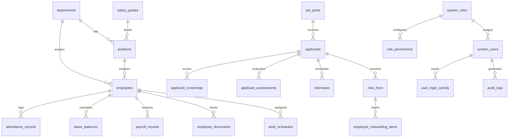

# Oxford Suites Makati HRMS — Complete System Documentation

A full-stack Human Resource Management System (HRMS) covering the complete employee lifecycle—from public careers, intelligent chatbot assistance, and automated AI candidate screening to recruitment pipelines, new-hire onboarding, core workforce management, and Employee Self-Service (ESS).

---

## 1. System Overview & Technology Stack

```
┌────────────────────────────────────────────────────────────────────────┐
│                              CLIENT TIER                               │
│  React 19 + TypeScript + TanStack Start (SSR/Router) + Tailwind CSS 4  │
│  • Public Careers & Chatbot       • Admin & Recruitment Portal         │
│  • Super Admin System Hub         • Employee Self-Service (ESS)        │
└───────────────────────────────────┬────────────────────────────────────┘
                                    │ HTTP / JSON REST APIs (v1)
                                    ▼
┌────────────────────────────────────────────────────────────────────────┐
│                            APPLICATION TIER                            │
│           Laravel 12 REST API Gateway (Modular Monolith)               │
│  • Laravel Sanctum Auth + OTP Verification                             │
│  • 12 Dedicated Modular Domains (nwidart/laravel-modules)              │
│  • RBAC & Permission Middleware (Matrix-based authorization)           │
│  • Activity Observers & Comprehensive Audit Trail                      │
└───────────────────┬────────────────────────────────┬───────────────────┘
                    │                                │
      JSON Payload  │                                │ PDO / Eloquent SQL
      Over HTTP     ▼                                ▼
┌───────────────────────────────┐  ┌────────────────────────────────────┐
│      AI / NLP MICROSERVICE    │  │           DATABASE TIER            │
│   Python FastAPI + Uvicorn    │  │       MySQL (hotel_hr schema)      │
│  • spaCy NER Custom Models    │  │ • 35+ Normalized Tables            │
│  • Resume Text Extraction     │  │ • Foreign Key Relational Integrity │
│  • Weighted Candidate Scoring │  │ • JSON-backed metadata & config    │
└───────────────────────────────┘  └────────────────────────────────────┘
```

### Technology Matrix

| Layer | Stack | Key Packages & Libraries |
|---|---|---|
| **Frontend** | **React 19**, **TypeScript 5.8**, **TanStack Start** | `TanStack Router`, `TanStack Query (React Query)`, `Tailwind CSS v4`, `Radix UI / shadcn/ui`, `Recharts`, `Lucide React`, `Sonner`, `Axios` |
| **Backend API** | **Laravel 12** (PHP ^8.2) | `Laravel Sanctum`, `nwidart/laravel-modules`, `spatie/laravel-backup`, `maatwebsite/excel`, `Laravel Notifications / Mail` |
| **AI / NLP Service** | **Python 3.10+**, **FastAPI**, **Uvicorn** | `spaCy` (NER pipelines: `en_core_web_sm` + custom fine-tuned weights), `PyPDF2`, `python-docx`, `pydantic` |
| **Database** | **MySQL 8.0+ / MariaDB** | Character Set: `utf8mb4_unicode_ci`, InnoDB Storage Engine |
| **Security & Auth** | **Sanctum Bearer Auth + 2FA OTP** | 6-digit cryptographic OTP, Bcrypt password hashing (`cost: 12`), IP/User Agent session tracking |

---

## 2. Repository & Workspace Structure

```
hrms-root/
├── frontend/                     # React + TanStack Start Frontend Application
│   ├── src/
│   │   ├── components/           # UI design system (shadcn/radix primitives & widgets)
│   │   │   ├── admin/            # HR Admin screens & widgets
│   │   │   ├── superadmin/       # Super Admin settings & security controls
│   │   │   ├── employee/         # Employee Self-Service (ESS) pages
│   │   │   ├── landing/          # Public careers pages & floating FAQ chatbot
│   │   │   └── ui/               # Shared component library (Button, Modal, Table, etc.)
│   │   ├── routes/               # File-based routing tree (/, /admin, /superadmin, /employee)
│   │   ├── lib/                  # Axios API client, Auth session store, navigation maps
│   │   └── data/                 # Seed models, mock fallbacks, and static options
├── backend-laravel/              # Laravel 12 API Server
│   ├── app/                      # App core (Models, Observers, Mail, Middleware)
│   │   ├── Models/               # Eloquent Models (Employee, SystemUser, AuditLog, etc.)
│   │   ├── Observers/            # Audit observers logging model mutations
│   │   └── Http/Middleware/      # PermissionMiddleware, VerifyCsrf, Sanctum
│   ├── Modules/                  # Domain-Driven Feature Modules
│   │   ├── ApplicantManagement/  # Candidate records, screening pipeline, interviews
│   │   ├── AuditLog/             # System audit logs & query filters
│   │   ├── Auth/                 # Authentication, OTP verification, password resets
│   │   ├── CoreHCM/              # Departments, Positions, Salary Grades, Recommendations
│   │   ├── EmployeeRecords/      # Full employee 360 dossiers & history
│   │   ├── EmployeeSelfService/  # ESS Portal (DTR, Leave, Payroll, Requests, Swaps)
│   │   ├── Landing/              # Public jobs API & Chatbot engine
│   │   ├── NewHireOnboarding/    # Onboarding checklists, requirements, probation
│   │   ├── Profile/              # User profile & credentials management
│   │   ├── RecruitmentManagement/# Job postings & Requisitions
│   │   ├── Settings/             # Global system configurations & DB backups
│   │   └── UserManagement/       # System users, roles & permission matrices
├── nlp-service/                  # Python FastAPI Microservice
│   ├── app/
│   │   ├── main.py               # API Endpoints (/health, /extract-resume, /screening/score)
│   │   ├── config.py             # Score weights, match thresholds, model parameters
│   │   └── services/             # Resume parsing, spaCy NER entity extraction, score evaluator
│   ├── models_spacy/             # Custom fine-tuned spaCy weights
│   └── evaluation_output/        # Accuracy benchmarks & screening test sets
└── database/
    └── hotel_hr_merged(latest).sql # Complete schema definition & seed records
```

---

## 3. Detailed Module Breakdown

### 1. Authentication & Security (`Modules/Auth`)
- **Login with 2FA OTP**: Authenticates users with username/email and password. If OTP is enabled, a secure 6-digit one-time PIN is emailed to the user before granting access.
- **Session & Device Tracking**: Logs IP address, device type, and user-agent on every login attempt (tracked in `user_login_activity`).
- **Password Policies**: Configurable password strength rules (min length, special characters, uppercase, numbers) enforced across all portals.

### 2. Recruitment Management (`Modules/RecruitmentManagement`)
- **Requisitions**: Department heads request headcount openings with budget, target hire date, and justification.
- **Job Postings**: HR creates, publishes, and syndicates job postings linked to departments, positions, and salary grades.
- **Publishing & Syndication**: Tracks publishing channels (Website, LinkedIn, Indeed, JobStreet) and application deadlines.

### 3. Applicant Management & AI Screening (`Modules/ApplicantManagement` + `nlp-service`)
- **Applicant Pipeline**: Tracks candidates through structured hiring stages: `Applied` → `Screening` → `Shortlisted` → `Interview` → `Offered` → `Hired` → `Rejected`.
- **NLP Resume Parser**: Extracts contact details, education, work experience, certifications, and skills from PDF/DOCX resumes.
- **AI Fit Scoring**: Scores candidates against required qualifications, preferred skills, and experience criteria using weighted rules.
- **Assessments & Interviews**: Schedules interview rounds (Initial, Technical, Panel, Final) with integrated assessor scorecards.

### 4. New Hire Onboarding (`Modules/NewHireOnboarding`)
- **Onboarding Templates**: Configurable checklist templates categorized by department and position.
- **Pre-Hire Requirements**: Tracks mandatory submission of pre-employment files (NBI clearance, Medical exam, SSS, PhilHealth, Pag-IBIG, BIR 2316).
- **Probationary Milestones**: Automates 3-month and 5-month probationary evaluations prior to regular employment.

### 5. Core HCM (`Modules/CoreHCM`)
- **Organizational Structure**: Manages company hierarchy across Departments, Positions, and Job Classifications.
- **Salary Grading**: Standardized compensation matrices with minimum, midpoint, and maximum base rates.
- **HR3 Recommendations**: System-generated insights and recommendations on staffing deficits and compensation alignments.

### 6. Employee Records (`Modules/EmployeeRecords`)
- **Employee 360° Dossier**: Comprehensive record containing personal details, government IDs, bank details, and employment history.
- **Document Management**: Secure repository for contracts, certificates, memos, and performance appraisals.
- **Emergency Contacts & Offboarding**: Tracks emergency contacts and handles formal exit interviews, turnover checklists, and clearance certificates.

### 7. Employee Self-Service (ESS) (`Modules/EmployeeSelfService`)
- **Attendance & DTR**: Daily time records, time in/out stamps, biometric synchronization, and overtime logs.
- **Leave Management**: Leave filing, manager approval workflows, and automated balance deduction across Vacation, Sick, and Emergency leaves.
- **Payroll & Payslips**: Digital payslips broken down into basic salary, overtime pay, allowances, and statutory deductions (SSS, PhilHealth, Pag-IBIG, Tax).
- **Shift Swapping & Work Schedules**: Interactive schedule view and peer-to-peer shift swap requests with supervisor approval.
- **Document & Request Center**: Formal requests for Certificates of Employment (COE), Leave of Absence, and official documents.
- **Social Recognition**: Peer recognition board with custom hotel core values and reactions (Claps, Stars, Hearts).

### 8. User Management & RBAC (`Modules/UserManagement`)
- **Role-Based Access Control**: Pre-defined roles (`Super Admin`, `Admin`, `Employee`) with a granular permission matrix (e.g., `Recruitment Management:Edit`, `Audit Logs:View`).
- **Account Control**: Provisioning, suspending, password resets, and role assignments for system users.

### 9. Public Careers & Chatbot (`Modules/Landing`)
- **Public Careers Page**: High-performance landing page displaying open positions, hotel amenities, culture, and online application submission.
- **AI Careers Assistant (Chatbot)**: Intent-driven chatbot answering candidate questions on open roles, qualifications, benefits, and application status.
- **FAQ Knowledge Base**: Admin dashboard to train FAQ pairs; logs unanswered questions for HR review.

### 10. Audit Logs & System Settings (`Modules/AuditLog` & `Modules/Settings`)
- **Audit Trails**: Non-destructive audit logs recording user ID, action type, IP address, changed data, and severity level (`low`, `medium`, `high`, `critical`).
- **System Backups**: Automated and manual database backup management with download and restore functionality.
- **System Configs**: Hotel branding, timezone, notification channels, and UI theme preferences.

---

## 4. API Endpoints Reference

### 🔐 Authentication & Session
| Method | Endpoint | Description |
|---|---|---|
| `POST` | `/api/v1/auth/login` | Initial credentials check; triggers OTP if enabled |
| `POST` | `/api/v1/auth/verify-otp` | Validates 6-digit OTP and returns Sanctum Bearer Token |
| `POST` | `/api/v1/auth/resend-otp` | Re-generates and sends a fresh OTP token |
| `POST` | `/api/v1/auth/logout` | Revokes current Sanctum personal access token |
| `GET`  | `/api/v1/auth/me` | Fetches authenticated user identity and permissions |

### 📢 Recruitment & Job Posts
| Method | Endpoint | Description |
|---|---|---|
| `GET`  | `/api/v1/job-posts` | List job posts with search, department, and status filters |
| `POST` | `/api/v1/job-posts` | Create a new job vacancy posting |
| `GET`  | `/api/v1/job-posts/{id}` | Retrieve specific job post details |
| `PUT`  | `/api/v1/job-posts/{id}` | Update existing job post requirements |
| `PATCH`| `/api/v1/job-posts/{id}/toggle` | Toggle active/closed status |
| `GET`  | `/api/v1/requisitions` | List staff requisition requests |
| `POST` | `/api/v1/requisitions` | Submit a new staff requisition |
| `POST` | `/api/v1/requisitions/{id}/convert` | Convert an approved requisition to a live job post |

### 👥 Applicants & AI Screening
| Method | Endpoint | Description |
|---|---|---|
| `GET`  | `/api/v1/applicants` | List applicants with stage, job post, and fit-score filters |
| `POST` | `/api/v1/applicants` | Submit a candidate application (Public/Internal) |
| `GET`  | `/api/v1/applicants/{id}` | Get full applicant profile, screening score, and resume details |
| `POST` | `/api/v1/applicants/{id}/screen` | Triggers NLP microservice to analyze resume and generate fit score |
| `PATCH`| `/api/v1/applicants/{id}/stage` | Transition applicant stage (`Interview`, `Offer`, `Hired`, etc.) |
| `POST` | `/api/v1/interviews` | Schedule an interview for an applicant |
| `POST` | `/api/v1/interviews/{id}/evaluate` | Submit interview assessment scores and feedback |

### 🤖 NLP Screening Microservice (Python FastAPI)
| Method | Endpoint | Description |
|---|---|---|
| `GET`  | `/health` | Service health status, model metadata, and scoring weights |
| `POST` | `/extract-resume` | Multipart file upload; extracts text, contact info, and skills |
| `POST` | `/screening/score` | Calculates qualification match score (%) against job post criteria |
| `POST` | `/ner/extract-entities` | Raw spaCy entity extraction on provided text |

### 📋 New Hire Onboarding
| Method | Endpoint | Description |
|---|---|---|
| `GET`  | `/api/v1/new-hires` | List new hire candidates in onboarding |
| `POST` | `/api/v1/new-hires` | Create new hire onboarding record from an accepted applicant |
| `GET`  | `/api/v1/onboarding/templates` | List onboarding checklist templates |
| `PATCH`| `/api/v1/onboarding/items/{id}/status` | Mark onboarding task (e.g. ID badge, NBI Clearance) as complete |
| `POST` | `/api/v1/new-hires/{id}/convert-to-employee`| Promotes completed onboardee to official `employees` record |

### 🏢 Core HCM & Employee Records
| Method | Endpoint | Description |
|---|---|---|
| `GET`  | `/api/v1/departments` | List all hotel operational departments |
| `GET`  | `/api/v1/positions` | List positions with salary grade mappings |
| `GET`  | `/api/v1/salary-grades` | List compensation bands |
| `GET`  | `/api/v1/employees` | List employees with filtering and pagination |
| `POST` | `/api/v1/employees` | Create a new employee record |
| `GET`  | `/api/v1/employees/{id}` | Get complete 360° employee file |
| `PUT`  | `/api/v1/employees/{id}` | Update employee personal/work details |
| `GET`  | `/api/v1/employees/{id}/documents` | Retrieve uploaded employee records & contracts |

### 📱 Employee Self-Service (ESS)
| Method | Endpoint | Description |
|---|---|---|
| `GET`  | `/api/v1/ess/attendance` | Fetch personal Daily Time Record (DTR) entries |
| `POST` | `/api/v1/ess/attendance/clock` | Clock In / Clock Out action |
| `GET`  | `/api/v1/ess/leaves` | List filed leave applications and leave balances |
| `POST` | `/api/v1/ess/leaves` | File a new leave request (Vacation, Sick, etc.) |
| `GET`  | `/api/v1/ess/payroll` | Fetch historical payslips for the authenticated employee |
| `GET`  | `/api/v1/ess/schedules` | Fetch assigned weekly work shifts |
| `POST` | `/api/v1/ess/shift-swaps` | Propose a shift swap to another colleague |
| `POST` | `/api/v1/ess/recognitions` | Send kudos/social recognition to a coworker |

### 💬 Chatbot & FAQs
| Method | Endpoint | Description |
|---|---|---|
| `POST` | `/api/v1/chatbot/query` | Send user message to chatbot; returns AI/FAQ response |
| `GET`  | `/api/v1/chatbot/faqs` | List admin-managed chatbot FAQ entries |
| `POST` | `/api/v1/chatbot/faqs` | Create/update FAQ question-answer pairs |
| `GET`  | `/api/v1/chatbot/unanswered` | View questions the bot failed to answer |

### 🛡️ System Administration & Audits
| Method | Endpoint | Description |
|---|---|---|
| `GET`  | `/api/v1/users` | List system portal user accounts |
| `POST` | `/api/v1/users` | Create new portal user account with assigned role |
| `GET`  | `/api/v1/roles` | List all system roles and assigned permissions |
| `PUT`  | `/api/v1/roles/{id}/permissions` | Update permission matrix for a role |
| `GET`  | `/api/v1/audit-logs` | Retrieve system-wide audit trail entries |
| `GET`  | `/api/v1/settings/backups` | List database backups |
| `POST` | `/api/v1/settings/backups` | Trigger an immediate manual database backup |

---

## 5. Database Architecture (`hotel_hr_merged(latest).sql`)

The database `hotel_hr` consists of **35+ relational tables** grouped into the following functional domains:



### Table Index & Descriptions

#### A. Authentication, Users & Access Control
1. **`system_roles`**: System role definitions (`Super Admin`, `Admin`, `Employee`) with flags for system protection and super-admin privileges.
2. **`role_permissions`**: Granular role-to-module capability mapping (e.g. `Recruitment Management`, `User Management`, `Full`, `View`, `Edit`).
3. **`system_users`**: Portal accounts containing credentials, email, password hash, role foreign key, 2FA OTP toggle, and status (`Active`, `Suspended`).
4. **`user_login_activity`**: Audit trail of all authentication events, IP addresses, client devices, user-agents, and success/failure statuses.
5. **`personal_access_tokens`**: Laravel Sanctum bearer token storage for API authorization.
6. **`password_reset_tokens`**: Temporary security hashes for password recovery flows.

#### B. Organization Structure & Core HCM
7. **`departments`**: Hotel department definitions (e.g., Front Office, Food & Beverage, Housekeeping, Kitchen / Culinary, Administration / HR).
8. **`positions`**: Job titles mapped to specific departments and associated with standard salary grades.
9. **`salary_grades`**: Compensation tier definitions with minimum, midpoint, and maximum base pay scales.
10. **`employees`**: Central workforce master file (First/Last name, Employee Code, Department ID, Position ID, Salary Grade, Date Hired, Employment Status, SSS, PhilHealth, Pag-IBIG, TIN).
11. **`employee_position_history`**: Historical timeline tracking promotions, department transfers, and title adjustments.
12. **`hr3_recommendations`**: AI/System-generated workforce optimization insights regarding staffing levels and salary adjustments.

#### C. Recruitment & AI Applicant Screening
13. **`requisitions`**: Internal department requests for new headcount, target start dates, and hiring justifications.
14. **`job_posts`**: Public and internal job openings with detailed descriptions, requirements, qualifications, and vacancy limits.
15. **`job_post_platforms`**: External syndication tracking across job search engines (LinkedIn, JobStreet, Indeed).
16. **`applicants`**: Candidate applications linked to a job post, storing contact info, raw resume files, and current pipeline stage.
17. **`applicant_screenings`**: Results from the AI/NLP screening engine (Qualification Score, Extracted Experience, Education Match, Fit Classification).
18. **`applicant_screening_entities`**: Detailed entity extractions identified by the spaCy NER pipeline (Skills, Companies, Certifications).
19. **`applicant_screening_scores`**: Breakdown of scoring sub-components (Skill Match %, Experience Score %, Education Score %).
20. **`screening_reference_data`**: Canonical skill, university, and certification taxonomy with synonym/alias JSON mapping for normalization.
21. **`screening_ground_truths`**: Benchmark ground-truth datasets used to evaluate and train NER screening model accuracy.
22. **`applicant_assessments`**: Evaluator scorecards and rubric ratings recorded during applicant screening.
23. **`interviews`**: Scheduled interview sessions with candidate details, date/time, interviewer ID, meeting link/room, and final feedback.

#### D. Onboarding & Pre-Employment
24. **`new_hires`**: Transition table for accepted applicants progressing into the pre-employment onboarding pipeline.
25. **`onboarding_checklist_templates`**: Master template definitions for departmental onboarding procedures.
26. **`onboarding_checklist_items`**: Tasks within each template (e.g., ID Issuance, Locker Assignment, System Account Setup).
27. **`employee_onboarding_items`**: Per-candidate task tracking with completion timestamps and verifier user IDs.
28. **`checklist_requests`**: Candidate document requests (Medical Exams, NBI clearance, SSS E-1 form) with verification statuses.

#### E. Employee Self-Service (ESS), Time & Payroll
29. **`attendance_records`**: Daily time records (DTR), clock-in/out timestamps, break durations, overtime hours, and attendance flags (Late, Undertime, Present).
30. **`leave_balances`**: Available leave credits per employee by category (Vacation Leave, Sick Leave, Emergency Leave, Maternity/Paternity).
31. **`ess_requests`**: Generic ESS ticket submissions for Certificate of Employment (COE), schedule alterations, or profile changes.
32. **`ess_categories`**: Request catalog taxonomy configuring ESS form types and approval routing.
33. **`payroll_periods`**: Cutoff cycles (e.g., 1st–15th, 16th–End of Month) with payment disbursement dates.
34. **`payroll_records`**: Consolidated payroll registers calculating gross pay, net pay, total deductions, and tax withholdings.
35. **`payroll_items`**: Detailed itemized payslip lines (Basic Pay, Night Differential, Overtime, SSS, PhilHealth, Pag-IBIG, Withholding Tax).
36. **`work_schedules`**: Shift schedules mapped by day of week (AM Shift, Mid Shift, PM Shift, Graveyard, Rest Day).
37. **`social_recognitions`**: Peer-to-peer recognition posts celebrating team achievements based on hotel core values.
38. **`recognition_reactions`**: Reactions (Claps, Hearts, Stars, Fire) given to social recognition feed posts.
39. **`employee_documents`**: Stored employee files (Contracts, 201 Files, Medical Results, Government IDs).
40. **`employee_emergency_contacts`**: Relatives and emergency contacts linked to each employee.
41. **`employee_exit_records`**: Offboarding clearance, exit interview feedback, and resignation details.

#### F. Platform Operations, Chatbot & Audits
42. **`chatbot_faqs`**: Knowledge base storing questions, answers, categories, and keyword triggers.
43. **`chatbot_unanswered`**: Log of candidate questions that failed to find an answer, enabling continuous FAQ improvement.
44. **`announcements`**: System announcements targeted by audience role or department with expiry dates.
45. **`notifications`**: User-specific in-app notification alerts with read/unread statuses.
46. **`audit_logs`**: System audit trail capturing user IDs, module name, action event, payload changes (old/new values), and IP addresses.
47. **`system_settings`**: Global JSON configuration settings (Company profile, Security rules, Notification settings, Backup schedules).

---

## 6. Portal Access & Roles Matrix

```
┌────────────────────────────────────────────────────────────────────────┐
│                              PORTAL MAP                                │
├───────────────────┬───────────────────┬────────────────────────────────┤
│ Portal            │ Route Prefix      │ Primary Target Audience        │
├───────────────────┼───────────────────┼────────────────────────────────┤
│ Public Landing    │ /                 │ Job Seekers & Applicants       │
│ Super Admin Hub   │ /superadmin/*     │ System Admins & IT Leadership  │
│ HR Admin Portal   │ /admin/*          │ HR Managers, Recruiters & Execs│
│ Employee Portal   │ /employee/*       │ Active Hotel Staff & Employees │
└───────────────────┴───────────────────┴────────────────────────────────┘
```

- **Super Admin (`/superadmin`)**: Full unconstrained oversight over system security, role/permission matrices, system backups, database health, audit logs, and global hotel settings.
- **Admin (`/admin`)**: Operational control over job postings, applicant pipelines, AI resume screening, interview scorecards, new hire onboarding, master employee files, and ESS request approvals.
- **Employee (`/employee`)**: Personal self-service portal to view assigned work shifts, punch in/out (DTR), view payslips, file leave requests, download documents, and send coworker recognition.
- **Public (`/`)**: High-converting careers page to search hotel vacancies, submit applications with resume uploads, and interact with the 24/7 Careers Chatbot.
